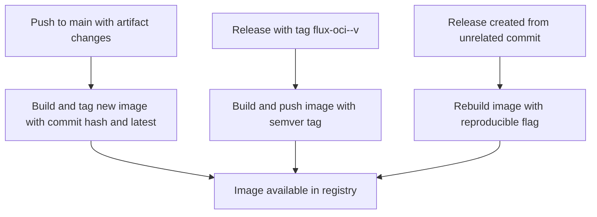
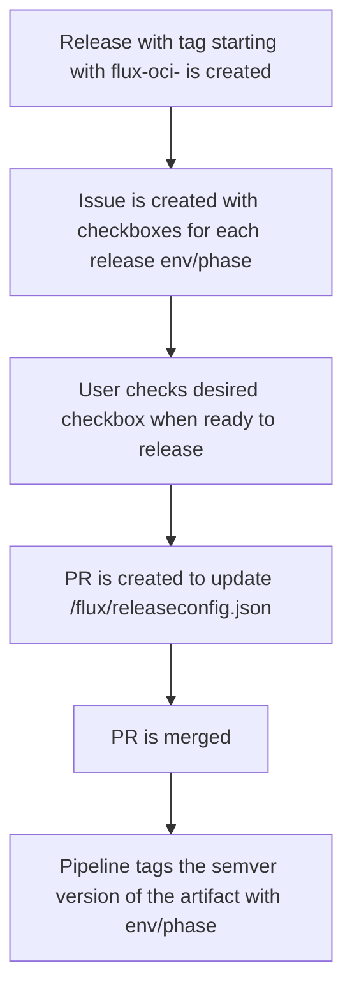

# Flux artifacts

This folder contains the different sources for our flux oci images.

There are some workflows that eases the creation and promotion of flux oci images throughout all our clusters

* release-flux-artifact.yml
* manage-flux-releases.yml

## Release flux oci image version
Push or tag a flux oci image
For every push to main that contains changes to an artifact a new version is build and tagged with the commit hash and latest.

If a release with the naming flux-oci-\<artifactname>-v\<semver-version> (`flux-oci-eso-v1.0.0`) a new image is buildt and pushed with the semver-version specified.

We rebuild on release in case the commit that the release was created from didn't happen to be a commit with a change to the oci artifact. We use the reproducible flag for flux so if there is an existing image build and pushed it will still match.

## Manage flux oci image promotion
Promote a version to our container runtime clusters

When a release is created with a tag starting with `flux-oci-`, an issue is automatically opened with checkboxes for each environment.

To promote a version, simply check the box for the desired environment. This triggers a pull request that updates `/flux/releaseconfig.json` with the new version for that environment.

Once the pull request is merged, the pipeline tags the artifact with the selected environment or phase, making it available in the target cluster.

