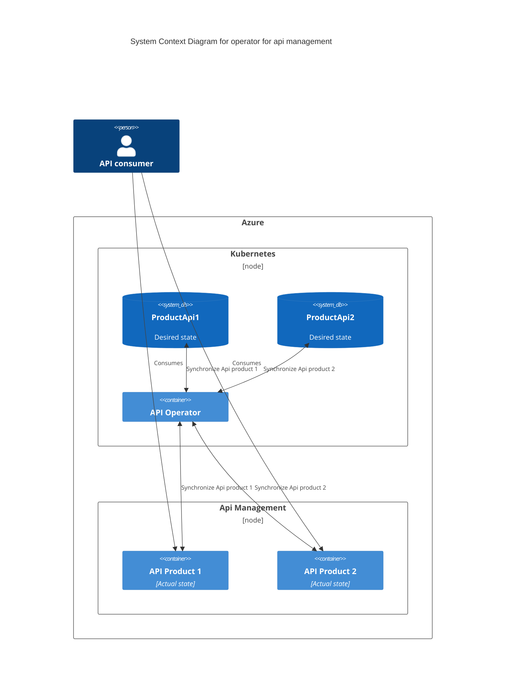
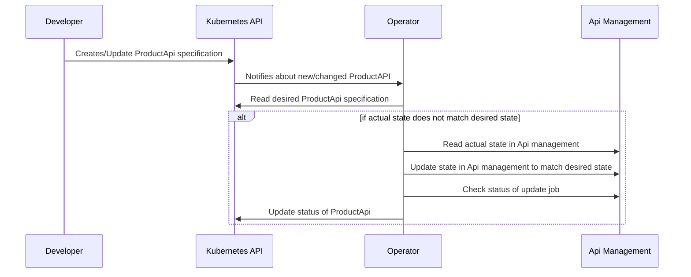
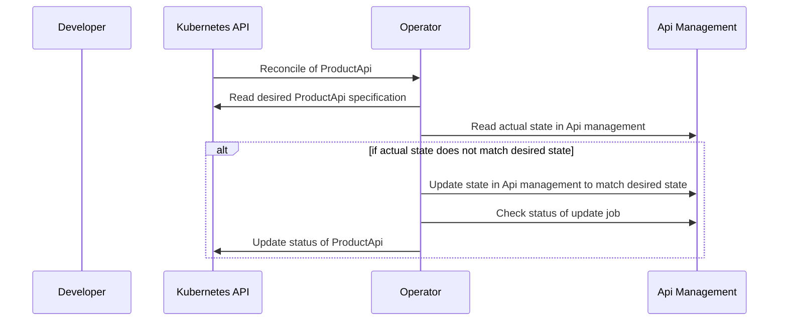
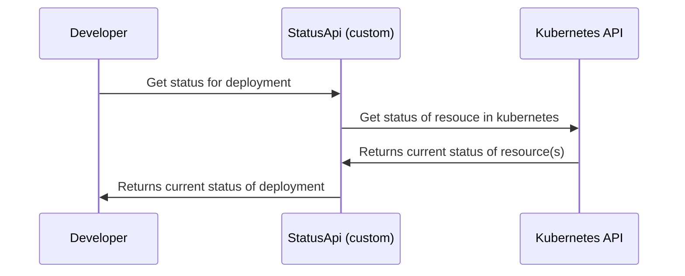

- Feature Name: operator_managed_apim_config
- Start Date: 2024-10-08
- RFC PR: [altinn/altinn-platform#1026](https://github.com/Altinn/altinn-platform/pull/1026)
- Github Issue: [altinn/altinn-platform#770](https://github.com/Altinn/altinn-platform/issues/770)
- Github Discussion: [altinn/altinn-platform/discussion#986](https://github.com/Altinn/altinn-platform/discussions/986)
- Product/Category: APIM
- State: **REVIEW** (possible states are: **REVIEW**, **ACCEPTED** and **REJECTED**)

# Summary

Create a kubernetes operator that manages api, product, ++ configuration of a api management service

# Motivation

We are setting up a centralized api management service. To simplify and standardize how our apis are configured we create an abstraction between the developers of the apis and the api management solution.
This abstraction sets sane defaults and only forces the developers to configure the important parts of their segment of the api management solution.
By removing/defaulting as much as possible for each team we reduce the cognitive load for the teams that should be focusing on delivering features in their solution, not keeping up with the api management solution.
Having an operator makes it possible for team platform to upgrade/reconfigure internal configs of the api management without any work needed by the devops teams leveraging the service.

# Guide-level explanation

We have a operator deployed in centralized kubernetes management cluster. THis cluster is utilised to manage core services that team platform is responsible for. 
This operator is using workload identity or a similar solution to authenticate against azures apis.
This operator manages [Custom Resources](https://kubernetes.io/docs/concepts/extend-kubernetes/api-extension/custom-resources/) that defines the APIs we serve through the API management service.
When a developer from a team that wants to expose their API through the centralized api management service they create a new object of the custom resource. This can then only contain the actual parts the developer needs to care about, like name, base path of the api, the version (if versioned), and where the api specification is and what format it is.
A yaml defining this could look something like this (just a sample and will change in the actual implementation):
```yaml
apiVersion: apimanagement.dis.altinn.cloud/v1alpha1
kind: Api
metadata:
  labels:
    app.kubernetes.io/name: apimanagement-operator
  name: api-sample
spec:
  description: "This is a sample API"
  displayName: "Sample API"
  versioningScheme: "Segment"
  path: "sample"
  apiType: "http"
  contact:
    email: "test@example.com"
    name: "test"
  versions:
    - name: "v1"
      displayName: "v1"
      description: "This is version 1"
      contentFormat: "openapi+json"
      content: |
        {
            "schemes": [],
            "swagger": "2.0",
            "info": {
                "description": "This is a sample server openapi server.",
                "title": "Swagger Example API",
                "termsOfService": "http://swagger.io/terms/",
                "contact": {},
                "license": {
                    "name": "Apache 2.0",
                    "url": "http://www.apache.org/licenses/LICENSE-2.0.html"
                },
                "version": "1.0"
            },
            "host": "example.com",
            "basePath": "/",
            "paths": {
                "/hello": {
                    "get": {
                        "description": "get a hello message",
                        "consumes": [
                            "text/plain"
                        ],
                        "produces": [
                            "text/plain"
                        ],
                        "summary": "Get Hello",
                        "parameters": [
                            {
                                "type": "string",
                                "description": "Some Name",
                                "name": "name",
                                "in": "query"
                            }
                        ],
                        "responses": {
                            "200": {
                                "description": "ok",
                                "schema": {
                                    "type": "string"
                                }
                            }
                        }
                    }
                }
            }
        }
      subscriptionRequired: false
      policies:
        policyFormat: xml
        policyContent: |
          <policies>
            <inbound>
              <set-backend-service backend-id="default-backend-sample" />
            </inbound>
          </policies>
```

This is then synced to the cluster where the operator runs via a gitops solution or similar.
The operator creates the necessary resources in azure and updates the status on the object in kubernetes.

In addition to this sync loop we need to ensure visibility into the process. Users deploying/configuring the API needs to have an easy way of checking the deployment status of their api configuration

# Reference-level explanation

Disclaimer: These diagrams give a very simplified overview of the sync/reconcile process. This is to not hide the important higher level aspects of the solution. For more complete and complex diagrams please see the operators actual documentation



Sequence diagram of create/upgrade scenario


Sequence diagram sync loop


Sequence diagram status api


# Drawbacks

* We need to learn and understand the kubernetes operator pattern
* Tied to kubernetes as a "provider"/"system"
* Faults in the operator will affect all the APIs it manages

# Rationale and alternatives

* Terraform modules that each team deploys
* Bicep modules that each team deploys
* Centralized IaC configuration
* Scripts and pipelines
* Azure service operator

# Prior art

We have a pipeline script setup today that configures the api management service. This is complex and has alot of configuration elements that most of the developers shouldn't have to care about.

Few people know how this works and it is complicated to deploy a new or a change to a api in the api management service

# Unresolved questions

* Can we automate even more of the process than we do today
* How we should report status of an deployment back to the teams
  * Flux status?
  * Custom api endpoint for viewing status (ala. kuberneteswrapper)
  * other

# Future possibilities

Having a operator pattern in front of Api Management can in the future automate the subscription registration for apps at run time. This will simplify our deployment process of apps.

If the application is deployed in one of our kubernetes clusters we can tie the api setup tighter together with the deployment of the application.

Managing subscriptions for external entities, this is a bigger decission as we need a place where customers can manage their subscriptions. We need to decide if we are going to use a SaaS service for this or write our own. Either way this operator might be a good place to handle backup/restore functionality