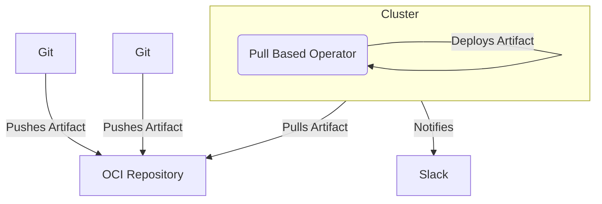
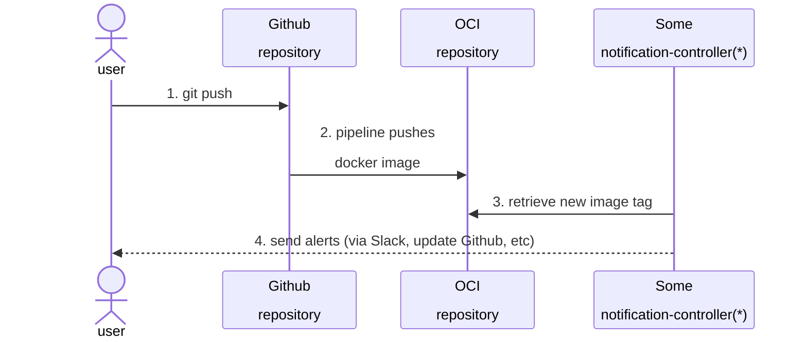
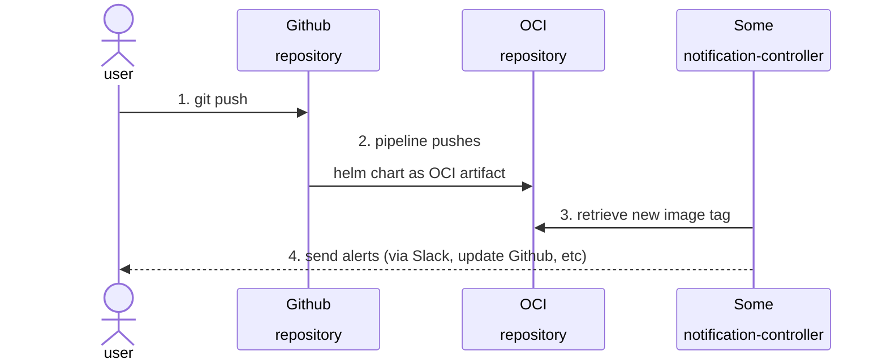
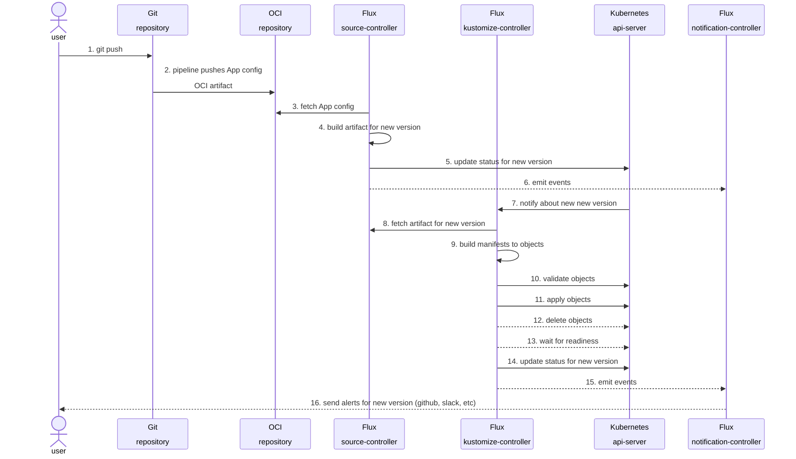
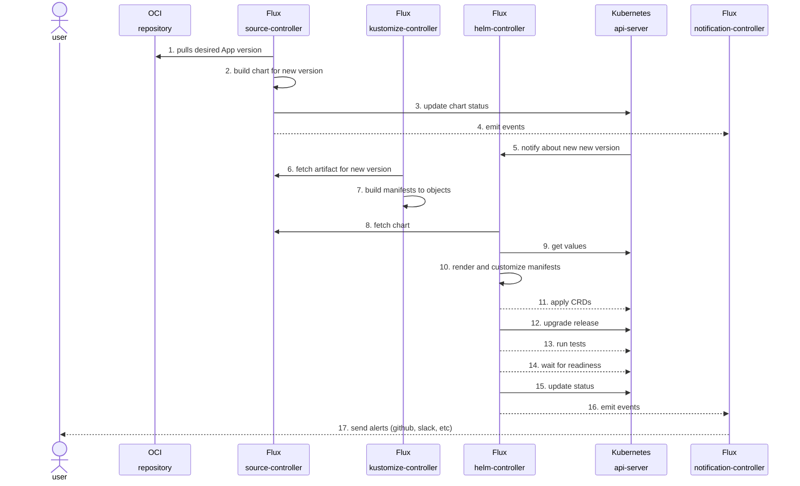

- Feature Name: pull_based_cd
- Start Date: 2024-05-15
- RFC PR: [altinn/altinn-platform#782](https://github.com/altinn/altinn-platform/pull/782)
- Github Issue: [altinn/altinn-platform#0000](https://github.com/altinn/altinn-platform/issues/0000)
- Product/Category: CI/CD
- State: **REVIEW**

# Summary
[summary]: #summary

The proposed RFC introduces a new pull-based continuous deployment/delivery (CD) system to the software development platform, replacing the current push-based system that relies on complex pipelines managed by a separate tool (Azure Devops). The pull-based approach significantly reduces complexity by adopting a declarative process where the desired state of the application is explicitly defined on a single source of truth (SSOT). A Kubernetes operator(s) will continuously reconcile the actual state of the cluster with the desired state, ensuring consistency, and furthermore being alligned with reconciliation pattern of K8s itself. This method offers the added benefit of state re-creation from scratch, as the operator(s) can simply fetch the latest desired state from the single source of truth (SSOT), enabling seamless cluster provisioning and recovery.

# Motivation
[motivation]: #motivation

The main motivation for this change is to reduce complexity regarding CD purposes. 
- The way it works currently adds extra time since the pipelines and processes have to be manually triggered and followed through.
- Whenever a pipeline fails, for any reason, this has to be re-run manually.
-
The second biggest motivation is leaning towards the concept of self-reconciliation and aiming for fast recovery
- Since there is a SSOT the cluster itself will trigger the reconciliation, hence removing the need for a person taking care of a pipeline running.
- In the case of re-creating the cluster, the desired state is pulled and reconciliated, eliminating the whole complexity of checking and triggering manually a pipeline per service.
- There is a clear an plain desired state which can be always compared to the actual state running in the cluster/platform.

This supports several uses cases such as:
- A clear CD of a service among different environments
- Adding a fast way in the case of a need for a rollback
- The possibility to fetch (through any kind of API) what's the current desired and actual state of an application running in the platform
- Cleaner Disaster Recovery (DR) exercises and re-creation of clusters/environments
- Provide useful Observability signals that can be used further for debugging or higher degree metrics, e.g DORA metrics

# Guide-level explanation
[guide-level-explanation]: #guide-level-explanation

## Concepts
### Artifact
A (usually compressed) file that contains one or more files that represent software or configuration, such file is therefore deployed onto a platform that serves a service or applies a configuration. Examples: a Terraform state, a tar file that contains K8s manifests, a docker image, etc
### OCI Artifact
An OCI (Open Container Initiative) Artifact is a specification that extends the capabilities of the OCI Image Specification to support storing, discovering, and managing different types of content, beyond container images, in an OCI-compliant registry, e.g ACR. Examples: Helm charts, yaml files, configuration files, and other non-container content. By leveraging the same distribution model as OCI images (such as a Docker image). In brief, they provide a consistent way to operate artifacts.
### Helm artifact
The Helm Chart as an OCI artifact
### App Config artifact
This artifact is defined by both the Chart version and the Docker image tag, ie. :
```yaml
apiVersion: helm.toolkit.fluxcd.io/v2beta1
kind: HelmRelease
metadata:
  name: my-app
  namespace: my-ns
spec:
  chart:
    spec:
      version: "1.0.0-1234567" 
  values:
    environment: dev
    image:
      tag: "abc1234"
```
As an initial implementation this is based on [Flux's HelmRelease](https://fluxcd.io/flux/components/helm/helmreleases/) custom resource.
### Pull-based CD
A CD pull-based system is basically a system that fetches automatically, usually in a loop fashion, an artifact from a SSOT and does something with it, e.g doing a kubectl apply -f manifest.yaml
### Push-based CD
A CD system that just deploys only when is instructed, either by a machine or human. Examples: a deployment pipeline triggered automatically in Github Actions, a release pipeline that deploys an artifact to the cluster

## Process


The new CD process becomes then:
1. A commit is pushed to the Git repo (this can be either code or configuration)
2. An OCI artifact is pushed to the OCI repo
3. The pull-based operator observes for new artifacts and fetches them according to its configuration 
4. The operator applies the desired (a specific verion or could be the latest) artifact in the cluster
5. (Optional) An operator notifies about the new release to third parties (Slack, Github, etc)

# Reference-level explanation
[reference-level-explanation]: #reference-level-explanation

There mainly two possible workflows when releasing:

## New Docker image version

This process is illustrated in following diagram:

#### Diagram: Docker image update


This process is basically the same as the current one, the only difference is that a notification
will be triggered when a new Docker image version is available in the OCI repository, which
can therefore be declared in the new config for the App in any given environment.

(*) The reason for this being Some and not Flux is because we may not use the one from Flux.

## New App version

Currently we define and run Apps and its configuration as Helm Charts. This might change
in the near future with the introduction of an Application Custom Resource.

#### Diagram: Helm Chart update



## New App config version

The App config artifact, as it was mentioned before, defines the actual
versions for both the App (Docker image tag) and Helm Chart. This artifact
can be thought as the runtime variables of the App.

This is the artifact that represents the SOOT for what's supposed to be
running in the environment.

#### Diagram: App config upgrade from Git




Until this point the new version of the App config (Helm Release) will be updated in the cluster, hence triggering the correspondant reconciliation.

#### Diagram: App (Helm chart) upgrade from the cluster


And at this point the App should be updated to the desired state.

## More on OCI Artifacts

One of the nice benefits of using OCI artifacts is that we can track them back to
the source that built them. They can contain useful metadata such as the Annotations:
```json
{
  "schemaVersion": 2,
  "mediaType": "application/vnd.oci.image.manifest.v1+json",
  "config": {
    "mediaType": "application/vnd.cncf.flux.config.v1+json",
    "size": 233,
    "digest": "sha256:5f758b45a7249471982b83fa320cb9d709f5aaf1ad20b55f157bce701cacac83"
  },
  "layers": [
    {
      "mediaType": "application/vnd.cncf.flux.content.v1.tar+gzip",
      "size": 718,
      "digest": "sha256:663c7e53020c0b658714633b9798a82d255215cc40a26899906456f45d8eb835"
    }
  ],
  "annotations": {
    "org.opencontainers.image.created": "2024-05-13T16:50:24Z",
    "org.opencontainers.image.revision": "df48b31b82efc28a3929b4cd3e5e1c087fc2267b",
    "org.opencontainers.image.source": "https://github.com/myorg/myrepo"
  }
}
```
In this example we can see that it is possible to get to the git repo and specific commit that triggered the pipeline that created such OCI artifact. This specific example was
generated and pushed by the Flux CLI. It is also possible to use the [ORAS](https://learn.microsoft.com/en-us/azure/container-registry/container-registry-oci-artifacts) CLI to achieve
the same effect.

### Why is this useful?

Because we can easily have any API telling us the desired the state and actual state, plus
being able to get exactly to their sources. 

## Security

It is quite straight forward to incorporate [Cosign when using Flux](https://fluxcd.io/blog/2022/11/verify-the-integrity-of-the-helm-charts-stored-as-oci-artifacts-before-reconciling-them-with-flux/). It is becoming
a very popular practice for open source projects (as well as private) and we should go for it.

# Drawbacks
[drawbacks]: #drawbacks

There is already a CD system that contains pipelines that can deploy to any environments and we could just expand on it.

This requires a change of paradigm when it comes to CD, as this proposal introduces a pull-based system instead of the current push-based one. Such
change will require some cognitive effort. The concept of promotion, as it is known in standard push-based CD processes and systems, might change
noticeable due to the nature of the pull-based ones.

When it comes to the technical implementation, one could clearly object on using either the open source Flux or ArgoCD, both being quite valid alternatives
that allow us with the freedom to update them whenever we want and not depending on what Azure itself defines.

# Rationale and alternatives
[rationale-and-alternatives]: #rationale-and-alternatives

Going into the so-called GitOps practice and using reconciliation has become the de facto standard with a myriad of open source projects following it.
Which provides us with the benefit of using a proven process and tools, that have demonstrated to being effective at reducing complexity in the software
development lifecycle.

In particular, basing a solution on managed Flux gives us the opportunity to escalate when failures occur and liberates us from some maintenance efforts.
Other projects in the area that were considered (ArgoCD being the other main alternative here) did not have a managed version that we could use in Azure,
which ultimately decided to favor on Flux. Both tools have a rich API and can be extended if desired.

By not doing this we expect to keep spending precious time on toil an manual tasks that keep us away from using that time on building products for the platform.
# Prior art
[prior-art]: #prior-art

As far as the authors know, there isn't any GitOps or similar tool in our platform.

# Unresolved questions
[unresolved-questions]: #unresolved-questions

- How much does acually cost to use this solution on all clusters, both in monetary terms and operational
- Will the adoption of this new CD process make an impact on some DORA metrics, e.g Deployment Frequency or Lead Time for Changes?
- How often is Azure updating its managed Flux, as there is at least one controller being slightly outdated
- Can we base our own Definition of Concept of App on this pattern? Meaning that our Platform's App Resource could be the only thing being reconciled 

# Future possibilities
[future-possibilities]: #future-possibilities

We think that by introducing this process and tools we can reach a much better performance
of the platform itself, enabling us as a team to focus on working on the products, instead
of having to spend time on toil, e.g manual deployments.

Clearly by using reconciliation towards a reliable and highly available system like ACR
put us in much better position, both in terms of reliability and security. There is many
improvements that can be constructed upon this:
- A seamless introduction of signed artifacts by using [Cosign](https://www.sigstore.dev/), which are becoming a standard
- Driving all third-party tools, e.g Grafana et al, through reconciliation can reduce drastically the time invested in maintenance
- Good starting point to build on controllers/operators that can serve different purposes, such as observability
