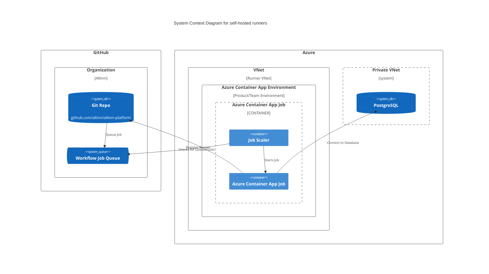
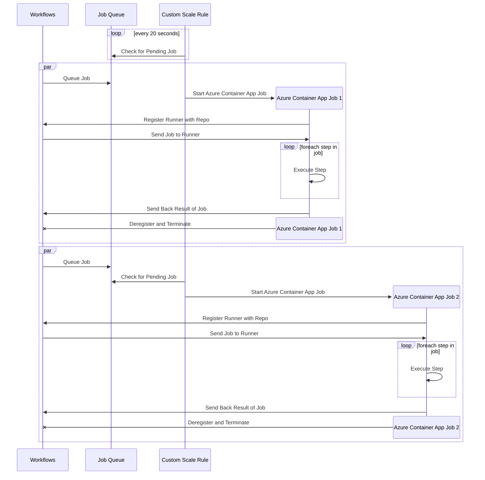

- Feature Name: github_self_hosted_runner
- Start Date: 2024-08-28
- RFC PR: [altinn/altinn-platform#0000](https://github.com/altinn/altinn-platform/pull/0000)
- Github Issue: [altinn/altinn-platform#861](https://github.com/Altinn/altinn-platform/issues/861)
- Product/Category: (optional)
- State: **REVIEW** (possible states are: **REVIEW**, **ACCEPTED** and **REJECTED**)

# Summary
[summary]: #summary

The proposed RFC introduces self-hosted runners in GitHub that teams can set up using a straightforward self-service solution. Self-hosted runners are useful in scenarios where exceptions in firewalls are needed or in private projects that consume all the free minutes available for GitHub-hosted runners. The runners should be discarded after each job to reduce the chances of contamination. The number of runners should scale up and down automatically.

# Motivation
[motivation]: #motivation

We have some use cases where we need to run pipelines that access internal resources within our infrastructure. We cannot allow access to GitHub-hosted runners, as this would remove a layer of security in our solution. By setting up self-hosted runners, we can place these in a VNet we control and enable secure communication between those VNets and other private VNets.

Each product/team should have its own set of self-hosted runners located in a VNet, so we don't need to expose all services to all runners. Self-hosted runners in a public repository introduce a security concern, as jobs can be executed from forks. To reduce the risk, a runner should only run one job and then be discarded (ephemeral runners). Additionally, all services or infrastructure in the VNets connected to the runner VNet should be protected by a secure login/authentication barrier, ensuring that access to the runner is not enough to access private services.

Teams have different needs, and our solution should support these varying needs without adding too much of a maintenance burden on the platform team. The number of runners should scale up if there are queued jobs and down to zero if there are none. This ensures that we support both use cases with a high number of executions and those with few, without paying for unused resources.

# Guide-level explanation
[guide-level-explanation]: #guide-level-explanation

Explain the proposal as if it was already included in the platform and you were teaching it to another member of the team. That generally means:

- Introducing new named concepts.
- Explaining the feature largely in terms of examples.
- Explaining how team members should *think* about the feature, and how it should impact the way they use the platform product. It should explain the impact as concretely as possible.
- If applicable, provide sample error messages, deprecation warnings, or migration guidance.
- If applicable, describe the differences between teaching this to existing team members and new team members.
- If applicable, discuss how this impacts the ability to read, understand, and maintain sofware that runs in or uses the platform. Code is read and modified far more often than written; will the proposed feature make services easier to maintain? Will this help users of the platform to maintain their services?

For implementation-oriented RFCs (e.g. for a code based solution), this section should focus on how code contributors should think about the change, and give examples of its concrete impact. For policy RFCs, this section should provide an example-driven introduction to the policy, and explain its impact in concrete terms.

# Reference-level explanation
[reference-level-explanation]: #reference-level-explanation

## Infrastructure overview

## Lifecycle of Containers Running Jobs

This is the technical portion of the RFC. Explain the design in sufficient detail that:

- Its interaction with other features is clear.
- It is reasonably clear how the feature would be implemented.
- Corner cases are dissected by example.

The section should return to the examples given in the previous section, and explain more fully how the detailed proposal makes those examples work.

# Drawbacks
[drawbacks]: #drawbacks

Why should we *not* do this?

# Rationale and alternatives
[rationale-and-alternatives]: #rationale-and-alternatives

- Why is this design the best in the space of possible designs?
- What other designs have been considered and what is the rationale for not choosing them?
- What is the impact of not doing this?

# Prior art
[prior-art]: #prior-art

Discuss prior art, both the good and the bad, in relation to this proposal.
A few examples of what this can include are:

- For any of the platform products: Does this feature exist in other projects and what experience have their community had?
- For community proposals: Is this done by some other community and what were their experiences with it?
- For other teams: What lessons can we learn from what other communities have done here?

This section is intended to encourage you as an author to think about the lessons from other projects, provide readers of your RFC with a fuller picture.
If there is no prior art, that is fine - your ideas are interesting to us whether they are brand new or if it is an adaptation from other languages.

Note that while precedent set by other projects is some motivation, it does not on its own motivate an RFC.

# Unresolved questions
[unresolved-questions]: #unresolved-questions

- What parts of the design do you expect to resolve through the RFC process before this gets merged?
- What parts of the design do you expect to resolve through the implementation of this feature before stabilization?
- What related issues do you consider out of scope for this RFC that could be addressed in the future independently of the solution that comes out of this RFC?
- What are the (unknown) unknowns?

# Future possibilities
[future-possibilities]: #future-possibilities

Think about what the natural extension and evolution of your proposal would
be and how it would affect the project as a whole in a holistic
way. Try to use this section as a tool to more fully consider all possible
interactions with the project in your proposal.
Also consider how this all fits into the roadmap for the project
and of the relevant sub-team.

This is also a good place to "dump ideas", if they are out of scope for the
RFC you are writing but otherwise related.

If you have tried and cannot think of any future possibilities,
you may simply state that you cannot think of anything.

Note that having something written down in the future-possibilities section
is not a reason to accept the current or a future RFC; such notes should be
in the section on motivation or rationale in this or subsequent RFCs.
The section merely provides additional information.