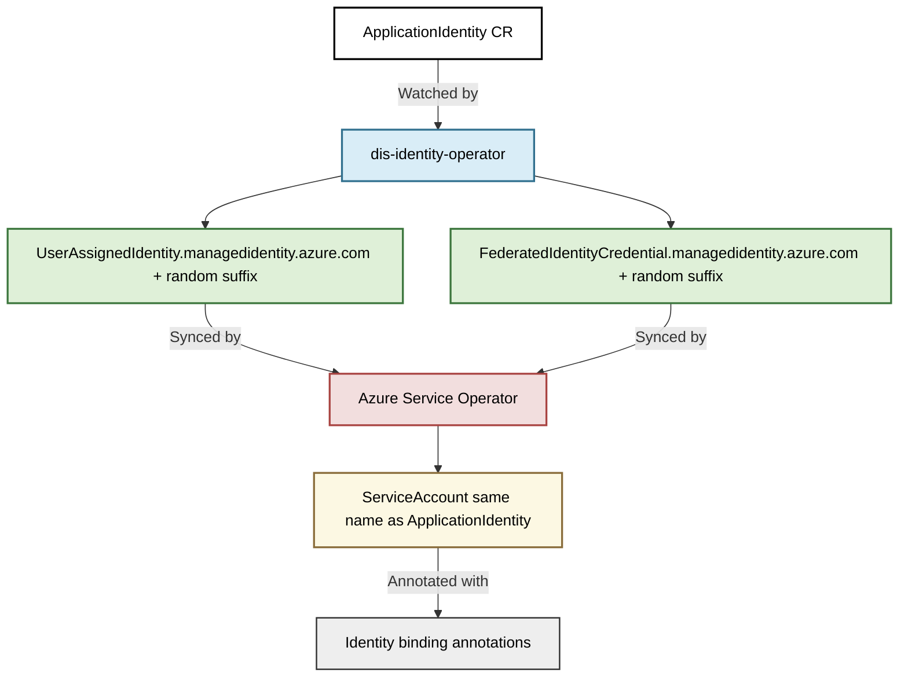

- Feature Name: container_runtime_workload_identity
- Start Date: 2025-05-06
- RFC PR: [altinn/altinn-platform#](https://github.com/Altinn/altinn-platform/pull/)
- Github Issue: [altinn/altinn-platform#1567](https://github.com/Altinn/altinn-platform/issues/1567)
- Github Discussion: [altinn/altinn-platform/discussion#1591](https://github.com/Altinn/altinn-platform/discussions/1591)
- Product/Category: Container Runtime
- State: **REVIEW** (possible states are: **REVIEW**, **ACCEPTED** and **REJECTED**)

### Summary

We need to create an easy way for teams using our container runtime to create and attach workload identities to their applications.

### Motivation

Todays way of creating an workload identity for applications running in one of our clusters requires the teams to create an issue to team platform. We then have to create a new Entra ID in the correct IaC code along side the creation of a service account in the correct cluster and namespace. These two have to be linked in the correct way. This takes time and some effort for both team, also known as toil.

### Guide-level explanation

The new setup should allow the team needing a workload identity to create a custom resource in their container runtime cluster. This will in turn create a service account and a entra id application. Once both the resources are created the status is updated on the custom resource with information about the created entra id application.
The service account would get the same name as the custom resource to keep things clean and simple

### Reference-level explanation

Create a new k8s operator `dis-identity-operator` that is responsible for handling identity related resources.
For now the only custom resource it handles would be `ApplicationIdentity` (name pending) that gives an application an identity in entra id.
This operator configures custom resources managed by azure service operator. Dis-Identity creates a `UserAssignedIdentity.managedidentity.azure.com` and a connected `FederatedIdentityCredential.managedidentity.azure.com` resources. The name of the aso object should be the same as the ApplicationIdentity but with an added random suffix.
Once the Azure service operator has created/synced these resources the dis-identity operator creates a service account with the required annotations.
The name of the service account matches the ApplicationIdentity

### Drawbacks

* We need to maintain another operator

### Rationale and alternatives

__User Azure-sdk-for-go directly instead of leveraging azure service operator__
THe objects are generated from the same ARM resources, but we would have to write the azure syncronization ourselves.

__Use Azyre Service Operator and kro.run__
This would remove our own operator and just leverage these two. This will a good alternativ down the road, but as the kro.run is still in alpha/beta I think it's wise to wait

### Prior art

I can't find a product that is stable and handles both the entraID and k8s side of the setup.

### Unresolved questions

No big questions in my head as of now

### Future possibilities

This operator could get the functionality to create other kinds of identities in entra, for example federated identities used in a github repo for authenticating github actions
