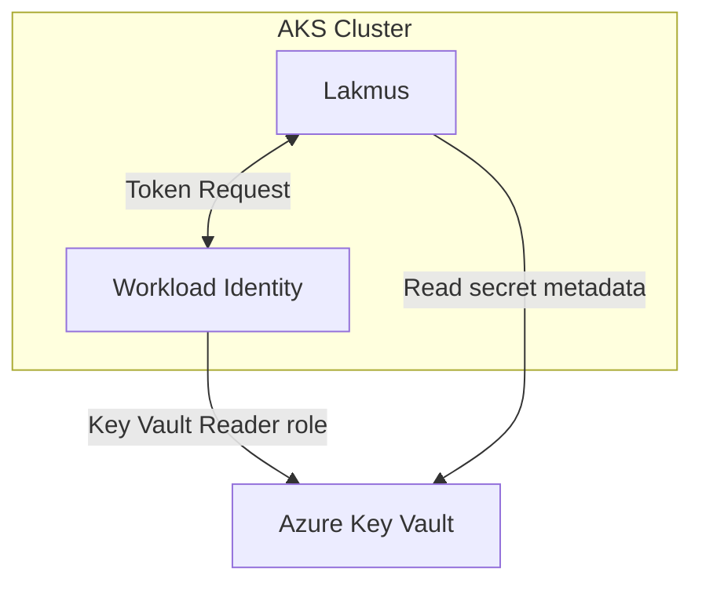

- Feature Name: monitoring_expiring_secrets
- Start Date: 2025-08-07
- RFC PR: [altinn/altinn-platform#2018](https://github.com/altinn/altinn-platform/pull/2018)
- Github Issue: [altinn/altinn-platform#1945](https://github.com/altinn/altinn-platform/issues/1945)
- Product/Category: Observability
- State: **REVIEW**

# Summary
[summary]: #summary

Introduce a lightweight Go service that runs inside an AKS cluster with Workload Identity and periodically scans an Azure Key Vault (AKV) for secrets that are expired or will expire soon, exposing an observability signal that can be easily queried later in Grafana.

# Motivation
[motivation]: #motivation

* Several Altinn services rely on AKV-stored secrets, tokens or certificates.  
* Expired secrets invariably cause outages that are hard to triage.  
* Current solution is not maintained and it deviates from our golden path.
* A built-in, read-only exporter lets every team add an alert rule in Grafana and receive actionable alerts before incidents occur.

# Guide-level explanation
[guide-level-explanation]: #guide-level-explanation

Proposed name for the tool will be **Lakmus**.

### New concepts

None.

## Overview

## Exposing observability signals

Initially it will use a metric per secret in the KV. These metrics can be consumed directly by Prometheus and therefore queried for alerts later in Grafana:

```
secret_expiration_timestamp_seconds{secret="my-sec", kv="mykv-prod"}
```

A simple query for dashboards and alerts can be as simple as:

```
# secrets expiring or already expired
(secret_expiration_timestamp_seconds - time()) < 7*24*60*60
```


## Operational Impact

Teams gain immediate visibility into the state of their AKV secrets without requiring manual audits or external scripts. The application uses read-only permissions via workload identity, minimizing security risks.

# Reference-level explanation
[reference-level-explanation]: #reference-level-explanation

The simplest way is to run the app with a ticker for continually polling secrets.
A minimal implementation demonstrating the core functionality:

```go
func main() {
	vaultURL := os.Getenv("AZURE_KEYVAULT_URL")

	credential, err := azidentity.NewDefaultAzureCredential(nil)

	client, err := azsecrets.NewClient(vaultURL, credential, nil)

	ticker := time.NewTicker(60 * time.Minute)
	for {
		checkSecrets(client)
		<-ticker.C
	}
}

func checkSecrets(client *azsecrets.Client) {
	ctx := context.Background()
	pager := client.NewListSecretsPager(nil)

	for pager.More() {
        for _, secret := range page.Value {
            // update metric
        }
	}
}
```

# Drawbacks
[drawbacks]: #drawbacks


# Rationale and alternatives
[rationale-and-alternatives]: #rationale-and-alternatives

There is alternatives from Azure but these use Event Grid which we don't support and don't
seem to be compatible with Grafana.

# Prior art
[prior-art]: #prior-art

None.

# Unresolved questions
[unresolved-questions]: #unresolved-questions

# Future possibilities
[future-possibilities]: #future-possibilities

We might use this app for other data that we need to expose and that can't be fetched easily
from the cloud vendor.

