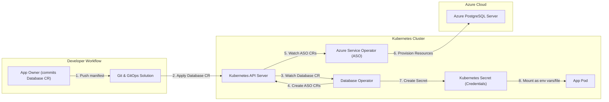

- Feature Name: self_service_postgresql_database
- Start Date: 2025-10-27
- RFC PR: [altinn/altinn-platform#](https://github.com/altinn/altinn-platform/pull/)
- Github Issue: [altinn/altinn-platform#2323](https://github.com/Altinn/altinn-platform/issues/2323)
- Product/Category: ContainerRuntime
- State: **REVIEW**

# Summary

This RFC proposes a new capability for app owners to self-provision a dedicated PostgreSQL database for their applications. This will be achieved using a new Kubernetes Database Operator. App owners will declare their need for a database by defining a Database Custom Resource (CR) in a YAML file within their app repository. The existing GitOps solution will apply this manifest to the Kubernetes cluster. The Database Operator will watch for these Database CRs and orchestrate the provisioning of an Azure PostgreSQL Flexible Server instance by creating and managing resources via the Azure Service Operator (ASO). The operator will also create a Kubernetes secret containing the database credentials, making them available for the application to consume. This approach empowers app owners with a fully automated, declarative, and isolated database solution.

# Motivation

Currently, provisioning a database for an application is a manual process that requires intervention from the platform team. This creates a bottleneck, slows down development, and introduces potential for human error.

The motivation for this proposal is to:

* **Empower App Owners**: Give development teams the autonomy to manage their application's database lifecycle directly from their source code repository using familiar Kubernetes manifests.
* **Increase Velocity**: Automate the entire database provisioning and de-provisioning process, allowing teams to get the resources they need faster.
* **Improve Consistency and Reliability**: By adopting a declarative, "database-as-code" approach, we ensure that database configurations are version-controlled, repeatable, and consistently applied across all environments.
* **Enhance Security and Isolation**: Provide each application with its own dedicated and isolated database instance, preventing "noisy neighbor" problems and improving the overall security posture.

The expected outcome is a streamlined, fully-automated, and self-service experience for managing application databases, which aligns with modern GitOps and DevOps principles.

# Guide-level explanation

We are introducing a new way to manage databases for your application, which we call "managed databases". From now on, if your application needs a PostgreSQL database, you no longer need to file a ticket. Instead, you simply declare it in your application's repository using a standard Kubernetes manifest.

Declare your database: In your app repository, likely in a directory where you keep other Kubernetes manifests (e.g., k8s/), create a file named database.yaml. This file defines the Database resource you need.

Early example of a default-sized database, the manifest will be very simple, but this is just an example to provide context:
```yaml
apiVersion: altinn.app/v1alpha1
kind: Database
metadata:
  name: my-app-db
spec:
  version: 17
  auth:
    adminAppIdentity: my-admin-app-identity # The name of the AppIdentity that should have full admin access to the database.
    userAppIdentity: my-app-identity # The name of the AppIdentity that should have access to the database, but need to be granted permissions.
```

Teams that want more control can set the following parameters:

```yaml
apiVersion: altinn.app/v1alpha1
kind: Database
metadata:
  name: my-app-db
spec:
  version: 17
  auth:
    adminAppIdentity: my-admin-app-identity # The name of the AppIdentity that should have full admin access to the database.
    userAppIdentity: my-app-identity # The name of the AppIdentity that should have access to the database, but need to be granted permissions.
  storageGBSize: 32 # Initial storage size in GB, AUtogrow is enabled for all so the disk will grow automatically.
  serverSize: "DEV" # DEV, DB10, DB20. DB30 # These DIS DB-sizes maps to different combinations of machine sku_name and sku_tier
  secretName: my-app-db-credentials # Secret in kubernetes where the connection string is stored
  backupRetentionDays: 14
  iops: 120 # This is at some level to the storage size: https://learn.microsoft.com/en-us/azure/virtual-machines/disks-change-performance#what-tiers-can-be-changed
```

Once the configuration is done commit and push your code. The existing GitOps flow will then pick up this change and apply it to the teams cluster

Connect to your database: Our new Database Operator will see your request and automatically provision a dedicated PostgreSQL database for you in Azure. It will also create a Kubernetes Secret and Service account in your app's namespace. This secret will contain all the necessary connection details (host, database name). The Service account will have a federated identity setup that allows the application to connect to the database through an identity in entraID.

This feature encourages you to think of your database as just another piece of your application's configuration, managed declaratively in Git. It makes setting up new environments for testing or production trivial and ensures every app has its own isolated database, improving stability and security.

Teams still are responsible for tuning and managing the database, like upgrading the major version. We just remove most of the infrastructure complexity and just make what is strictly neccessary to configure for each configurable.

We should make it easy to discover databases that are outdated. Teams are responsible to upgrade their databses in a timely manner.

Backups are built in. We leverage Azures PITR solution that is built into the managed solution. For offsite and truly distaster cases we leverage Azure BackupVault to have an encrypted and isolated backup of the database.

# Reference-level explanation

This section details the technical implementation of the Database Operator and its interaction with the ecosystem.

1. Custom Resource Definition (CRD)
We will introduce a new Database CRD. This CRD will be the primary interface for our system. A simplified version of the CRD definition would be:

```yaml
apiVersion: apiextensions.k8s.io/v1
kind: CustomResourceDefinition
metadata:
  name: databases.altinn.app
spec:
  group: altinn.app
  names:
    kind: Database
    plural: databases
    singular: database
  scope: Namespaced
  versions:
    - name: v1alpha1
      served: true
      storage: true
      schema:
        openAPIV3Schema:
          type: object
          properties:
            spec:
              type: object
              properties:
                sku:
                  type: string
                  description: The Azure SKU for the PostgreSQL Flexible Server.
                  default: "Standard_B1ms"
            status:
              type: object
              properties:
                # Status fields to be populated by the operator
                provisioningState:
                  type: string
                secretName:
                  type: string
```

2. High-Level Flow
The end-to-end process is orchestrated by several components working together.


Flow Breakdown:

1. App Owner: The developer commits a Database CR manifest (e.g., database.yaml) to their application repository.
2. GitOps Solution: The existing GitOps controller (Flux) or a CI/CD pipeline step detects the change in the repository and applies the Database CR manifest to the application's namespace in the Kubernetes cluster.
3. Database Operator (Watch): Our new Database Operator is subscribed to events for Database resources. It detects the creation or update of a Database CR.
4. Database Operator (Reconcile): The operator's reconciliation loop begins. It reads the spec of the Database CR and generates the required Azure Service Operator (ASO) resources. This will primarily be an ASO FlexibleServer resource and a FlexibleServerFirewallRule to allow access from within the cluster.
5. Azure Service Operator (ASO): ASO detects the creation of its own CRs (FlexibleServer, etc.).
6. ASO (Provision): ASO communicates with the Azure Resource Manager (ARM) API to provision the actual PostgreSQL Flexible Server and its associated firewall rules in Azure. ASO then waits for the resources to be successfully created.
7. Database Operator (Create Secret): Once ASO reports that the Azure resources are ready, the Database Operator retrieves the connection details (like the admin username and password that ASO stores in a secret). It then creates a new, standardized Kubernetes Secret in the app's namespace (e.g., <app-name>-db-credentials) containing the full connection string, host, user, and password.
8. App Pod: The application's Deployment is configured to mount this secret as environment variables or config file, making the database credentials available to the application at runtime.


# Drawbacks

* **Complexity**: Building, testing, and maintaining a Kubernetes operator is a significant undertaking. It adds a new critical component to our platform that requires specialized knowledge.
* **Dependency on ASO**: Our solution is tightly coupled to the Azure Service Operator. Any bugs, performance issues, or delays in ASO supporting new Azure features will directly impact our capability. We are reliant on another team's release cycle and support.
* **Operator Permissions**: The Database Operator will require elevated permissions to create ASO resources, which in turn have permissions to create and manage expensive resources in Azure. A security vulnerability in the operator could have a large blast radius.

# Rationale and alternatives

**Why this design?** 
This declarative, operator-based approach aligns perfectly with our GitOps strategy. It provides a seamless, self-service experience for developers, treating infrastructure (a database) as code. It is scalable, automatable, and provides strong isolation between applications. Using ASO abstracts away the direct complexities of the Azure API.

Alternatives Considered:

* **Manual Provisioning (Status Quo)**: This is the current process. It is slow, not scalable, and prone to human error. It acts as a major bottleneck for development teams.
* **Scripts in CI/CD**: We could have the CI/CD pipeline run a script (e.g., using Azure CLI or Terraform) to provision the database directly. This is less robust than an operator. It lacks the reconciliation loop, meaning it cannot detect or correct configuration drift. Error handling and state management within a CI/CD pipeline are also far more complex.
* **Third-Party Database-as-a-Service Platforms**: Using a platform like Aiven or Crunchy Data. This would involve significant cost and vendor lock-in, and would require complex integration into our existing platform and identity management systems.

**Impact of not doing this**: We will continue to face challenges with developer velocity and operational overhead. The platform team will remain a bottleneck for a common development need, and we will miss an opportunity to modernize our stack and provide a best-in-class developer experience.

# Prior art

* **Crossplane**: An open-source Kubernetes add-on that enables platform teams to assemble infrastructure from multiple vendors, and expose higher-level self-service APIs for application teams to consume. It has a similar philosophy of using Kubernetes as a universal control plane for cloud resources. Our proposal is like a purpose-built, lightweight version of Crossplane focused solely on one task.
* **https://cloudnative-pg.io/ or KubeDB**: Production-grade Kubernetes operators for running databases like PostgreSQL, MySQL, MongoDB, etc., on Kubernetes. They focuses on managing the database within the cluster, whereas our proposal focuses on managing a PaaS database outside the cluster.
* **Azure Service Operator (ASO)**: The very tool we propose to use is prior art. It proves the viability of managing Azure resources via Kubernetes CRs. We are essentially building an abstraction layer on top of ASO to provide a simpler, more opinionated API for our app developers.

# Unresolved questions

* What is the de-provisioning strategy? When an app is deleted or the Database CR is removed, what is the process for tearing down the database and its data? Is there a "soft delete" or recovery period?

# Future possibilities

* **Multi-Cloud/Multi-Provider Support**: The operator could be designed with an interface/provider model, allowing us to add support for other database providers (e.g., AWS RDS, or even on-premise databases) in the future by simply writing a new provider-specific implementation.
* **Support for Other Database Types**: We can extend the Database CRD and operator to support other data stores like Redis, MongoDB, or Elasticsearch, providing a unified API for requesting any type of stateful service.
* **Advanced Configuration**: In the future, we could allow app owners to specify more advanced configurations in the Database CR spec, such as enabling specific PostgreSQL extensions, configuring read replicas, or setting backup policies.
* **Dashboard/UI Integration**: The status of the managed databases could be surfaced in a central developer dashboard, providing visibility into provisioning status, costs, and performance metrics.
