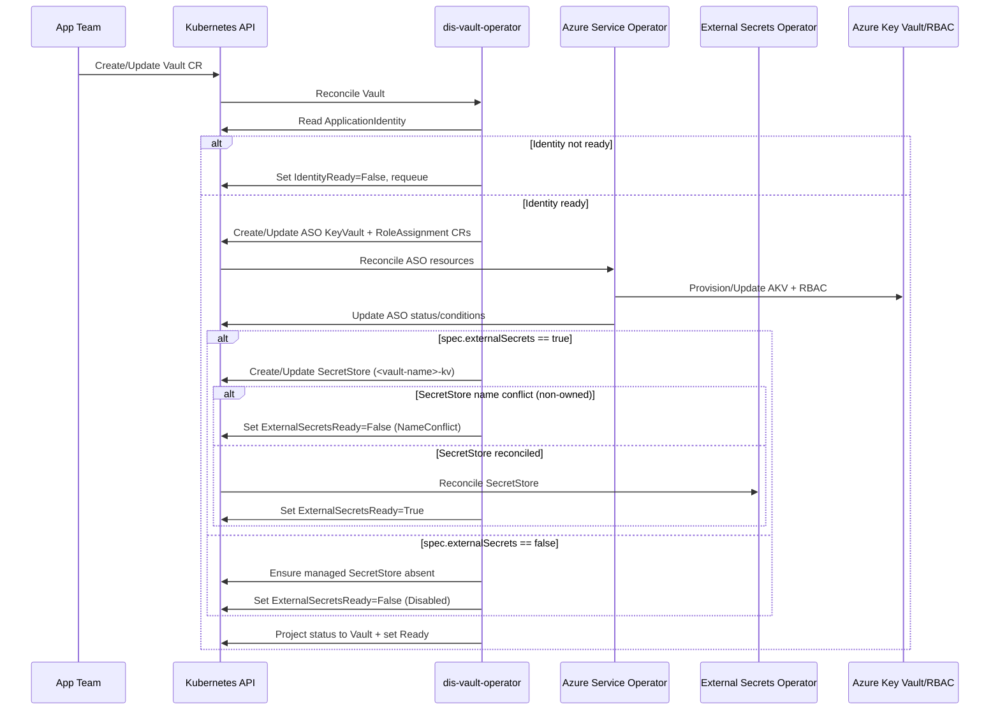

- Feature Name: self_service_key_vault
- Start Date: 2026-03-03
- RFC PR: [altinn/altinn-platform#0009](https://github.com/Altinn/altinn-platform/pull/0009)
- Github Issue: [altinn/altinn-platform#0009](https://github.com/Altinn/altinn-platform/issues/0009)
- Product/Category: Container Runtime
- State: **REVIEW** (possible states are: **REVIEW**, **ACCEPTED** and **REJECTED**)

# Summary

This RFC proposes a new Kubernetes operator, `dis-vault-operator`, that provides self-service Azure Key Vault (AKV) provisioning for DIS applications. App teams declare a `Vault` custom resource in Kubernetes, and the operator reconciles it into Azure resources through Azure Service Operator (ASO). The proposal is opinionated: one vault per app per environment, non-multitenant assumptions, Azure RBAC authorization, and strict subnet-based network allowlisting. The `Vault` API also optionally enables External Secrets integration via `spec.externalSecrets`.

# Motivation

Today, AKV provisioning and access setup is often handled manually or through scattered infrastructure workflows. This leads to:
- Platform-team bottlenecks.
- Inconsistent security defaults.
- Slow lead time for app onboarding.
- Drift between intended and actual cloud configuration.

We want the same self-service, declarative pattern we are establishing with other DIS operators:
- App teams request capability through a CR.
- Operator enforces platform defaults and guardrails.
- ASO performs Azure resource provisioning.
- Status and readiness are visible in Kubernetes.

# Guide-level explanation

An app team that needs a vault creates a `Vault` resource in its namespace and references its owning `ApplicationIdentity`:

```yaml
apiVersion: vault.dis.altinn.cloud/v1alpha1
kind: Vault
metadata:
  name: my-app-vault
spec:
  identityRef:
    name: my-app-identity
  externalSecrets: true
  sku: standard
  softDeleteRetentionDays: 90
  purgeProtectionEnabled: true
  tags:
    app: my-app
    env: prod
```

The operator then:
1. Resolves the referenced `ApplicationIdentity`.
2. Waits until identity is ready and has a `principalId`.
3. Creates/reconciles AKV via ASO.
4. Creates/reconciles a role assignment granting the identity data-plane access.
5. If `spec.externalSecrets=true`, creates/reconciles a namespaced `SecretStore` named `<vault-name>-kv`.
6. If `spec.externalSecrets=false`, ensures any previously managed `SecretStore` for that `Vault` is removed.
7. Publishes readiness and resulting values (resource ID, vault URI, and external secrets integration readiness) in `status`.

Teams should think of vaults as app owned, environment scoped resources managed declaratively in GitOps, not manually in Azure.
Teams that want synchronized Kubernetes secrets then define `ExternalSecret` resources targeting the managed `SecretStore`.

## Security and network defaults in v1

The platform requirement is subnet-based allowlisting when supported. [For Key Vault this means firewall mode](https://learn.microsoft.com/en-us/azure/key-vault/general/secure-key-vault#network-security):
- `publicNetworkAccess=Enabled` (required for subnet allowlisting path in this RFC).
- `networkAcls.defaultAction=Deny`.
- `networkAcls.bypass=None` by default.
- `networkAcls.virtualNetworkRules` set from operator-configured AKS subnet IDs.

This creates a default-deny posture with explicit network allowlist.

# Reference-level explanation

## CRD contract

### Potential Spec (v1)
- `identityRef.name` (required): same-namespace reference to `ApplicationIdentity` from `application.dis.altinn.cloud/v1alpha1`.
- `sku` (optional): `standard|premium`, default `standard`.
- `publicNetworkAccess` (optional field but constrained to `Enabled` in v1 policy).
- `softDeleteRetentionDays` (optional): default `90`, range `7..90`.
- `purgeProtectionEnabled` (optional): default `true`.
- `tags` (optional): additional tags.
- `externalSecrets` (optional `boolean`, default `false`): enables operator-managed namespaced `SecretStore` for this vault.

### Potential Status (v1)
- `conditions[]`:
  - `Ready`
  - `IdentityReady`
  - `VaultReady`
  - `RoleAssignmentReady`
  - `NetworkPolicyReady`
  - `ExternalSecretsReady`
- `azureName`
- `resourceId`
- `vaultUri`
- `ownerPrincipalId`
- `ownerRoleAssignmentId`
- `externalSecretStoreName`
- `observedGeneration`

### Simplified CRD example

```yaml
apiVersion: apiextensions.k8s.io/v1
kind: CustomResourceDefinition
metadata:
  name: vaults.vault.dis.altinn.cloud
spec:
  group: vault.dis.altinn.cloud
  names:
    kind: Vault
    plural: vaults
    singular: vault
  scope: Namespaced
  versions:
    - name: v1alpha1
      served: true
      storage: true
      schema:
        openAPIV3Schema:
          type: object
          properties:
            spec:
              type: object
              required:
                - identityRef
              properties:
                identityRef:
                  type: object
                  required:
                    - name
                  properties:
                    name:
                      type: string
                externalSecrets:
                  type: boolean
                  default: false
                sku:
                  type: string
                  enum: ["standard", "premium"]
                publicNetworkAccess:
                  type: string
                  enum: ["Enabled"]
                softDeleteRetentionDays:
                  type: integer
                  minimum: 7
                  maximum: 90
                purgeProtectionEnabled:
                  type: boolean
                tags:
                  type: object
                  additionalProperties:
                    type: string
            status:
              type: object
              properties:
                conditions:
                  type: array
                resourceId:
                  type: string
                vaultUri:
                  type: string
                externalSecretStoreName:
                  type: string
```

## ASO resources and mapping

### Key Vault
- Resource: `keyvault.v1api20230701.Vault`
- Key fields set by operator:
  - `properties.enableRbacAuthorization=true`
  - `properties.publicNetworkAccess=Enabled`
  - `properties.networkAcls.defaultAction=Deny`
  - `properties.networkAcls.bypass=None`
  - `properties.networkAcls.virtualNetworkRules=<AKS subnet ARM IDs>`
  - `properties.tenantId=<operator config>`
  - `properties.softDeleteRetentionInDays`
  - `properties.enablePurgeProtection`
  - `properties.sku`

### Role assignment
- Resource: `authorization.v1api20220401.RoleAssignment`
- Owner: the Key Vault resource (extension resource).
- Key fields:
  - `principalId` from `ApplicationIdentity.status.principalId`
  - `principalType=ServicePrincipal`
  - `roleDefinitionReference.wellKnownName=Key Vault Secrets Officer`

## Reconciliation flow



### External Secrets integration contract
- `externalSecrets` is optional and defaults to `false`.
- When enabled, operator-managed `SecretStore` scope is namespaced only in v1.
- Managed `SecretStore` name is deterministic: `<vault-name>-kv`.
- `SecretStore` auth is derived from the vault owner identity (`spec.identityRef.name`) using workload identity.
- If `<vault-name>-kv` already exists and is not operator-managed for that `Vault`, the operator sets `ExternalSecretsReady=False` with reason `NameConflict` and does not overwrite it.
- Teams define `ExternalSecret` resources themselves and target the managed `SecretStore`.

## Naming strategy

AKV names are globally unique and constrained. The operator generates deterministic Azure names using app and environment inputs with a stable hash suffix:
- Avoids collisions.
- Keeps names stable across reconciles.
- Removes manual naming burden for app teams.
The same was done in dis-pgsql.

## Operator's configuration

Required operator env:
- `DISVAULT_AZURE_SUBSCRIPTION_ID`
- `DISVAULT_RESOURCE_GROUP`
- `DISVAULT_AZURE_TENANT_ID`
- `DISVAULT_LOCATION` (might no be needed per our default)
- `DISVAULT_ENV`
- `DISVAULT_AKS_SUBNET_IDS` (might be an array)

Startup validation fails fast on missing/invalid required values as usual.

## Compatibility and migration

- No direct migration impact for existing workloads because this introduces a new CRD/operator path.
- Teams adopting this model move from Terraform-based AKV provisioning to declarative `Vault` resources.
- `spec.externalSecrets` defaults to `false`, so existing users keep current behavior without automatic `SecretStore` management.

## Acceptance scenarios (RFC intent)

1. `externalSecrets` omitted is treated as disabled (`false`).
2. `externalSecrets=true` results in an operator-managed namespaced `SecretStore`.
3. Toggling `externalSecrets` from `true` to `false` removes the managed `SecretStore`.
4. If a non-owned `SecretStore` with the expected name already exists, reconciliation sets `ExternalSecretsReady=False` (`NameConflict`) and does not take ownership.
5. Vault provisioning and readiness behavior remain unchanged when `externalSecrets=false`.

## Assumptions and defaults for this RFC update

- This change only updates the RFC text.
- No implementation changes are part of this task.
- `SecretStore` scope is namespaced in v1.
- Managed `SecretStore` name defaults to `<vault-name>-kv`.

# Drawbacks

- Adds another platform operator to maintain.
- Depends on ASO API versions and behavior.
- Optional External Secrets integration adds coupling to ESO CRD availability in clusters where `spec.externalSecrets=true` is used.
- Strong defaults can require exceptions for some advanced workloads.
- Misconfigured subnet allowlists can block legitimate traffic until corrected.

# Rationale and alternatives

## Chosen design rationale

The operator + ASO model is consistent with DIS direction:
- Declarative self-service via Kubernetes.
- Reconciliation loop for drift correction.
- Reuse of dis tooling/resources, e.g `ApplicationIdentity`.

## Alternatives considered

### 1. Direct Azure IaC per team (Terraform/Bicep)
- Can create inconsistent guardrails and weaker central policy enforcement.

### 2. Custom Azure SDK reconciler without ASO
- More complicated and more code = more complexity.

### 3. ASO-only (no DIS abstraction)
- Using directly ASO resources is too low level for a desired product experience.

## Impact of not doing this

We keep fragmented AKV provisioning workflows and continue to miss the self-service goal for secure app scoped secrets infrastructure.

# Prior art

Dis related:

- [RFC 0004 - container_runtime_workload_identity](https://github.com/Altinn/altinn-platform/blob/main/rfcs/0004-container-runtime-workload-identity.md) (identity self-service and workload identity contract).
- [RFC 0006 - self_service_postgresql_database](https://github.com/Altinn/altinn-platform/blob/main/rfcs/0006-serlf-service-psql.md) (self-service data-plane resource via DIS operator + ASO).
- `dis-pgsql-operator` implementation patterns:
  - identity resolver
  - watch mapping
  - ASO readiness gating
- `dis-identity-operator` as source of identity lifecycle and status fields.
- Azure Service Operator as the Azure control plane integration.

# Unresolved questions

- Deletion lifecycle: what retention and recovery behavior should we enforce when a `Vault` CR is deleted?
- Should we expose role override(s) per vault in a future API version?
- Should the private endpoint mode be introduced in some point?
- Do we need a policy channel for trusted Microsoft services bypass as an explicit exception path?

# Future possibilities

- Add private endpoint mode and optionally make it the strict default in a later version.
- Add per vault network override policy with guardrails.
- Support additional vault managed resources (e.g certificates).
- Add policy integration (Kyverno, CEL, azure policies?) for compliance checks (tagging, naming, soft delete, purge protection).
- Support/migrate to [Secrets Store CSI Driver providers](https://secrets-store-csi-driver.sigs.k8s.io/providers/) as an alternative consumption path that could possibly remove the need for ESO.
