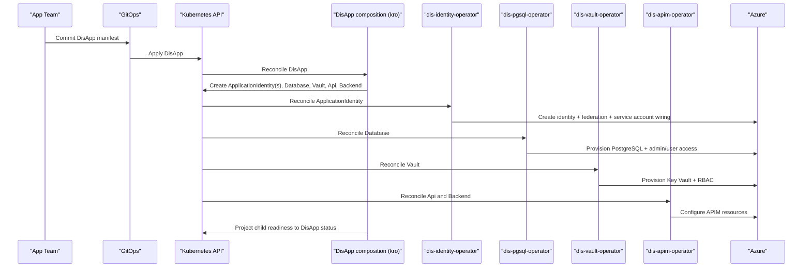

- Feature Name: dis_app_api
- Start Date: 2026-03-25
- RFC PR: [altinn/altinn-platform#0010](https://github.com/Altinn/altinn-platform/pull/0010)
- Github Issue: [altinn/altinn-platform#0010](https://github.com/Altinn/altinn-platform/issues/0010)
- Product/Category: Container Runtime
- State: **REVIEW** (possible states are: **REVIEW**, **ACCEPTED** and **REJECTED**)

# Summary
[summary]: #summary

This RFC proposes a new self-service `DisApp` API for DIS applications. App teams will define one Kubernetes manifest that describes the app and the platform capabilities it needs. Every `DisApp` will always create an application identity through `dis-identity-operator`, and in v1 it can additionally compose the patterns we already use in the monorepo for `Database`, `Vault`, and `dis-apim`. The existing DIS operators remain the systems of record for infrastructure provisioning and reconciliation. `dis-cache` and `dis-bus` can be added later as additional capability blocks. kro is proposed as the implementation mechanism for this API, not as the product that app teams consume.

# Motivation
[motivation]: #motivation

We are steadily adding self-service operators to DIS. That is good for platform consistency, but it also means app teams will need to understand and maintain more manifests over time.

Today, an app that needs identity, PostgreSQL, Key Vault, and APIM must reason about multiple CRDs and how they relate to each other:
- `ApplicationIdentity` creates a managed identity, federated credential, and service account.
- `Database` expects both user and admin identity inputs.
- `Vault` expects an `ApplicationIdentity` reference.
- `Api` and `Backend` define APIM configuration and are reconciled separately by `dis-apim-operator`.

This already creates repeated boilerplate, and the problem will grow when `dis-cache` and `dis-bus` arrive.

We want to offer a clearer application-facing framework:
- One manifest per app.
- One default app identity per app.
- Platform-owned defaults and naming.
- Reuse of the operators we already have instead of replacing them.
- A model that is extensible as more DIS capabilities are introduced.

The expected outcome is a clearer golden path for app teams: declare the app and the capabilities it needs through one stable `DisApp` API, while the platform owns how those capabilities are wired together behind that API.

# Guide-level explanation
[guide-level-explanation]: #guide-level-explanation

An app team creates one `DisApp` resource in its namespace:

```yaml
apiVersion: application.dis.altinn.cloud/v1alpha1
kind: DisApp
metadata:
  name: my-app
spec:
  database:
    version: 17
    serverType: prod
    storage:
      sizeGB: 128
      tier: P10
  vault:
    sku: standard
  apim:
    backends:
      - name: my-app
        title: my-app
        url: https://my-app.apps.example.no
    apis:
      - name: my-api
        displayName: My API
        path: my-api
        versions:
          - name: v1
            displayName: v1
            serviceUrl: https://my-app.apps.example.no
            contentFormat: swagger-link-json
            content: https://my-app.apps.example.no/swagger/v1/swagger.json
```

From that single manifest, the platform always creates the base app identity and then adds optional capabilities:
- `ApplicationIdentity/my-app`
- `ApplicationIdentity/my-app-db-admin` when `spec.database` is present
- `Database/my-app`
- `Vault/my-app` when `spec.vault` is present
- one `Backend` resource per `spec.apim.backends[]`
- one `Api` resource per `spec.apim.apis[]`

The current DIS operators then continue to do their normal work:
- `dis-identity-operator` creates the managed identity, federated credential, and same-name service account.
- `dis-pgsql-operator` provisions PostgreSQL and wires admin/user access.
- `dis-vault-operator` provisions Key Vault and grants the app identity access.
- `dis-apim-operator` reconciles the generated `Backend` and `Api` resources into APIM, and continues to manage `ApiVersion` as a child concern of `Api`.

This means `DisApp` is not a replacement for the existing operators. It is the user-facing API on top of them.

For app teams, the mental model becomes:
- `DisApp` is the main entry point.
- `DisApp` always gives the app an identity and service account through `dis-identity-operator`.
- Platform defaults are applied automatically.
- Existing child resources still exist and can be inspected with normal Kubernetes tooling.
- Teams with advanced needs can still choose raw `Database`, `Vault`, `Api`, or `Backend` manifests until the `DisApp` API grows to cover those cases.

# Reference-level explanation
[reference-level-explanation]: #reference-level-explanation

## Proposed API

This RFC proposes a platform-managed `DisApp` API backed by a `ResourceGraphDefinition`.

Suggested generated API:
- Group: `application.dis.altinn.cloud`
- Version: `v1alpha1`
- Kind: `DisApp`

Suggested v1 spec:
- `spec.database` optional block. If present, a managed PostgreSQL database is requested.
- `spec.database.version` PostgreSQL major version.
- `spec.database.serverType` existing `Database.spec.serverType` value.
- `spec.database.storage.sizeGB` optional.
- `spec.database.storage.tier` optional.
- `spec.database.highAvailabilityEnabled` optional.
- `spec.database.backupRetentionDays` optional.
- `spec.database.enableExtensions` optional curated list.
- `spec.vault` optional block. If present, a managed Key Vault is requested.
- `spec.vault.sku` optional, default `standard`.
- `spec.vault.softDeleteRetentionDays` optional, default `90`.
- `spec.vault.purgeProtectionEnabled` optional, default `true`.
- `spec.apim` optional block. If present, APIM resources are requested for the app.
- `spec.apim.backends[]` optional list mapped closely to `Backend.spec`.
- `spec.apim.backends[].name` required logical name used as `Backend.metadata.name`.
- `spec.apim.apis[]` optional list mapped closely to `Api.spec`.
- `spec.apim.apis[].name` required logical name used as `Api.metadata.name`.
- `spec.apim.apis[].versions[]` mapped closely to the existing inline API version model already used by `Api.spec.versions`.

Suggested v1 status:
- `status.appIdentityName`
- `status.databaseAdminIdentityName`
- `status.databaseName`
- `status.vaultName`
- `status.identityReady`
- `status.databaseReady`
- `status.vaultReady`
- `status.apimReady`
- `status.ready`

## Resource mapping

`DisApp` should create resources in the same namespace as the parent object.

### Identity

Always create:
- `ApplicationIdentity/<disapp-name>`

This matches the current `dis-identity-operator` model, where an `ApplicationIdentity` also creates:
- a user-assigned managed identity in Azure
- a federated identity credential
- a same-name Kubernetes `ServiceAccount`

This is a core rule of the API, not an optional capability. Every `DisApp` should start with this base identity so all apps follow the same workload identity model, even before they request database, vault, cache, or bus.

### Database

When `spec.database` is present, create:
- `ApplicationIdentity/<disapp-name>-db-admin`
- `Database/<disapp-name>`

The generated `Database` should map to the current contract in `services/dis-pgsql-operator/api/v1alpha1/database_types.go`:
- `spec.auth.user.identity.identityRef.name = <disapp-name>`
- `spec.auth.admin.identity.identityRef.name = <disapp-name>-db-admin`
- `spec.auth.admin.serviceAccountName = <disapp-name>-db-admin`

This is important because the current database operator provisions the normal DB user through a Job that runs with the admin identity's service account.

### Vault

When `spec.vault` is present, create:
- `Vault/<disapp-name>`

The generated `Vault` should map to the current contract in `services/dis-vault-operator/api/v1alpha1/vault_types.go`:
- `spec.identityRef.name = <disapp-name>`

This matches the current vault operator pattern, where vault access is granted to an `ApplicationIdentity` in the same namespace.

### APIM

When `spec.apim` is present, create:
- one `Backend` resource per `spec.apim.backends[]`
- one `Api` resource per `spec.apim.apis[]`

The generated resources should map closely to the current `dis-apim` contracts:
- `spec.apim.backends[]` maps to `services/dis-apim-operator/api/v1alpha1/backend_types.go`
- `spec.apim.apis[]` maps to `services/dis-apim-operator/api/v1alpha1/api_types.go`
- `spec.apim.apis[].versions[]` maps to the current inline version shape in `Api.spec.versions`, which is based on `ApiVersionSubSpec`

`DisApp` should not generate `ApiVersion` resources directly. The existing `Api` controller already owns that split and keeps `ApiVersion` synchronized from `Api.spec.versions`.

## Proposed implementation

The current proposal is that the platform uses kro to implement this API and installs:
- the kro controller
- one platform-owned `ResourceGraphDefinition` (RGD) for `DisApp`
- more RGDs can be defined later if needed

That `ResourceGraphDefinition` defines:
- the `DisApp` schema
- the child resources to create
- the dependency wiring between resources
- the projected status fields

Simplified shape:

```yaml
apiVersion: kro.run/v1alpha1
kind: ResourceGraphDefinition
metadata:
  name: disapp.application.dis.altinn.cloud
spec:
  schema:
    apiVersion: v1alpha1
    kind: DisApp
    spec:
      database:
        version: integer
      vault:
        sku: string
      apim:
        backends: []
        apis: []
    status:
      ready: ${...}
  resources:
    - id: appIdentity
      template:
        apiVersion: application.dis.altinn.cloud/v1alpha1
        kind: ApplicationIdentity
        metadata:
          name: ${schema.metadata.name}
    - id: dbAdminIdentity
      includeWhen:
        - ${has(schema.spec.database)}
      template:
        apiVersion: application.dis.altinn.cloud/v1alpha1
        kind: ApplicationIdentity
        metadata:
          name: ${schema.metadata.name + '-db-admin'}
    - id: database
      includeWhen:
        - ${has(schema.spec.database)}
      template:
        apiVersion: storage.dis.altinn.cloud/v1alpha1
        kind: Database
    - id: vault
      includeWhen:
        - ${has(schema.spec.vault)}
      template:
        apiVersion: vault.dis.altinn.cloud/v1alpha1
        kind: Vault
    - id: apimBackends
      forEach:
        - backend: ${schema.spec.apim.backends}
      template:
        apiVersion: apim.dis.altinn.cloud/v1alpha1
        kind: Backend
        metadata:
          name: ${backend.name}
    - id: apimApis
      forEach:
        - api: ${schema.spec.apim.apis}
      template:
        apiVersion: apim.dis.altinn.cloud/v1alpha1
        kind: Api
        metadata:
          name: ${api.name}
```

The important part is not the exact YAML above, but the execution model:
- kro owns the composed Kubernetes resources.
- the DIS operators own the external cloud reconciliation for those resources.
- `DisApp` stays a thin orchestration layer, not a new Azure control-plane implementation.
- Collections allow the API to create zero, one, or many APIM `Backend` and `Api` resources from one app manifest.

## Reconciliation flow



## Compatibility and rollout

This RFC does not replace the existing CRDs.

Instead:
- Existing operators and CRDs stay supported.
- `DisApp` becomes the preferred entry point for common cases.
- Raw `ApplicationIdentity`, `Database`, `Vault`, `Api`, and `Backend` manifests remain the escape hatch for advanced scenarios.

Rollout should happen in this order:
1. Install kro in a non-production cluster.
2. Ship the `DisApp` `ResourceGraphDefinition`.
3. Validate that generated child resources match the existing operator contracts.
4. Onboard one or two apps using `DisApp`.
5. Expand the API only after the defaults and status shape have proven stable.

# Drawbacks
[drawbacks]: #drawbacks

- This adds a composition runtime dependency in the platform, with kro as the current proposal.
- `DisApp` adds another abstraction layer, which can hide the details of the child CRs if the documentation is poor.
- Debugging now spans multiple reconcilers: the composition layer plus the underlying DIS operators.
- The APIM part of the API is less opinionated than database and vault, so `DisApp` may need to expose more fields there than in other capability blocks.

# Rationale and alternatives
[rationale-and-alternatives]: #rationale-and-alternatives

Why this design is the best fit now:
- It gives app teams a stable `DisApp` API instead of exposing more platform wiring over time.
- It reuses the operators we already have instead of introducing another custom controller.
- It keeps the child CRDs and their reconciliation logic intact.
- It brings the existing DIS capabilities under one top-level app manifest now, including APIM.
- It gives us a stable place to add `dis-cache` and `dis-bus` later.
- It keeps the end-user API small and opinionated.

Alternatives considered:

- Continue with raw per-operator manifests only.
  - This keeps the platform simple, but pushes increasing wiring complexity onto every app team.
- Build a new `dis-app-operator` in Go.
  - This gives full control, but duplicates orchestration logic that kro already provides and increases long-term maintenance cost.
- Use Helm or Kustomize as the composition layer.
  - This helps with templating, but it does not create a first-class Kubernetes API with status and reconciliation.
- Use Crossplane compositions.
  - Crossplane solves a similar problem, but we already have operator investments and patterns built around our existing CRDs.

Impact of not doing this:
- Every new DIS operator will add another manifest and another set of wiring rules for app teams to learn.
- We will make self-service available, but not simple.

# Prior art
[prior-art]: #prior-art

- The existing DIS operator pattern in this repository is the primary prior art for this RFC:
  - [RFC 0006 - Self service PostgreSQL](./0006-serlf-service-psql.md)
  - [RFC 0009 - Self-service Key Vault](./0009-self-service-key-vault.md)
  - [RFC 0003 - Operator managed APIM config](./0003-operator-managed-apim-config.md)
  - `dis-identity-operator`, which already creates the identity, federation, and service account pattern that both database and vault depend on.
- [kro overview](https://kro.run/docs/overview) is relevant implementation prior art because it supports defining one Kubernetes API and composing multiple underlying resources with schema defaults and CEL-based wiring.


# Unresolved questions
[unresolved-questions]: #unresolved-questions

- Should the generated API be `DisApp`, `App`, or something else?
- How much of the underlying `Database`, `Vault`, and APIM specs should be exposed in v1, and what should stay out of scope?
- Should `DisApp.status` start with simple readiness fields, or should we model full Kubernetes conditions from day one?
- How opinionated should the APIM block be around policies, products, and backend references?
- What deletion guarantees do we want to document for stateful resources created through `DisApp`, especially for databases?

# Future possibilities
[future-possibilities]: #future-possibilities

- Add `cache` and `bus` capability blocks when `dis-cache` and `dis-bus` have stable CRDs.
- Tighten the APIM part of the API with more defaults.
- Generate starter documentation or `disctl/dis` scaffolding from the `DisApp` schema.
- Offer a few platform-owned presets for common workloads, while keeping raw CRs available for teams that need full control.
