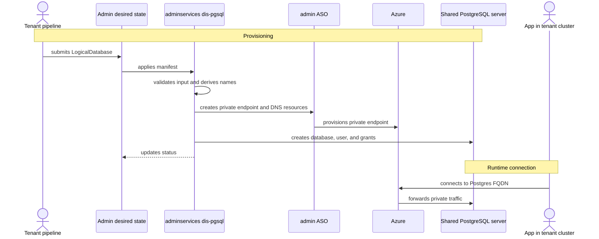

- Feature Name: multitenant_dis_databases
- Title: Multitenant DIS databases
- Start Date: 2026-04-29
- RFC PR: [altinn/altinn-platform#0000](https://github.com/altinn/altinn-platform/pull/0000)
- Github Issue: [altinn/altinn-platform#0000](https://github.com/altinn/altinn-platform/issues/0000)
- Product/Category: Container Runtime
- State: **REVIEW** (possible states are: **REVIEW**, **ACCEPTED** and **REJECTED**)

# Summary
[summary]: #summary

Add a `LogicalDatabase` resource to `dis-pgsql-operator`.

`Database` keeps its current ownership model: one resource creates one dedicated Azure PostgreSQL Flexible Server.

The `Database` CRD will likely need a new Private Link network mode. That mode is for dedicated servers.

`LogicalDatabase` means one database inside a shared PostgreSQL Flexible Server. It is reconciled by `dis-pgsql` in adminservices and can be used by any tenant or system that needs a database on a shared server.

# Motivation
[motivation]: #motivation

Some systems do not need one PostgreSQL server each. They need one shared server per environment and one logical database per tenant.

The current `Database` API creates full servers using delegated subnets. That is still useful, but too heavy for shared multitenant cases.

We need a second API that keeps shared server ownership central, while still making tenant databases declarative.

# Guide-level explanation
[guide-level-explanation]: #guide-level-explanation

The platform has two database APIs:

- `Database`: creates a dedicated PostgreSQL Flexible Server.
- `LogicalDatabase`: creates one database inside a shared PostgreSQL Flexible Server.

`Database` should support both existing delegated-subnet networking and a new Private Link mode for dedicated servers.

`LogicalDatabase` is the multitenant API. It creates a database inside an admin-owned shared server.

The shared server is fixed admin infrastructure. In v1 it is expected to be created by admin Terraform or equivalent admin automation. Server-level settings such as SKU, storage, backup, HA, PgBouncer, and tags belong to the shared server, not to each logical database.



Example:

```yaml
apiVersion: storage.dis.altinn.cloud/v1alpha1
kind: LogicalDatabase
metadata:
  name: tenant123-dev-app-db
spec:
  databaseKey: app-db
  tenant:
    id: tenant123
    environment: dev
  access:
    identity:
      name: my-app-tenant123-dev
      principalId: "<entra-object-id>"
  privateLink:
    subscriptionId: "<tenant-subscription-id>"
    resourceGroupName: "<tenant-resource-group>"
    vnetName: "<tenant-aks-vnet>"
    subnetName: "<private-endpoint-subnet>"
  deletionPolicy: Retain
```

The resource is generic. It uses `tenant.id`, not any product, system, or organization-specific term.

The `LogicalDatabase` manifest may be delivered to adminservices by GitOps, `azapi`, or another onboarding flow. That delivery flow is out of scope here.

When `dis-pgsql` reconciles it, it:

1. derives the target shared server from admin config
2. validates tenant Azure values
3. creates Private Link and DNS resources
4. creates the PostgreSQL database
5. creates or maps the Entra principal and grants access
6. writes status

# Reference-level explanation
[reference-level-explanation]: #reference-level-explanation

## API

`LogicalDatabase` is a new namespaced resource in `storage.dis.altinn.cloud`.

This RFC also expects a small `Database` CRD change:

- keep delegated-subnet networking as the default
- add Private Link networking for dedicated servers
- do not add shared-server fields to `Database`

Important spec fields:

- `databaseKey`: short database purpose.
- `tenant.id`: stable tenant id.
- `tenant.environment`: environment.
- `access.identity`: Entra principal name and object id.
- `privateLink`: tenant subscription, resource group, VNet, and subnet.
- `deletionPolicy`: defaults to `Retain`.

Status should include:

- `databaseName`
- `host`
- `port`
- `privateEndpointId`
- `privateEndpointPrivateIp`
- conditions: `Ready`, `PrivateLinkReady`, `DatabaseReady`, `AccessReady`
- `observedGeneration`
- validation errors

## Reconciliation

`dis-pgsql` must not trust admin-side values from the request.

The request may describe tenant-side network and identity data. The operator derives the shared server, database name, private endpoint name, DNS resources, and ASO resource names.

The operator creates or updates:

- ASO private endpoint resources
- ASO private DNS integration
- ASO PostgreSQL database resource
- a Postgres provisioning job for Entra user and grants

The existing direct Postgres provisioning pattern should be reused and extended.

## Networking

`LogicalDatabase` uses Private Link. This is different from the current dedicated-server path, which uses delegated subnets and VNet integration.

Private Link gives the tenant VNet a private endpoint to the shared server. It only handles network reachability. Entra auth and PostgreSQL grants still decide who can log in and what they can access.

The existing `Database` API should also get a Private Link network mode. In that case, it is still for dedicated servers only.

## Deletion

`deletionPolicy` defaults to `Retain`.

Deleting the Kubernetes resource must not drop the database or delete private connectivity by default. Destructive cleanup needs explicit opt-in.

## Existing Database

`Database` keeps the current dedicated-server behavior as the default. A new Private Link option can be added for dedicated servers that should use private endpoints instead of delegated subnets.

Both APIs can exist side by side:

- `Database`: dedicated server
- `LogicalDatabase`: database inside admin-owned shared server

# Drawbacks
[drawbacks]: #drawbacks

- Admin `dis-pgsql` and ASO need broader Azure permissions.
- Shared servers need capacity planning and tenant isolation discipline.
- Backup, HA, PgBouncer, and failover are server-level decisions.
- Per-tenant restore and cleanup are harder than deleting a dedicated server.

# Rationale and alternatives
[rationale-and-alternatives]: #rationale-and-alternatives

This keeps the existing `Database` API simple and avoids adding a confusing multitenant mode to it.

Alternatives:

- Add a mode to `Database`: rejected because one kind would mean two very different things.
- Use Terraform for every logical database: possible, but poor for Postgres grants and live status?
- Let "tenant" clusters create shared databases directly: possible, but spreads shared-server authority too widely.
- Keep one server per tenant: simplest isolation, but too costly and heavy for shared-server use cases.

# Prior art
[prior-art]: #prior-art

- RFC 0006 introduced the dedicated PostgreSQL self-service model.
- The current operator already manages ASO PostgreSQL resources, DNS, server parameters, Entra admin, and Postgres grants.
- RFC 0012 describes the admin GitOps direction for platform components.
- ASO already supports Azure PostgreSQL and network resources.

# Unresolved questions
[unresolved-questions]: #unresolved-questions

- Which ASO API versions should be used for Private Endpoint, DNS integration, and PostgreSQL databases?
- What is the minimum Azure RBAC needed for admin ASO?
- Which tenant-side fields are required for safe validation?
- Should status be copied back to workload clusters and how?
- What is the long-term cleanup process for retained databases and private endpoints?
- What are the shared server profiles for tenant count, PgBouncer, HA, backup, and storage?

# Future possibilities
[future-possibilities]: #future-possibilities

- Have a shared state, probably admin gets its own DIS db.
- Add approved deletion flows.
- Sync connection metadata back to workload clusters.
