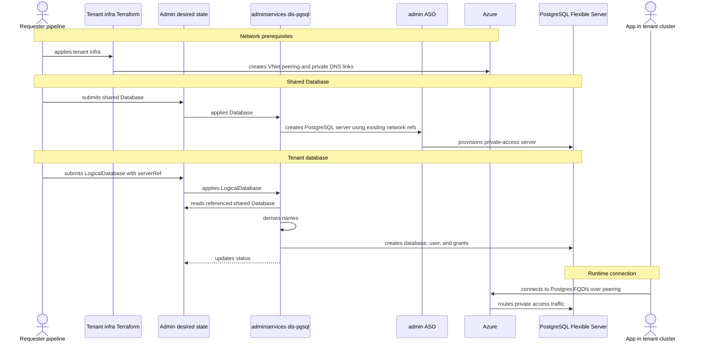

- Feature Name: multitenant_dis_databases
- Title: Multitenant DIS databases
- Start Date: 2026-04-29
- RFC PR: [altinn/altinn-platform#0000](https://github.com/altinn/altinn-platform/pull/0000)
- Github Issue: [altinn/altinn-platform#0000](https://github.com/altinn/altinn-platform/issues/0000)
- Product/Category: Container Runtime
- State: **REVIEW** (possible states are: **REVIEW**, **ACCEPTED** and **REJECTED**)

# Summary
[summary]: #summary

Add a `LogicalDatabase` resource to `dis-pgsql-operator`.

`Database` remains the server API: one resource creates one Azure PostgreSQL Flexible Server.

The `Database` CRD needs to support a shared mode that uses existing private access network prerequisites.

`LogicalDatabase` means one database inside a shared `Database`. It is reconciled by `dis-pgsql` in adminservices and can be used by any tenant or system that needs a database on a shared PostgreSQL Flexible Server.

# Motivation
[motivation]: #motivation

Some systems do not need one PostgreSQL server each. They need shared PostgreSQL servers that can host one logical database per tenant.

The current `Database` API creates full servers using delegated subnets. That is still useful, but it needs a shared mode for multitenant cases.

We need a second API that keeps server ownership central, while still making tenant databases declarative.

# Guide-level explanation
[guide-level-explanation]: #guide-level-explanation

The platform has two database APIs:

- `Database`: creates a PostgreSQL Flexible Server.
- `LogicalDatabase`: creates one database inside a shared `Database`.

`Database` should support the current dedicated mode and a new shared mode. Shared `Database` networking does not belong to each `LogicalDatabase`.

`LogicalDatabase` is the tenant database API. It creates a database inside a shared `Database` selected by `spec.serverRef.name`.

A shared `Database` runs in admin infrastructure and is managed from admin desired state, for example syncroot. The team or requester that needs the shared database service owns that desired state. Server-level settings such as SKU, storage, backup, HA, PgBouncer, and tags belong to the shared `Database`, not to each logical database.

A deployment may start with one shared `Database` for a use case or environment, but this is not an operator constraint. `dis-pgsql` reconciles named `Database` resources, and multiple shared `Database` resources may exist in the same adminservices cluster, including the same namespace.

The v1 multitenant path should stay close to the current private access model. It reuses existing network prerequisites created outside `dis-pgsql`, such as VNet peering, private DNS zones, and private DNS zone links between tenant AKS VNets and the admin multitenant DBs VNet.



Example:

```yaml
apiVersion: storage.dis.altinn.cloud/v1alpha1
kind: LogicalDatabase
metadata:
  name: tenant123-dev-app-db
spec:
  serverRef:
    name: shared-postgres-dev
  databaseKey: app-db
  tenant:
    id: tenant123
    environment: dev
  access:
    identity:
      name: my-app-tenant123-dev
      principalId: "<entra-object-id>"
  deletionPolicy: Retain
```

The resource is generic. It uses `tenant.id`, not any product, system, or organization-specific term.

The `LogicalDatabase` manifest may be delivered to adminservices by GitOps, `azapi`, or another onboarding flow. That delivery flow is out of scope here.

When `dis-pgsql` reconciles it, it:

1. reads `spec.serverRef.name`
2. validates that it points to a shared `Database` in the same namespace
3. validates tenant and identity values
4. creates the PostgreSQL database
5. creates or maps the Entra principal and grants access
6. writes status

# Reference-level explanation
[reference-level-explanation]: #reference-level-explanation

## API

`LogicalDatabase` is a new namespaced resource in `storage.dis.altinn.cloud`.

This RFC also expects `Database` CRD changes:

- keep delegated-subnet networking as the default
- add an explicit shared mode
- make shared mode consume existing private access network references
- do not add tenant database fields to `Database`

Important spec fields:

- `serverRef.name`: same-namespace shared `Database`.
- `databaseKey`: short database purpose.
- `tenant.id`: stable tenant id.
- `tenant.environment`: environment.
- `access.identity`: Entra principal name and object id.
- `deletionPolicy`: defaults to `Retain`.

Status should include:

- `databaseName`
- `host`
- `port`
- conditions: `Ready`, `DatabaseReady`, `AccessReady`
- `observedGeneration`
- validation errors

## Reconciliation

`dis-pgsql` must not trust admin-side values from the request.

For a shared `Database`, `dis-pgsql` creates and updates the PostgreSQL Flexible Server through ASO using existing private access network references. It manages server settings, tags, Entra admin, parameters, and status.

It does not create tenant VNet peering or private DNS links in v1.

For a `LogicalDatabase`, the request describes the logical database and identity access. The operator resolves the same-namespace `serverRef` and derives the database name.

The operator creates or updates:

- ASO PostgreSQL database resource
- a Postgres provisioning job for Entra user and grants

The existing direct Postgres provisioning pattern should be reused and extended.

## Networking

`LogicalDatabase` does not create network resources.

Shared `Database` networking uses private access with VNet integration in v1.

The PostgreSQL Flexible Server is created in a delegated subnet in an admin multitenant DBs VNet. Tenant AKS VNets reach it through VNet peering or the existing platform network. Private DNS zone links let workloads resolve the PostgreSQL FQDN to the server private address.

`dis-pgsql` does not create the peering or private DNS links for this mode. Those are tenant infrastructure prerequisites and can stay in Terraform or equivalent automation.

This is closest to the current `dis-pgsql` model. It also avoids one private endpoint per tenant or per logical database.

The shared `Database` should reference or be configured with the existing delegated subnet and private DNS zone needed by Azure PostgreSQL Flexible Server private access.

Operator-managed peering or DNS links can be considered later for tenants that do not use the current infrastructure pipelines.

Server-level Private Endpoint remains an alternative.

A shared private endpoint in the admin multitenant DBs VNet could be added later if the platform chooses that model. It still should not create one private endpoint per `LogicalDatabase`.

In both models, network reachability only decides whether traffic can reach the server. Entra auth and PostgreSQL grants still decide who can log in and what they can access.

## Deletion

`deletionPolicy` defaults to `Retain`.

Deleting a `LogicalDatabase` resource must not drop the database by default. Shared connectivity is an infrastructure prerequisite and is not affected by logical database deletion. Destructive cleanup needs explicit opt-in.

## Existing Database

`Database` keeps the current dedicated behavior as the default. A new shared mode can be added for `Database` resources that host `LogicalDatabase` resources.

A shared `Database` uses existing private access network prerequisites. It does not create network resources per `LogicalDatabase`.

Multiple shared `Database` resources may exist in the same namespace. `LogicalDatabase.spec.serverRef.name` selects the target.

Both APIs can exist side by side:

- `Database`: dedicated or shared PostgreSQL Flexible Server
- `LogicalDatabase`: database inside a shared `Database`

# Drawbacks
[drawbacks]: #drawbacks

- Shared `Database` resources depend on Terraform or equivalent automation creating network prerequisites first.
- Shared `Database` resources need capacity planning and tenant isolation discipline.
- Backup, HA, PgBouncer, and failover are server-level decisions.
- Per-tenant restore and cleanup are harder than deleting a dedicated server.

# Rationale and alternatives
[rationale-and-alternatives]: #rationale-and-alternatives

This keeps `Database` focused on PostgreSQL servers and puts tenant databases in their own resource.

Alternatives:

- Put tenant database fields on `Database`: rejected because one kind would mean two very different things.
- Manage logical databases outside DIS: rejected because this should be a DIS database API.
- Let "tenant" clusters create shared databases directly: possible, but spreads shared `Database` authority too widely.
- Derive the target `Database` from operator config: rejected because the operator must support multiple shared `Database` resources.
- Create private endpoints per logical database: rejected because connectivity is shared `Database` infrastructure.
- Let `dis-pgsql` own tenant VNet peering and private DNS links: possible later, but v1 keeps those prerequisites in Terraform or equivalent infrastructure automation.
- Use one shared Private Endpoint per `Database`: possible later if the platform chooses that connectivity model.
- Keep one server per tenant: simplest isolation, but too costly and heavy for multitenant use cases.

# Prior art
[prior-art]: #prior-art

- RFC 0006 introduced the dedicated PostgreSQL self-service model.
- The current operator already manages ASO PostgreSQL resources, DNS, server parameters, Entra admin, and Postgres grants.
- RFC 0012 describes the admin GitOps direction for platform components.
- CloudNativePG uses `Cluster` for the PostgreSQL cluster and `Database` for databases inside it. DIS already uses `Database` for the server API, so this RFC uses `LogicalDatabase` for databases inside a shared DIS `Database`.
- ASO already supports Azure PostgreSQL and network resources.

# Unresolved questions
[unresolved-questions]: #unresolved-questions

- Which ASO API versions should be used for shared PostgreSQL Flexible Servers and PostgreSQL databases?
- What is the minimum Azure RBAC needed for admin ASO?
- Which tenant-side fields are required for safe validation?
- Should status be copied back to workload clusters and how?
- What is the long-term cleanup process for retained databases?
- What are the shared `Database` profiles for tenant count, PgBouncer, HA, backup, and storage?

# Future possibilities
[future-possibilities]: #future-possibilities

- Have a shared state, probably admin gets its own DIS db.
- Add approved deletion flows.
- Sync connection metadata back to workload clusters.
