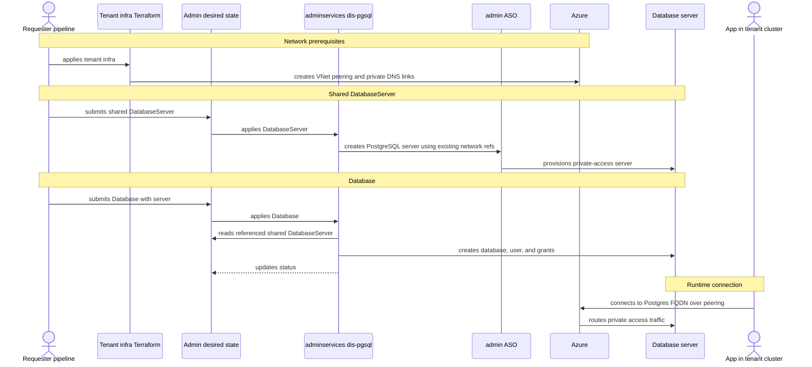

- Feature Name: multitenant_dis_databases
- Title: Multitenant DIS databases
- Start Date: 2026-04-29
- RFC PR: [altinn/altinn-platform#3405](https://github.com/Altinn/altinn-platform/pull/3405)
- Github Issue: [altinn/altinn-platform#3418](https://github.com/Altinn/altinn-platform/issues/3418)
- Product/Category: Container Runtime
- State: **REVIEW** (possible states are: **REVIEW**, **ACCEPTED** and **REJECTED**)

# Summary
[summary]: #summary

Add a `Database` resource to `dis-pgsql-operator`.

`DatabaseServer` is the server API: one resource creates one Azure PostgreSQL
Flexible Server.

The `DatabaseServer` CRD needs to support a shared mode that uses existing
private access network prerequisites.

`Database` means one PostgreSQL database inside a same-namespace
`DatabaseServer`. It is reconciled by `dis-pgsql` in adminservices and can be
used by any product app or system that needs a database on a shared
`DatabaseServer`.

# Motivation
[motivation]: #motivation

Some systems do not need one dedicated `DatabaseServer` each. They need shared
`DatabaseServer` resources that can host one `Database` per app within a
product/environment context.

The current server API creates full servers using delegated subnets. That is
still useful, but it needs a shared mode for multitenant cases.

We need a second API that keeps server ownership central, while still making app databases declarative.

# Guide-level explanation
[guide-level-explanation]: #guide-level-explanation

The platform has two database APIs:

- `DatabaseServer`: creates a database server.
- `Database`: creates one database inside a shared `DatabaseServer`.

`DatabaseServer` should support the current dedicated mode and a new shared
mode. Shared `DatabaseServer` networking does not belong to each `Database`.

`Database` is the app database API. It creates a database inside a shared
`DatabaseServer` selected by `spec.server.name`.

The database name is explicit. `spec.name` is the PostgreSQL and Azure database
name inside the selected shared server. The operator does not add a suffix or
derive the database name from namespace, environment, or app context. If two
`Database` resources request the same `spec.name` on the same server, they
conflict and the requester must choose a different name.

The Kubernetes ASO `FlexibleServersDatabase.metadata.name` is still
operator-generated because ASO resources are namespace-scoped Kubernetes
objects. It should be based on the selected server and requested database name,
for example `<server>-<database>`. The ASO `spec.azureName` remains exactly
`Database.spec.name`.

A shared `DatabaseServer` runs in admin infrastructure and is managed from
admin desired state, for example syncroot. The team or requester that needs the
shared database service owns that desired state. Server-level settings such as
SKU, storage, backup, HA, PgBouncer, and tags belong to the shared
`DatabaseServer`, not to each `Database`.

A deployment may start with one shared `DatabaseServer` for a use case or
environment, but this is not an operator constraint. `dis-pgsql` reconciles
named `DatabaseServer` resources, and multiple shared `DatabaseServer`
resources may exist in the same adminservices cluster, including the same
namespace.

The v1 multitenant path should stay close to the current private access model. It reuses existing network prerequisites created outside `dis-pgsql`, such as VNet peering, private DNS zones, and private DNS zone links between tenant AKS VNets and the admin multitenant DBs VNet.



Example:

```yaml
apiVersion: storage.dis.altinn.cloud/v1alpha1
kind: Database
metadata:
  name: router
  namespace: product-myproduct
spec:
  name: router
  server:
    name: myproduct-dev
  access:
    principals:
      - role: Writer
        identityRef:
          name: myproduct-router-dev
      - role: Owner
        group:
          name: my-team-db-owners
          principalId: "<owner-group-object-id>"
  deletionPolicy: Retain
```

The example above creates a PostgreSQL database named `router` on the shared
`DatabaseServer` named `myproduct-dev`.

The `Database` manifest may be delivered to adminservices by GitOps, `azapi`,
or another onboarding flow. That delivery flow is out of scope here.

When `dis-pgsql` reconciles it, it:

1. reads `spec.server.name`
2. validates that it points to a shared `DatabaseServer` in the same namespace
3. validates `spec.name` and the role-based access declarations
4. creates the PostgreSQL database
5. resolves `identityRef` values and maps existing Entra groups
6. grants access through operator-managed PostgreSQL roles
7. publishes a connection ConfigMap per service-identity principal once the
   database and access are ready (see [Connection details](#connection-details))
8. writes status

# Reference-level explanation
[reference-level-explanation]: #reference-level-explanation

## API

`Database` is a new namespaced resource in `storage.dis.altinn.cloud`.

This RFC also expects `DatabaseServer` CRD changes:

- keep delegated-subnet networking as the default
- add an explicit shared mode
- make shared mode consume existing private access network references
- do not add per-database access fields (`Reader`/`Writer`/`Owner`) to
  `DatabaseServer`; those stay on `Database`. Read-only, server-scoped
  *operational* access (`spec.debugAccess`: Azure Reader on the Flexible Server
  for portal/debug visibility, dedicated servers only) is a distinct concern and
  does live on `DatabaseServer`.

Important spec fields:

- `name`: PostgreSQL database name inside the selected shared server. It must be unique per shared server.
- `server.name`: same-namespace shared `DatabaseServer`.
- `access.principals[]`: at least one role grant with `role: Reader|Writer|Owner`
  and exactly one source:
  - `identityRef.name`: same-namespace DIS `ApplicationIdentity`.
  - `group.name` and `group.principalId`: existing Entra group display name and object ID.
- `deletionPolicy`: defaults to `Retain`.

Status should include:

- `databaseName`
- `host`
- `port`
- conditions: `Ready`, `DatabaseReady`, `AccessReady`
- `observedGeneration`
- validation errors

The connection ConfigMaps (see [Connection details](#connection-details)) add no
new status condition: they are published on the same path that sets `Ready`, and
a failure to publish keeps `Ready=False`.

## Reconciliation

`dis-pgsql` must not trust admin-side values from the request.

For a shared `DatabaseServer`, `dis-pgsql` creates and updates the database
server through ASO using existing private access network references. It manages
server settings, tags, Entra admin, parameters, and status.

It does not create tenant VNet peering or private DNS links in v1.

For a `Database`, the request describes the database name, role-based access,
and selected shared server. The operator resolves the same-namespace `server`,
validates that it points to a shared `DatabaseServer`, and uses `spec.name` as
the database name. `identityRef` entries are resolved from
`ApplicationIdentity.status.managedIdentityName` and `status.principalId`.
Missing or not-ready `ApplicationIdentity` references make `AccessReady=False`
with a waiting reason; they are not hard API validation failures.

The operator creates or updates:

- ASO `FlexibleServersDatabase` resource for the `Database`, with `spec.azureName` set to `Database.spec.name`
- a user provisioning job with an operator-owned serialized access payload for Entra principal grants

The existing direct database provisioning pattern should be reused and extended.

The public API remains YAML. Any JSON payload is internal controller-to-Job
plumbing, such as `DISPG_ACCESS_PRINCIPALS`, and is not a public API.

The provisioner creates stable no-login PostgreSQL roles per database/schema:
reader, writer, and owner. It grants access by role membership:

- `Reader`: `CONNECT`, schema `USAGE`, and read access on current/future tables
  and sequences.
- `Writer`: Reader plus `INSERT`, `UPDATE`, `DELETE`, and sequence write access.
  It does not get DDL.
- `Owner`: Writer plus ownership of the managed schema and `CREATE` on the
  database, so migrations and maintainers can run DDL and create their own
  schemas (e.g. an app that puts its tables in a dedicated `engine` schema).
  Because each database is dedicated to its app, this mirrors CloudNativePG's
  model where the application role owns its database; `Reader`/`Writer` stay
  scoped to the managed schema.

`identityRef` entries are provisioned as PostgreSQL AAD `service` principals.
`group` entries are provisioned as PostgreSQL AAD `group` principals.
The operator reconciles membership in its managed reader/writer/owner roles,
including removing principals when removed from `spec.access.principals`. It
does not drop Entra principals or revoke unrelated/manual grants.

## Connection details

The connection coordinates an app needs (host, port, database name, the Postgres
user it authenticates as) are only known after the Azure resources exist and the
operator reports the `Database` ready. The runtime connection step above relies
on the app discovering those coordinates; `dis-pgsql` publishes them as
non-secret ConfigMaps rather than requiring app teams to scrape `status`. This
mirrors the pattern `dis-vault` already uses for Key Vault coordinates.

The operator publishes one ConfigMap per `identityRef` (service-identity) access
principal once the `Database` is ready. `group` principals get none (no single
app consumer). Each ConfigMap:

- is named `<database.metadata.name>-<identityRef.name>-dis-pgsql`, sanitized to
  a valid DNS-1123 name and hash-suffixed if it would exceed 63 characters. The
  name is a pure function of values known at authoring time, so a consumer can
  derive it before the database is deployed.
- carries CloudNativePG-style keys: `host`, `port`, `dbname`, `user` (the
  resolved managed identity / Postgres role), `sslmode` (`require`), and a
  passwordless `uri`. It holds **no password / pgpass** — authentication is Entra
  token based, so the ConfigMap is non-secret.
- carries labels `pgsql.dis.altinn.cloud/database`,
  `pgsql.dis.altinn.cloud/principal`, and
  `pgsql.dis.altinn.cloud/component=connection`. These labels are the stable
  binding contract: a consumer (or a future `DisApp` kro resource graph, which
  should consume DB connectivity with no knowledge of platform internals) can
  select the ConfigMap by label even when the name is hash-suffixed.

The ConfigMap is owned by the `Database`, so it is garbage-collected on delete
and pruned when its principal is removed from `spec.access.principals`.

## Networking

`Database` does not create network resources.

Shared `DatabaseServer` networking uses private access with VNet integration in
v1.

The database server is created in a delegated subnet in an admin multitenant DBs VNet. Tenant AKS VNets reach it through VNet peering or the existing platform network. Private DNS zone links let workloads resolve the Database endpoint to the server private address.

`dis-pgsql` does not create the peering or private DNS links for this mode. Those are tenant infrastructure prerequisites and can stay in Terraform or equivalent automation.

This is closest to the current `dis-pgsql` model. It also avoids one private
endpoint per product app or per database.

The shared `DatabaseServer` should reference or be configured with the existing
delegated subnet and private DNS zone needed for private access.

Operator-managed peering or DNS links can be considered later for tenants that do not use the current infrastructure pipelines.

Server-level Private Endpoint remains an alternative.

A shared private endpoint in the admin multitenant DBs VNet could be added
later if the platform chooses that model. It still should not create one
private endpoint per `Database`.

In both models, network reachability only decides whether traffic can reach the server. Entra auth and PostgreSQL grants still decide who can log in and what they can access.

## Deletion

`deletionPolicy` defaults to `Retain`.

Deleting a `Database` resource must not drop the database by default. Shared
connectivity is an infrastructure prerequisite and is not affected by database
resource deletion. Destructive cleanup needs explicit opt-in.

## Existing DatabaseServer

`DatabaseServer` keeps the current dedicated behavior as the default. A new
shared mode can be added for `DatabaseServer` resources that host `Database`
resources.

A shared `DatabaseServer` uses existing private access network prerequisites.
It does not create network resources per `Database`.

Multiple shared `DatabaseServer` resources may exist in the same namespace.
`Database.spec.server.name` selects the target.

Both APIs can exist side by side:

- `DatabaseServer`: dedicated or shared database server
- `Database`: database inside a shared `DatabaseServer`

# Drawbacks
[drawbacks]: #drawbacks

- Shared `DatabaseServer` resources depend on Terraform or equivalent automation creating network prerequisites first.
- Shared `DatabaseServer` resources need capacity planning and database isolation discipline.
- Backup, HA, PgBouncer, and failover are server-level decisions.
- Per-database restore and cleanup are harder than deleting a dedicated server.

# Rationale and alternatives
[rationale-and-alternatives]: #rationale-and-alternatives

This keeps `DatabaseServer` focused on PostgreSQL servers and puts app-level
databases in their own resource.

Alternatives:

- Put per-database access fields on `DatabaseServer`: rejected because one kind would mean two very different things. Read-only, server-scoped *observability/debug* access (`spec.debugAccess`, dedicated-only) is separate and does live on `DatabaseServer` — it is not per-database DML access.
- Manage databases outside DIS: rejected because this should be a DIS database API.
- Let "tenant" clusters create shared databases directly: possible, but spreads shared `DatabaseServer` authority too widely.
- Derive the target `DatabaseServer` from operator config: rejected because the operator must support multiple shared `DatabaseServer` resources.
- Ask users for `tenant`, `databaseKey`, `product`, or `component` fields on each `Database`: rejected because these are not needed to create a PostgreSQL database inside a selected shared server.
- Derive database names from product, environment, app, and an operator suffix: rejected because PostgreSQL users should be able to choose the actual database name and resolve same-server naming conflicts explicitly.
- Create private endpoints per database: rejected because connectivity is shared `DatabaseServer` infrastructure.
- Let `dis-pgsql` own tenant VNet peering and private DNS links: possible later, but v1 keeps those prerequisites in Terraform or equivalent infrastructure automation.
- Use one shared Private Endpoint per `DatabaseServer`: possible later if the platform chooses that connectivity model.
- Keep one server per product app: simplest isolation, but too costly and heavy for multitenant use cases.

# Prior art
[prior-art]: #prior-art

- RFC 0006 introduced the dedicated PostgreSQL self-service model.
- The current operator already manages ASO resources, DNS, server parameters, Entra admin, and grants.
- RFC 0012 describes the admin GitOps direction for platform components.
- ASO already supports Azure PostgreSQL and network resources.

# Unresolved questions
[unresolved-questions]: #unresolved-questions

- Which ASO API versions should back `DatabaseServer` and `Database` reconciliation?
- What is the minimum Azure RBAC needed for admin ASO?
- Should `DatabaseServer.spec.serverType` remain the environment source, or should environment and server profile become separate fields?
- Should status be copied back to workload clusters and how?
- What is the long-term cleanup process for retained databases?
- What are the shared `DatabaseServer` profiles for database count, PgBouncer, HA, backup, and storage?

# Future possibilities
[future-possibilities]: #future-possibilities

- Have a shared state, probably admin gets its own DIS db.
- Add approved deletion flows.
- Sync connection metadata back to workload clusters.
