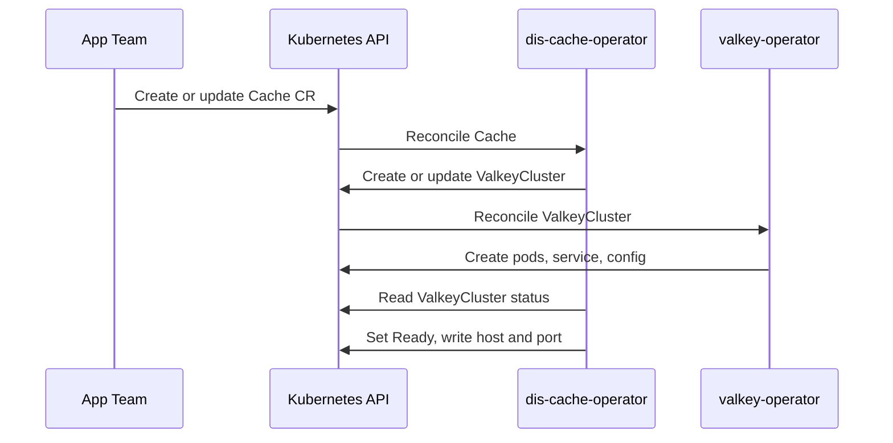

- Feature Name: self_service_cache
- Title: Self-service cache
- Start Date: 2026-08-28
- RFC PR: [altinn/altinn-platform#3952](https://github.com/Altinn/altinn-platform/pull/3952)
- Github Issue: [altinn/altinn-platform#0000](https://github.com/altinn/altinn-platform/issues/0000)
- Product/Category: Container Runtime
- State: **REVIEW** (possible states are: **REVIEW**, **ACCEPTED** and **REJECTED**)

# Summary

This RFC adds a new operator: `dis-cache-operator`. The operator gives app teams a self-service cache.

A team creates a `Cache` custom resource in its namespace. The operator creates a Valkey instance in the cluster. Valkey is the default engine, and the only engine for now.

The operator does not run Valkey itself. It creates resources for the official [valkey-operator](https://github.com/valkey-io/valkey-operator), and that operator runs Valkey. This is the same pattern that `dis-pgsql-operator` and `dis-vault-operator` use with Azure Service Operator (ASO).

This RFC replaces an earlier draft. The earlier draft used Azure Managed Redis (see [#3472](https://github.com/Altinn/altinn-platform/pull/3472)). That option is now listed under Future possibilities.

# Motivation

Caching is a common need for DIS applications. Today the platform has no self-service option for it. Teams build their own setups. The results differ in quality and safety, and the platform team becomes a bottleneck.

We want the same model as for databases and key vaults:

- The team declares what it needs in a custom resource.
- The operator applies safe platform defaults.
- The team reads readiness and connection values from the resource status.

We start with Valkey in the cluster, not with a managed cloud cache. The reasons are:

- It is much simpler. There are no private endpoints and no private DNS zones to manage.
- It costs less. A cache uses cluster capacity that we already pay for.
- Valkey is open source and protocol-compatible with Redis.

# Guide-level explanation

A team that needs a cache creates a `Cache` resource in its namespace:

```yaml
apiVersion: cache.dis.altinn.cloud/v1alpha1
kind: Cache
metadata:
  name: my-app-cache
spec:
  size: small
  persistence: false
  evictionPolicy: noeviction
```

The operator then:

1. Creates a `ValkeyCluster` resource in the team namespace. The official valkey-operator owns this resource type.
2. The valkey-operator creates the Valkey pods, the service, and the related objects.
3. The operator waits until the Valkey instance is ready.
4. The operator writes the connection values to `status`: `host`, `port`, and the `Ready` condition.

The application connects to `host:port` inside the cluster. The platform sets safe defaults for access control and transport. The exact defaults are open questions (see Unresolved questions).

# Reference-level explanation

## CRD contract

### Spec (v1alpha1)

- `size` (optional): one of `small | medium | large`. Default `small`. The platform maps each size to CPU, memory, and replica values.
- `persistence` (optional `bool`): default `false`. A cache does not keep data by default.
- `evictionPolicy` (optional): one of the Valkey `maxmemory-policy` values: `noeviction | allkeys-lru | allkeys-lfu | allkeys-random | volatile-lru | volatile-lfu | volatile-random | volatile-ttl`. Default `noeviction`.

The spec starts small on purpose. We can add fields later. We cannot remove fields later without breaking teams.

The spec has no identity references. Valkey does not use Entra ID for data access. Access control uses Valkey's own mechanisms (see Unresolved questions).

### Status (v1alpha1)

- `conditions[]`: `Ready`, plus more condition types when the implementation adds them.
- `host`: the in-cluster DNS name of the Valkey service.
- `port`: the Valkey port.
- `observedGeneration`: the last generation the operator reconciled.

## The official valkey-operator

Facts at the time of writing (2026-08-28):

- Repository: `github.com/valkey-io/valkey-operator`. It is part of the Valkey project.
- Latest release: v0.5.0 (2026-08-11). Development is very active. An official Helm chart exists.
- Resource types: `ValkeyCluster` and `ValkeyNode`, in the API group `valkey.io`, version `v1alpha1`.
- Features: failover, scaling, rolling upgrades, TLS, and access control.
- Maturity: the project says it is not ready for production. The `v1alpha1` API can change.

We choose it although it is alpha. The reasons are:

- It is the official operator, and it improves quickly.
- Our own `Cache` CRD protects the teams. When the upstream API changes, we update `dis-cache-operator`. The teams' `Cache` resources do not change.
- The platform pins the upstream operator version and updates it on its own schedule.

The upstream operator runs in the platform-system layer on each cluster. The platform installs it. Teams never create `ValkeyCluster` resources directly. Only the `Cache` CRD is part of the tenant contract.

## Reconciliation flow



## Deletion

The `ValkeyCluster` has an owner reference to the `Cache` resource. When the team deletes the `Cache`, Kubernetes deletes the `ValkeyCluster`. The valkey-operator then removes the pods and the service.

## Naming

Kubernetes names are unique per namespace. The operator derives the `ValkeyCluster` name from the `Cache` name. We do not need the hash-based global naming that the Azure-backed operators use.

# Drawbacks

- The upstream operator is alpha, and its API can change. We accept this because our CRD protects the teams.
- Caches use cluster CPU and memory. The platform needs capacity limits per team.
- The platform gets one more operator to run, watch, and update.

# Rationale and alternatives

## Alternatives considered

1. **Manage the Valkey pods ourselves.** `dis-cache-operator` would create StatefulSets directly. Rejected: we would rebuild failover, upgrades, and scaling that the valkey-operator already has.
2. **Give teams the `ValkeyCluster` CRD directly.** Rejected: the alpha upstream API becomes the tenant contract, and we lose the platform defaults.
3. **OT-CONTAINER-KIT/redis-operator.** More mature (1.4k stars, regular releases). It is Redis-first and supports Valkey images. It is our fallback if the official operator blocks us.
4. **The official Valkey Helm chart, without an operator.** Rejected: no reconcile loop, no failover management, and no status for teams.
5. **Azure Managed Redis** (the earlier draft of this RFC). Not the starting point: it needs private endpoints and a shared private DNS zone, it costs more, and it adds ASO version requirements. It stays possible later (see Future possibilities).

## Impact of not doing this

Teams keep building their own cache setups, and the platform keeps missing the self-service goal for caches.

# Prior art

- [RFC 0006 - self_service_postgresql_database](https://github.com/Altinn/altinn-platform/blob/main/rfcs/0006-serlf-service-psql.md): a DIS CRD in front of another operator.
- [RFC 0009 - self_service_key_vault](https://github.com/Altinn/altinn-platform/blob/main/rfcs/0009-self-service-key-vault.md): one resource per CR, safe defaults, status conditions.
- `dis-vault-operator` and `dis-pgsql-operator`: readiness gating and condition aggregation patterns.

# Unresolved questions

- Access control defaults: a password in a Secret? TLS on by default? A NetworkPolicy that limits access to the namespace? Decide during the controller implementation.
- The exact CPU, memory, and replica values for each `size`.
- Capacity limits per team.
- Backup and restore: out of scope for v1.
- How the platform installs and pins the upstream operator on the fleet: platform-system artifact, image supply, and a security review.

# Future possibilities

- **A managed cloud cache as an option in the same CRD.** For example, a new field such as `type: managed` creates Azure Managed Redis through ASO instead of in-cluster Valkey. The building blocks exist: ASO v2.19.0 has `RedisEnterpriseDatabaseAccessPolicyAssignment` under `cache.azure.com/v20250401`, so Entra-only access is possible. The earlier draft of this RFC describes that design.
- Valkey cluster mode for large workloads.
- Connection values in a ConfigMap, in the same way `dis-pgsql-operator` publishes one.
- Metrics and dashboards for team caches.
