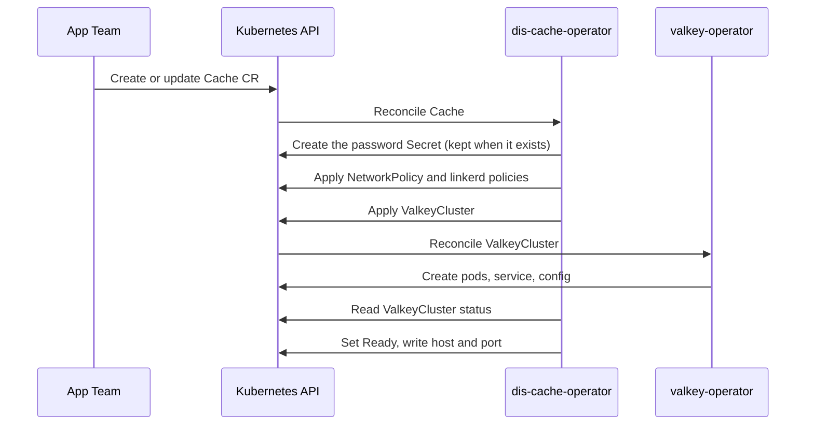

- Feature Name: self_service_cache
- Title: Self-service cache
- Start Date: 2026-08-28
- RFC PR: [altinn/altinn-platform#3952](https://github.com/Altinn/altinn-platform/pull/3952)
- Github Issue: [altinn/altinn-platform#0000](https://github.com/altinn/altinn-platform/issues/0000)
- Product/Category: Container Runtime
- State: **REVIEW** (possible states are: **REVIEW**, **ACCEPTED** and **REJECTED**)

# Summary

This RFC adds a new operator: `dis-cache-operator`. The operator gives app teams a self-service cache.

A team creates a `Cache` custom resource in its namespace. The operator creates a Valkey instance in the cluster. Valkey is the default engine, and the only engine for now.

The operator does not run Valkey itself. It creates resources for the official [valkey-operator](https://github.com/valkey-io/valkey-operator), and that operator runs Valkey. This is the same pattern that `dis-pgsql-operator` and `dis-vault-operator` use with Azure Service Operator (ASO).

This RFC replaces an earlier draft. The earlier draft used Azure Managed Redis (see [#3472](https://github.com/Altinn/altinn-platform/pull/3472)). That option is now listed under Future possibilities.

# Motivation

Caching is a common need for DIS applications. Today the platform has no self-service option for it. Teams build their own setups. The results differ in quality and safety, and the platform team becomes a bottleneck.

We want the same model as for databases and key vaults:

- The team declares what it needs in a custom resource.
- The operator applies safe platform defaults.
- The team reads readiness and connection values from the resource status.

We start with Valkey in the cluster, not with a managed cloud cache. The reasons are:

- It is much simpler. There are no private endpoints and no private DNS zones to manage.
- It costs less. A cache uses cluster capacity that we already pay for.
- Valkey is open source and protocol-compatible with Redis.

# Guide-level explanation

A team that needs a cache creates a `Cache` resource in its namespace:

```yaml
apiVersion: cache.dis.altinn.cloud/v1alpha1
kind: Cache
metadata:
  name: my-app-cache
spec:
  size: small
  persistence: false
  evictionPolicy: noeviction
```

The operator then:

1. Creates a `ValkeyCluster` resource in the team namespace, plus a NetworkPolicy, the linkerd access policies, and a password Secret.
2. The valkey-operator creates the Valkey pods, the service, and the related objects.
3. The operator waits until the Valkey instance is ready.
4. The operator writes the connection values to `status`: `host`, `port`, and the `Ready` condition.

The application connects to `host:port` inside the cluster and sends a password. The service mesh encrypts the traffic. The password is in a Secret in the team namespace. Only pods in the same namespace can reach the cache (see Access control).

# Reference-level explanation

## CRD contract

### Spec (v1alpha1)

- `size` (optional): one of `small | medium | large`. Default `small`. The platform maps each size to CPU, memory, and replica values.
- `persistence` (optional `bool`): default `false`. A cache does not keep data by default.
- `evictionPolicy` (optional): one of the Valkey `maxmemory-policy` values: `noeviction | allkeys-lru | allkeys-lfu | allkeys-random | volatile-lru | volatile-lfu | volatile-random | volatile-ttl`. Default `noeviction`.

The spec starts small on purpose. We can add fields later. We cannot remove fields later without breaking teams.

The spec has no identity references. Valkey does not use Entra ID for data access. See Access control below.

### Status (v1alpha1)

- `conditions[]`: `Ready`, plus more condition types when the implementation adds them. The reasons of `Ready` are `Provisioning`, `ValkeyReady`, `ValkeyDegraded`, `ValkeyFailed`, `UpstreamSpecMismatch`, `SecretCreateFailed`, and `ApplyFailed`.
- `host`: the in-cluster DNS name of the Valkey service, `valkey-<name>.<namespace>.svc.cluster.local`. Set only while `Ready` is true. It stays when an operator step fails, because the Valkey instance is untouched then.
- `port`: the Valkey port, 6379. Same rule as `host`.
- `observedGeneration`: the last generation the operator reconciled.

## The official valkey-operator

Facts at the time of writing (2026-08-28):

- Repository: `github.com/valkey-io/valkey-operator`. It is part of the Valkey project.
- Latest release: v0.5.0 (2026-08-11). Development is very active. An official Helm chart exists.
- Resource types: `ValkeyCluster` and `ValkeyNode`, in the API group `valkey.io`, version `v1alpha1`.
- Features: failover, scaling, rolling upgrades, TLS, and access control. The API has `users[]` for ACL users with password Secrets, and `networking.tls` for a server certificate from a Secret.
- Passwords: the operator reads the password from a Secret we provide, hashes it, and reloads the ACL on the running nodes (no pod restart). A user can have more than one valid password at a time. The operator does not generate or rotate app passwords, and it does not watch our Secret — it only re-reads it when it reconciles.
- Pod settings: the API has no field for pod annotations. Mesh injection must come from the namespace.
- Maturity: the project says it is not ready for production. The `v1alpha1` API can change.

We choose it although it is alpha. The reasons are:

- It is the official operator, and it improves quickly.
- Our own `Cache` CRD protects the teams. When the upstream API changes, we update `dis-cache-operator`. The teams' `Cache` resources do not change.
- The platform pins the upstream operator version and updates it on its own schedule.

The upstream operator runs in the platform-system layer on each cluster. The platform installs it. Teams never create `ValkeyCluster` resources directly. Only the `Cache` CRD is part of the tenant contract.

**Installation.** The platform installs the upstream operator with its Helm chart (`oci://ghcr.io/valkey-io/valkey-helm`, version 0.5.0) through the `valkey-operator` package in gitops-manifests, promoted ring by ring. A Terraform flag per cluster, `enable_valkey_operator`, creates the Flux configuration. The Helm chart and the Go module bump together. at22 and at23 are the first clusters.

## Access control

Valkey does not use Entra ID. Workload identity does not help here either: it gives a pod a token for Azure services, and Valkey cannot check such a token. The operator uses the cluster's own tools instead, in three layers:

1. **Network.** Two policies, on two levels.
   - A Kubernetes NetworkPolicy on the Valkey pods. It works on IP and port, and it applies to every pod. It allows only: pods in the same namespace (port 6379), the Valkey pods themselves (6379 and 16379, for replication), and the valkey-operator pods (6379). In DIS, the namespace is the team boundary.
   - Linkerd policies. The DIS clusters run linkerd with default inbound policy `deny`. A meshed pod rejects all traffic until a `Server` and an `AuthorizationPolicy` allow it. The operator creates two `Server`s on the Valkey pods (6379 and 16379, both `opaque` so the proxy does not try to detect a protocol), one `MeshTLSAuthentication` (every service account in the namespace, plus the valkey-operator identity `valkey-operator.valkey-operator-system`), and one `AuthorizationPolicy` per `Server`. This layer works on identity, not on IP. The Valkey health probes are `exec` probes, so they never cross the proxy and need no rule. Never add a CIDR-based `NetworkAuthentication` to the cache Servers: it would let plaintext clients back in.
2. **Encryption and identity: linkerd mTLS.** The Valkey pods and the app pods run in the mesh. Linkerd encrypts the traffic between them and checks both sides' identities. We do not create TLS certificates for Valkey. Two facts drive this:
   - The valkey-operator API has no pod-annotation field, so injection comes from the namespace annotation `linkerd.io/inject: enabled`. The whole team namespace is meshed. Team namespaces get this annotation from their syncroots.
   - The valkey-operator pod runs in the mesh too. It connects to the Valkey pods to load the ACL. The gitops-manifests package sets its pod annotations: inject the proxy, keep the metrics port 8443 outside the proxy (the Azure Monitor scraper is not meshed and the clusters deny inbound traffic by default; the port checks tokens itself), and keep the API server port 443 outside the proxy.
   - Linkerd's post-upgrade job restarts every StatefulSet. It must skip the Valkey StatefulSets, or every linkerd upgrade empties every cache without persistence (another gitops-manifests change).
3. **Password.** The operator generates a random password (`crypto/rand`) and stores it in a Secret in the team namespace, with the keys `username` and `password`. It configures a Valkey ACL user `app` with this password through the upstream `users[].passwordSecret` field. The `app` user gets `+@all -@admin -@dangerous` on all keys and channels: no `FLUSHALL`, `CONFIG`, `SHUTDOWN`, or `ACL` commands. The app reads the Secret.

**The built-in `default` user is locked.** Valkey always has a `default` user, and the valkey-operator sets `protected-mode no` and never disables it. Without action, any pod in the namespace can connect with no password and full access, and the `app` user changes nothing. The operator therefore adds `default` to `users[]` with `resetpass` (no password can ever match) and `-@all` (no permissions). It does not use `enabled: false`: that field is an `omitempty` bool with a CRD default of `true`, so a `false` sent from Go is dropped and turned back into `true`.

**Password rotation** has no downtime, because a Valkey user can have several valid passwords. The valkey-operator reads the Secret on every reconcile, every 30 seconds, and reloads the ACL when a password changed. A new value under the same key would lock out every app that still uses the old value, until the app reads the Secret again. The order below keeps both passwords valid during the change:

1. The operator adds a new key to the Secret. The old key stays.
2. The operator adds the new key to `passwordSecret.keys` on the `ValkeyCluster`. Within 30 seconds both passwords are valid.
3. The apps pick up the new value. Apps that mount the Secret as a file get it without a restart. Apps that read it as an environment variable need a restart.
4. After a fixed wait, the operator removes the old key from `keys` first, and from the Secret after. In the other order the valkey-operator fails with "missing password key" and does not update the ACL.

v1 rotates on request. A schedule can come later. Rotation is the only reason the operator needs `patch` on Secrets. Until rotation lands, the operator has `create` only.

**Why not cert-manager TLS.** The earlier version of this section used a cert-manager server certificate. We dropped it: the DIS clusters have no internal CA issuer (only Let's Encrypt, which cannot sign cluster-internal names and gives no `ca.crt`), a CA key would be one more secret to protect, and the mesh already gives encryption and client identity at once.

## Secrets in the team namespace

Three Secrets with credentials exist next to a cache. Any pod in the namespace can mount them, Kyverno runs in audit mode, and etcd uses platform-managed keys.

- `<cache>-cache-auth`: the `app` password, written by dis-cache-operator.
- `internal-<name>-system-passwords`: the valkey-operator's own users. `_replication` can dump all data (`PSYNC`) and write everything, and it is also on the `valkey-server` command line. `_operator` and `_exporter` are the other two.
- `internal-<name>-acl`: the ACL file with SHA-256 hashes of all passwords.

We accept this for v1: every password is per cache, so the damage stays inside the team's own cache. The `_replication` command-line exposure is an upstream issue to file.

## Operator permissions and safety

- **Secrets.** dis-cache-operator gets `create` on Secrets, and `patch` when rotation lands. It has no `get`, `list`, or `watch`, it does not watch Secrets, and its client cache excludes them. It never reads a password back; it tracks which keys exist through `passwordSecret.keys`. On every reconcile it generates a password and tries to create the Secret. When the Secret exists, the create fails and the stored password stays. A compromised operator can then overwrite Secrets but not read them. dis-pgsql and dis-vault have no Secret permissions at all; this operator is the first.
- **Deleted Secret.** The operator does not see the deletion. The valkey-operator does: it reads the Secret every 30 seconds and sets its `ValkeyCluster` to state `Failed` when the Secret is gone. That status change triggers a reconcile, which creates the Secret with a new password. Apps then read the Secret again.
- **Writes.** The NetworkPolicy, the linkerd policies, and the `ValkeyCluster` are written with server-side apply, with the field owner `dis-cache-operator` and force. The API server fills the CRD defaults, and a repeated apply with the same content writes nothing. A field that someone changed by hand goes back to the operator's value on the next reconcile. The operator reconciles an owned object again only when its spec generation or its status changed. The `Cache` status is written with a merge patch, and only when it changed.
- **Step failures.** When the Secret create or an apply fails, `Ready` becomes False with reason `SecretCreateFailed` or `ApplyFailed` and the error message. Without this a Cache that never reaches the `ValkeyCluster` step would show no status at all.
- **Drift guard.** The upstream CRD upgrades with `CreateReplace`. If a chart bump renames `spec.users`, the API server prunes the field and the `default` user is open again. The apply response carries the stored `ValkeyCluster`; the operator compares `spec.users` from it, and on a mismatch it sets `Ready=False` with reason `UpstreamSpecMismatch`. It does not read the informer cache for this, because the cache can be one version behind the apply. The Helm chart and the Go module bump together in one PR.
- **Permissions.** On `Cache`: `get`, `list`, `watch`; on its status: `patch`; on its finalizers: `update`, for clusters that run the owner-reference admission plugin. On the owned objects: `list` and `watch` for the informers, `create` and `patch` for server-side apply. No `update` or `delete` anywhere: owner references delete. On Secrets: `create` only.
- **Linkerd types.** The operator uses the official `github.com/linkerd/linkerd2` API packages, pinned by pseudo-version to the linkerd chart version the clusters run (`edge-26.4.2`). Renovate cannot track edge tags, so this pin moves by hand with the chart. The versions match the served CRDs: `Server` v1beta3, `AuthorizationPolicy` and `MeshTLSAuthentication` v1alpha1.

## Pod and data hardening

- The valkey-operator starts `valkey-server` directly and skips the image entrypoint, so the pods would run as root. The operator sets a pod security context (non-root, uid/gid/fsGroup 999, seccomp `RuntimeDefault`) and per-container settings (no privilege escalation, read-only root filesystem, all capabilities dropped) for the `server` and `metrics-exporter` containers.
- The upstream default images pull from Docker Hub. The operator sets both images to the ACR pull-through path, from the environment variables `DISCACHE_VALKEY_IMAGE` and `DISCACHE_EXPORTER_IMAGE`. An empty value keeps the upstream image.
- With `persistence: false`, Valkey would still write snapshots to the node disk, because upstream sets no `save`. The operator sets `save ""` and `appendonly no`.
- The metrics exporter sidecar cannot be turned off from Go (same `omitempty` problem), so it stays on and gets the same hardening.
- Persistent volumes use platform-managed keys, like every disk on the clusters.

## Deployment of dis-cache-operator

The operator follows the release path of the other DIS operators. release-please cuts the component `dis-cache`; `v0.1.0` is the first release. The tag builds the image on GitHub Container Registry and pushes a Kustomize artifact, `dis/kustomize/dis-cache-operator`, to altinncr. The package `oci/dis-cache` in gitops-manifests deploys the artifact with a Flux `Kustomization`, promoted ring by ring through the release issue, and a Terraform flag per cluster creates the Flux configuration.

Two rules for that package:

- Its `Kustomization` passes both image variables through as required variables, without defaults. The Terraform configuration must set both, an empty string is allowed. Flux runs the substitution only when at least one variable is set, so a forgotten value fails visibly instead of pulling from Docker Hub.
- Its `multitenancy` overlay depends on the valkey-operator `Kustomization`. The operator watches `ValkeyCluster` and the linkerd policy kinds, so their CRDs must exist before the manager starts, or its cache never syncs and the pod exits about two minutes after start.

## One cache per application

Each `Cache` resource becomes its own small `ValkeyCluster`: one shard, and replicas for failover. We do not share one big Valkey cluster between teams. The reasons:

- Valkey sets memory limits and the eviction policy per instance, not per user. Teams with different needs cannot share one instance.
- A cache per namespace keeps the team boundary: the NetworkPolicy closes it, and a leaked password only exposes one cache.
- Teams create, resize, and delete their caches without risk to other teams.
- A small Valkey instance is cheap. The isolation is worth the extra pods.

Valkey cluster mode with many shards stays a scale-up option for one team's large workload (see Future possibilities). It is not a way to share hardware between teams.

## Reconciliation flow



The Secret and the policies come first, so the Valkey pods find the password and the access rules on their first start. The operator writes `host` and `port` only when `Ready` is true.

## Deletion

Every object the operator creates has an owner reference to the `Cache`: the Secret, the NetworkPolicy, the linkerd policies, and the `ValkeyCluster`. When the team deletes the `Cache`, Kubernetes deletes all of them. The valkey-operator then removes the pods and the service. The operator uses no finalizer.

## Naming

Kubernetes names are unique per namespace. The operator derives the `ValkeyCluster` name from the `Cache` name. We do not need the hash-based global naming that the Azure-backed operators use.

The valkey-operator names the Service `valkey-<name>`. A Service name is one DNS label of at most 63 characters, so the CRD limits a `Cache` name to 56 characters and rejects names with a dot.

# Drawbacks

- The upstream operator is alpha, and its API can change. We accept this because our CRD protects the teams.
- Caches use cluster CPU and memory. The platform needs capacity limits per team.
- The platform gets one more operator to run, watch, and update.
- A cache puts a stateful workload in the mesh. The DIS clusters have one such case today (activemq). Linkerd upgrades restart StatefulSets unless the cache pods are excluded.
- The first password on the platform. Every other DIS data path uses Entra ID. The password is the second layer behind the mesh identity, not the only one.

# Rationale and alternatives

## Alternatives considered

1. **Manage the Valkey pods ourselves.** `dis-cache-operator` would create StatefulSets directly. Rejected: we would rebuild failover, upgrades, and scaling that the valkey-operator already has.
2. **Give teams the `ValkeyCluster` CRD directly.** Rejected: the alpha upstream API becomes the tenant contract, and we lose the platform defaults.
3. **OT-CONTAINER-KIT/redis-operator.** More mature (1.4k stars, regular releases). It is Redis-first and supports Valkey images. It is our fallback if the official operator blocks us.
4. **The official Valkey Helm chart, without an operator.** Rejected: no reconcile loop, no failover management, and no status for teams.
5. **Azure Managed Redis** (the earlier draft of this RFC). Not the starting point: it needs private endpoints and a shared private DNS zone, it costs more, and it adds ASO version requirements. It stays possible later (see Future possibilities).
6. **cert-manager server TLS with an internal CA** (the earlier version of the access-control section). Dropped for the mesh, see "Why not cert-manager TLS". It stays the fallback if the mesh cannot carry the cache: then the operator creates a per-namespace CA chain (selfsigned Issuer, CA Certificate, CA Issuer) and a server Certificate.
7. **Password in the app's Key Vault, synced by ESO.** Possible, and it fits the DisApp model where each app has a vault. Not chosen for v1: it makes every `Cache` depend on a `Vault`, and the operator would need write access to team vaults. The password still lands in a Kubernetes Secret either way.

## Impact of not doing this

Teams keep building their own cache setups, and the platform keeps missing the self-service goal for caches.

# Prior art

- [RFC 0006 - self_service_postgresql_database](https://github.com/Altinn/altinn-platform/blob/main/rfcs/0006-serlf-service-psql.md): a DIS CRD in front of another operator.
- [RFC 0009 - self_service_key_vault](https://github.com/Altinn/altinn-platform/blob/main/rfcs/0009-self-service-key-vault.md): one resource per CR, safe defaults, status conditions.
- `dis-vault-operator` and `dis-pgsql-operator`: readiness gating and condition aggregation patterns.

# Unresolved questions

- Mesh and Valkey: test on at22 that the cluster bus (16379) works through the proxy with `deny`, and that ACL reloads do not drop the `app` user's connections.
- Metrics: how the exporter sidecar is scraped under NetworkPolicy and `deny`, or whether v1 ships without cache metrics.
- Per-team limits: a `ResourceQuota` per namespace and a cap on the number of `Cache` objects, reported as a status condition.
- Password rotation: the trigger for v1 (an annotation or a spec field), and the wait before the old password is removed.
- Upstream requests to file: pod annotations on `ValkeyCluster`, a `serviceAccountName` for the Valkey pods (today they use the namespace `default` account, so the mesh identity is shared), `--primaryauth` off the command line, and `*bool` for `enabled`.
- Kyverno: the linkerd exception keys on a namespace label, injection on an annotation. Team namespaces need both or every injected pod audits against `disallow-capabilities`.
- The exact CPU, memory, and replica values for each `size`.
- Backup and restore: out of scope for v1.

# Future possibilities

- **A managed cloud cache as an option in the same CRD.** For example, a new field such as `type: managed` creates Azure Managed Redis through ASO instead of in-cluster Valkey. The building blocks exist: ASO v2.19.0 has `RedisEnterpriseDatabaseAccessPolicyAssignment` under `cache.azure.com/v20250401`, so Entra-only access is possible. The earlier draft of this RFC describes that design.
- Valkey cluster mode for large workloads.
- Connection values in a ConfigMap, in the same way `dis-pgsql-operator` publishes one.
- Password rotation on a schedule, and per-application ACL users with command and key limits (the upstream API supports both).
- Metrics and dashboards for team caches.
