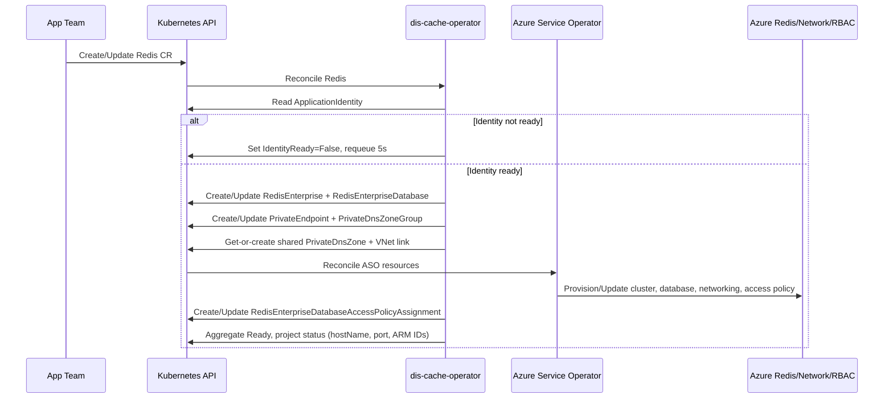

- Feature Name: self_service_managed_redis
- Start Date: 2026-05-19
- RFC PR: [altinn/altinn-platform#0014](https://github.com/Altinn/altinn-platform/pull/0014)
- Github Issue: [altinn/altinn-platform#0014](https://github.com/Altinn/altinn-platform/issues/0014)
- Product/Category: Container Runtime
- State: **REVIEW** (possible states are: **REVIEW**, **ACCEPTED** and **REJECTED**)

# Summary

This RFC proposes a new Kubernetes operator, `dis-cache-operator`, that provides self-service Azure Managed Redis (`Microsoft.Cache/redisEnterprise`) provisioning for DIS applications. App teams declare a `Redis` custom resource in Kubernetes, and the operator reconciles it into Azure resources through Azure Service Operator (ASO). The proposal is opinionated: one Redis Enterprise cluster + one database per CR, Entra-only data-plane authentication via federated identity, and private-endpoint-only network access with a shared private DNS zone linked to the AKS VNet. No shared access keys are exposed to workloads.

# Motivation

Caching is a primary DIS use case but today there is no first-class self-service way to provision a Redis instance. Teams must:
- Manually create `Microsoft.Cache/redisEnterprise` clusters and databases in the Azure portal or in side-channel infrastructure code.
- Manually wire up private endpoints and private DNS records to make the cache reachable from AKS.
- Manually grant data-plane access to their workload identity (or, worse, distribute shared keys).

This leads to:
- Platform-team bottlenecks.
- Inconsistent security defaults (key sprawl, public network access, missing private DNS).
- Slow lead time for app onboarding.
- Drift between intended and actual cloud configuration.

We want the same self-service, declarative pattern we already use for `dis-vault-operator` (RFC 0009) and `dis-pgsql-operator` (RFC 0006):
- App teams request capability through a CR.
- Operator enforces platform defaults and guardrails.
- ASO performs Azure resource provisioning.
- Status and readiness are visible in Kubernetes.

# Guide-level explanation

An app team that needs Redis creates a `Redis` resource in its namespace and references its owning `ApplicationIdentity`:

```yaml
apiVersion: redis.dis.altinn.cloud/v1alpha1
kind: Redis
metadata:
  name: my-app-cache
spec:
  identityRef:
    name: my-app-identity
  sku: Balanced_B0
  highAvailability: true
  clientProtocol: Encrypted
  evictionPolicy: NoEviction
  tags:
    app: my-app
    env: prod
```

The operator then:
1. Resolves the referenced `ApplicationIdentity`.
2. Waits until identity is ready and has a `principalId`.
3. Creates/reconciles a `RedisEnterprise` cluster + `RedisEnterpriseDatabase` via ASO.
4. Creates/reconciles a private endpoint targeting the cluster in the configured AKS data subnet.
5. Get-or-creates the shared `privatelink.redis.azure.net` private DNS zone and the AKS VNet link to it.
6. Creates a `PrivateDnsZoneGroup` binding the private endpoint A-record into the shared zone.
7. Creates/reconciles a `RedisEnterpriseDatabaseAccessPolicyAssignment` granting the resolved identity data-plane access using the built-in `default` access policy (full read/write).
8. Publishes readiness and resulting values (cluster + database ARM IDs, host name, port) in `status`.

Application code connects to the cache over TLS on port 10000, using an Entra-aware Redis client (for example `StackExchange.Redis` with an `Azure.Identity.TokenCredential`). No shared keys, no Kubernetes Secret distribution.

## Security and network defaults in v1

- **Auth**: Entra-only via federated identity. The `RedisEnterpriseDatabase` spec sets `accessKeysAuthentication=Disabled`. Data-plane access is granted via `RedisEnterpriseDatabaseAccessPolicyAssignment` referencing the resolved Entra object ID.
- **Network**: Private endpoint only. The operator owns the private endpoint, the private DNS zone group binding, and (idempotently, get-or-create) the shared `privatelink.redis.azure.net` zone and AKS VNet link.
- **Transport**: `clientProtocol=Encrypted` is the default; `Plaintext` requires explicit opt-in.

# Reference-level explanation

## CRD contract

### Potential Spec (v1alpha1)
- `identityRef.name` or `serviceAccountRef.name` (exactly one required): same-namespace reference to the owning identity. `identityRef` points to an `ApplicationIdentity` from `application.dis.altinn.cloud/v1alpha1`; `serviceAccountRef` points to a `ServiceAccount` annotated with `azure.workload.identity/client-id` and `dis.altinn.cloud/principal-id`.
- `sku` (optional): one of `Balanced_B0|Balanced_B1|Balanced_B3|Balanced_B5|Balanced_B10|MemoryOptimized_M10|MemoryOptimized_M20`. Default `Balanced_B0`.
- `highAvailability` (optional `bool`, default `true`): when `true`, deploy across multiple availability zones.
- `version` (optional `string`): Redis version (e.g. `7`, `7.4`). Defaults to ASO/Azure default.
- `clientProtocol` (optional): `Encrypted|Plaintext`. Default `Encrypted`.
- `evictionPolicy` (optional): one of `AllKeysLFU|AllKeysLRU|AllKeysRandom|VolatileLFU|VolatileLRU|VolatileRandom|VolatileTTL|NoEviction`. Default `NoEviction`.
- `modules` (optional `[]RedisModule`): enable `RedisJSON`, `RediSearch`, `RedisTimeSeries`, `RedisBloom`.
- `persistence` (optional): AOF / RDB configuration. Default no persistence.
- `tags` (optional): additional Azure tags.

### Potential Status (v1alpha1)
- `conditions[]`:
  - `Ready`
  - `IdentityReady`
  - `ClusterReady`
  - `DatabaseReady`
  - `PrivateEndpointReady`
  - `PrivateDNSReady`
  - `AccessPolicyReady`
- `azureName` — computed deterministic cluster name
- `clusterResourceId` — ARM ID of the `redisEnterprise` cluster
- `databaseResourceId` — ARM ID of the `redisEnterprise/databases/default` resource
- `hostName` — e.g. `myredis.norwayeast.redis.azure.net`
- `port` — `10000` by default
- `ownerPrincipalId` — resolved owner principal ID
- `accessPolicyAssignmentName` — name of the managed access policy assignment
- `observedGeneration` — last reconciled generation

## ASO resources and mapping

### Redis Enterprise cluster
- Resource: `cache.azure.com/v1api20250401.RedisEnterprise`
- Key fields set by operator:
  - `sku.name` from `spec.sku`
  - `zones` from `spec.highAvailability` (multi-zone when true, otherwise no zones)
  - `properties.minimumTlsVersion=1.2`
  - `tags` merged with `spec.tags`

### Redis Enterprise database
- Resource: `cache.azure.com/v1api20250401.RedisEnterpriseDatabase`
- Owner: the `RedisEnterprise` cluster
- Key fields:
  - `clientProtocol` from `spec.clientProtocol`
  - `evictionPolicy` from `spec.evictionPolicy`
  - `accessKeysAuthentication=Disabled`
  - `port=10000`
  - `modules` from `spec.modules`
  - `persistence` from `spec.persistence`

### Access policy assignment
- Resource: `cache.azure.com/v1api20250401.RedisEnterpriseDatabaseAccessPolicyAssignment`
- Owner: the `RedisEnterpriseDatabase`
- Key fields:
  - `accessPolicyName="default"`
  - `user.objectId` from the resolved identity's `principalId`

### Networking
- `network.azure.com/v1api20240601.PrivateEndpoint` per `Redis` CR. Target the cluster, land in the configured AKS data subnet.
- `network.azure.com/v1api20240601.PrivateDnsZone` named `privatelink.redis.azure.net`. **Single shared zone** (see below), get-or-create by name, label-managed (no owner reference to any `Redis` CR).
- `network.azure.com/v1api20240601.PrivateDnsZonesVirtualNetworkLink` linking the shared zone to the AKS VNet. Single, get-or-create, label-managed.
- `network.azure.com/v1api20240601.PrivateDnsZoneGroup` per `Redis` CR. Owner-ref to the `Redis` CR so it cascades on delete.

#### Why one shared DNS zone (not per-CR)

`dis-pgsql-operator` uses a per-instance private DNS zone (`{db-name}.private.postgres.database.azure.com`), which works because PG Flexible Server supports BYO-DNS. Azure Managed Redis does not: the private endpoint CNAME chain hard-codes `<cluster>.<region>.privatelink.redis.azure.net` as the target, so the zone literally has to be named `privatelink.redis.azure.net` for resolution to work. Splitting it per-CR would break DNS resolution.

The operator therefore uses an idempotent get-or-create for the zone + VNet link, identified by a `redis.dis.altinn.cloud/managed-by=dis-cache-operator` label rather than an owner-ref. The per-instance `privateEndpoint` and `privateDnsZoneGroup` keep their owner-refs to the `Redis` CR, so deletion cascades correctly for those.

## Reconciliation flow



## Naming strategy

Redis Enterprise cluster names are DNS-label scoped and must be unique within the region. The operator generates deterministic Azure names from namespace + name + environment using the same hashing approach as `dis-vault-operator` and `dis-pgsql-operator`:
- Avoids collisions across teams.
- Stable across reconciles.
- Removes manual naming burden for app teams.

## Operator's configuration

Required operator env:
- `DISREDIS_AZURE_SUBSCRIPTION_ID`
- `DISREDIS_RESOURCE_GROUP`
- `DISREDIS_AZURE_TENANT_ID`
- `DISREDIS_LOCATION`
- `DISREDIS_ENV`
- `DISREDIS_AKS_SUBNET_IDS` (comma-separated; the first entry is the subnet that private endpoints land in)
- `DISREDIS_AKS_VNET_ID` (the AKS VNet ARM ID, used for the shared DNS zone VNet link)
- `DISREDIS_DNS_ZONE_RESOURCE_GROUP` (resource group where the shared `privatelink.redis.azure.net` zone lives — typically the operator's own RG)

Startup validation fails fast on missing/invalid required values.

## Compatibility and migration

- No direct migration impact for existing workloads because this introduces a new CRD/operator path.
- Teams adopting this model move from manual Azure portal / Terraform-managed Redis caches to declarative `Redis` resources.
- ASO dependency must be bumped to v2.18.0+ for this operator to pick up `RedisEnterpriseDatabaseAccessPolicyAssignment` in `v1api20250401`. `dis-vault-operator` and `dis-pgsql-operator` can stay on their current ASO version because each operator is its own Go module.

# Drawbacks

- Adds another platform operator to maintain.
- Depends on ASO API versions and behavior. The newly required `v1api20250401` cache API needs ASO v2.18.0+.
- Strong defaults can require exceptions for some advanced workloads (multi-DB, shared cluster).
- Shared private DNS zone means a misbehaving Redis CR can in principle pollute the zone — mitigated by the per-CR `PrivateDnsZoneGroup` being narrowly scoped and owner-ref bound.

# Rationale and alternatives

## Chosen design rationale

The operator + ASO model is consistent with DIS direction:
- Declarative self-service via Kubernetes.
- Reconciliation loop for drift correction.
- Reuse of dis tooling/resources, e.g. `ApplicationIdentity` and `dis-identity-operator` federated credentials.

The Entra-only access policy plus private endpoint network model gives us a default-deny posture: no keys to rotate or distribute, no public network surface.

## Alternatives considered

### 1. Helm-chart-only (no operator)
Does not track Azure state, no drift correction, no status surface, no shared DNS zone management. Rejected.

### 2. Legacy `Microsoft.Cache/redis`
Weaker Entra integration, no `AccessPolicyAssignment` API, weaker network model (only Premium SKU supports VNet injection). Rejected in favor of the newer `Microsoft.Cache/redisEnterprise` (Azure Managed Redis) offering, which supports private link across all SKUs.

### 3. Key-based authentication with ESO SecretStore
Shared-secret blast radius, rotation pain, leaks via image/log/secret sprawl. Explicitly rejected per the Entra-only decision.

## Impact of not doing this

We keep fragmented Redis provisioning workflows and continue to miss the self-service goal for cached data infrastructure.

# Prior art

Dis related:

- [RFC 0006 - self_service_postgresql_database](https://github.com/Altinn/altinn-platform/blob/main/rfcs/0006-serlf-service-psql.md) — operator + ASO + private endpoint pattern.
- [RFC 0009 - self_service_key_vault](https://github.com/Altinn/altinn-platform/blob/main/rfcs/0009-self-service-key-vault.md) — single-resource-per-CR + federated-identity-owned pattern.
- `dis-pgsql-operator` implementation patterns:
  - private DNS zone + VNet link reconciliation (`internal/controller/database_controller_dns.go`).
- `dis-vault-operator` implementation patterns:
  - identity resolver (`internal/vault/identity.go`).
  - watch mapping (`internal/controller/vault_auth_watch.go`).
  - ASO readiness gating, condition aggregation.
- `dis-identity-operator` as source of identity lifecycle and status fields.
- Azure Service Operator as the Azure control plane integration.

# Unresolved questions

- Multi-DB-per-cluster (Shared mode like `dis-pgsql`) — future RFC.
- Backup / restore semantics — out of scope v1.
- Per-CR private DNS zone (vault-style) vs shared zone — decided shared (see "Why one shared DNS zone"), document the trade-off for future revisitation.
- Group access (`groupObjectId`) — easy follow-up, mirrors `dis-vault-operator`'s group role assignment.

# Future possibilities

- Multi-database / shared-cluster mode for cost-sensitive workloads.
- Backup / restore configuration (export to storage account, point-in-time restore).
- Group access via `groupObjectId` for shared team access.
- ConfigMap projection of `hostName`/`port` for vault-style consumption ergonomics.
- Per-CR network override policy (different subnets, additional VNet links) with guardrails.
- Cluster autoscaling / capacity adjustment hints in status.
