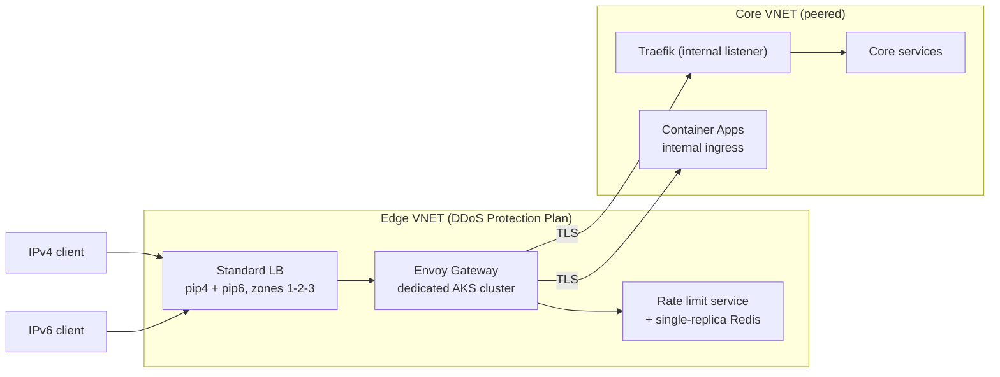
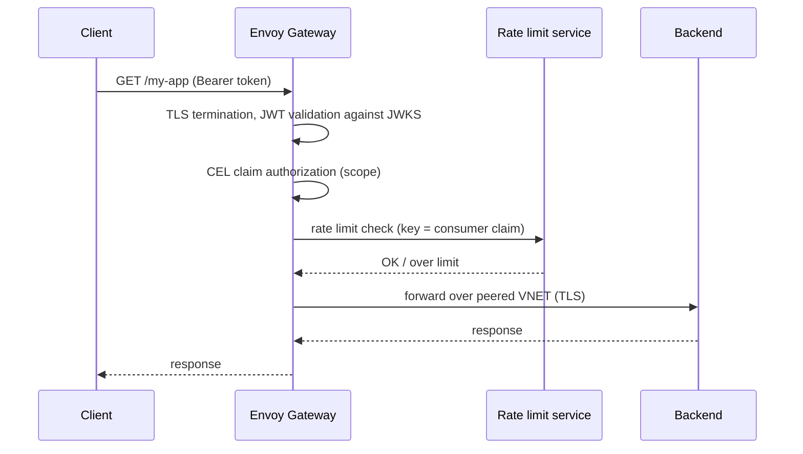

- Feature Name: envoy_gateway_api_edge
- Title: Envoy Gateway as the Altinn API edge
- Start Date: 2026-09-14
- RFC PR: [altinn/altinn-platform#4051](https://github.com/Altinn/altinn-platform/pull/4051)
- Github Issue: [altinn/altinn-platform#3938](https://github.com/Altinn/altinn-platform/issues/3938)
- Product/Category: APIM
- State: **REVIEW** (possible states are: **REVIEW**, **ACCEPTED** and **REJECTED**)

# Summary

This RFC replaces Azure API Management as the public API edge for Altinn core services with [Envoy Gateway](https://gateway.envoyproxy.io/) running on a dedicated AKS cluster per environment.

The edge cluster is dual-stack, zone-redundant, and lives in a VNET covered by an Azure DDoS Protection Plan. A new operator, `dis-apigw-operator`, keeps the self-service onboarding model that `dis-apim-operator` gives teams today, but reconciles into Gateway API resources instead of into Azure APIM.

Scope is the core services only: roughly two AKS clusters plus a set of Azure Container Apps per environment. The ~200 product clusters keep Traefik as their in-cluster ingress and are not affected.

# Motivation

API Management is now the only hop in the Altinn stack that is not dual-stack, not in a VNET, and not zone-redundant. Everything behind it already is. Three things force the decision at the same time.

**We are legally required to serve IPv6, and APIM cannot.** API Management has no native IPv6 listener in any SKU or tier, v1 or v2. The only Azure-sanctioned workaround is to put Azure Front Door or an Application Gateway in front of it, which terminates IPv6 at the edge and speaks IPv4 to the origin. Meanwhile every product AKS cluster already runs dual-stack. The AKS module sets `ip_versions = ["IPv4", "IPv6"]` on Azure CNI Overlay, allocates zone-redundant IPv4 and IPv6 public IPs across all three availability zones, and the DNS child-zone module publishes matching A and AAAA records. We can already do end-to-end IPv6. APIM is what stops us.

**We want tunable network-layer protection, and on APIM we cannot have it.** Azure's infrastructure-level DDoS protection is always on for every Azure public IP, so the baseline is covered. What it does not give is the Network Protection tier: per-resource mitigation policies tuned to our own traffic profile, attack telemetry and alerting, and rapid-response support. That tier is VNET-scoped, and our APIM module sets no `virtual_network_type`, so there is no VNET to attach a plan to. On v1 that means moving to the Premium tier. On v2 it is not available at all — the v2 tiers do not support Azure DDoS Protection. Putting the edge in a VNET we own makes this a configuration choice rather than a product limitation.

**Migrating APIM v1 to v2 is a rebuild, so this is the moment to spend the effort once.** Microsoft provides no automated migration from the classic tiers to v2. On top of that, the v2 tiers drop multi-region deployment, backup and restore, Git-based configuration, the self-hosted gateway, and DDoS Protection. Staying on APIM means paying for a greenfield rebuild and landing on a product that still cannot serve IPv6. The cheap option does not exist.

Two things that are commonly cited as reasons to keep APIM are not reasons for us:

- We do not use the developer portal.
- The organisation has decided to stop issuing subscription keys and to rely on JWT claims instead.

That removes APIM's two largest differentiators before the comparison even starts.

# Guide-level explanation

Today a team publishes an API by committing `Api`, `ApiVersion` and `Backend` resources in the `apim.dis.altinn.cloud` group to its syncroot. After this RFC the shape is the same, but the group is `apigw.dis.altinn.cloud` and the resources describe a route rather than an APIM configuration.

```yaml
apiVersion: apigw.dis.altinn.cloud/v1alpha1
kind: Backend
metadata:
  name: my-app
spec:
  url: https://my-app.core.tt02.altinn.cloud
---
apiVersion: apigw.dis.altinn.cloud/v1alpha1
kind: Api
metadata:
  name: my-app
spec:
  hostname: platform.tt02.altinn.cloud
  path: /my-app
  backendRef:
    name: my-app
  authentication:
    issuers:
      - maskinporten
    requiredScopes:
      - altinn:my-app.read
  rateLimit:
    requests: 100
    unit: Second
```

The operator then:

1. Creates an `HTTPRoute` attached to the shared `Gateway` in the edge cluster, and an Envoy Gateway `Backend` for the upstream.
2. Creates a `SecurityPolicy` with the JWT providers for the named issuers and CEL-based claim authorization for the required scopes.
3. Creates a `BackendTrafficPolicy` carrying the rate limit.
4. Waits for the Gateway API resources to report accepted and programmed, then writes a `Ready` condition and `observedGeneration` back to `status`.

A team that does not need authentication or rate limiting at the edge omits those blocks and gets a plain route. A team that needs something the CRD does not model can be granted permission to write Gateway API and Envoy Gateway resources directly in its namespace; the CRD is a convenience layer, not a wall.

The visible differences for teams are:

- `Ocp-Apim-Subscription-Key` is gone. Callers authenticate with a JWT. This is happening regardless of this RFC.
- The OpenAPI document is no longer uploaded to the gateway. Routing is by path, not by operation. See Unresolved questions.
- Gateway behaviour is observable in Grafana against Azure Monitor Workspace, not in the APIM blade.

Long-lived connections keep working. WebSockets and Server-Sent Events are both supported, and a team declaring a streaming route gets timeouts and buffering set correctly by the operator rather than having to know the failure modes. See Streaming below.

# Reference-level explanation

## Topology

One edge cluster per environment: `at22`, `at23`, `at24`, `tt02`, `yt01` and `prod`. Each has its own VNET and its own zone-redundant dual-stack public IPs, following the pattern already used for the product clusters.



The edge cluster runs nothing but the gateway, its rate limit service, cert-manager and the observability agents. It is deliberately small and deliberately separate: it must be able to fail, be upgraded and be changed independently of the services behind it. That independence is what APIM provides today and is the property we are least willing to regress on.

The public IPs are pre-created and static, as they are for the product clusters, so DNS records can be moved between the APIM hostname and the edge cluster without waiting for an IP to be allocated.

## Edge to backend connectivity

The edge VNET is peered to the core cluster VNETs, reusing the bidirectional VNet peering pattern already used for the PostgreSQL subnets. Envoy Gateway routes to an internal Traefik listener on each core cluster over the peering, resolved through a private DNS zone.

Azure Container Apps backends must run in a VNet-integrated Container Apps Environment with internal ingress to participate in this. Whether that is the case today, and what it costs if not, is an open question below. Until it is resolved, Container Apps backends are reached over their public FQDN, which is what APIM does today and is therefore not a regression, but it is not the target state.

One consequence must be stated explicitly: **Linkerd mTLS does not span clusters.** The mesh has a single trust domain per cluster, so the edge-to-backend hop is not meshed. It is ordinary TLS over a peered private network. If mutual authentication is required on that hop, it has to be built — client certificates via `BackendTLSPolicy`, or an identity header validated by the backend. This RFC proposes starting with server-side TLS plus network isolation and treating mutual authentication on that hop as a follow-up.

## Dual-stack

Envoy Gateway takes the IP family from the `EnvoyProxy` resource:

```yaml
apiVersion: gateway.envoyproxy.io/v1alpha1
kind: EnvoyProxy
metadata:
  name: edge
spec:
  ipFamily: DualStack
```

This is worth verifying rather than trusting. Dual-stack was broken in Envoy Gateway until v1.3: the Gateway service was created as `SingleStack` and only received an IPv4 address, and the manual workaround of patching `ipFamilyPolicy: RequireDualStack` broke readiness checks (envoyproxy/gateway [#5004](https://github.com/envoyproxy/gateway/issues/5004), [#5017](https://github.com/envoyproxy/gateway/issues/5017), fixed by [#5019](https://github.com/envoyproxy/gateway/pull/5019)). Proving `ipFamily: DualStack` end to end against an Azure Standard Load Balancer is the first task of the proof of concept, not an assumption of the design.

## Authentication

Three issuers are in scope: Maskinporten, ID-porten, and Altinn-issued internal tokens. Standard OIDC issuers map onto an Envoy Gateway `SecurityPolicy`:

```yaml
apiVersion: gateway.envoyproxy.io/v1alpha1
kind: SecurityPolicy
spec:
  jwt:
    providers:
      - name: maskinporten
        issuer: https://maskinporten.no/
        remoteJWKS:
          uri: https://maskinporten.no/jwk
  authorization:
    rules:
      - action: Allow
        principal:
          jwt:
            provider: maskinporten
            claims:
              - name: scope
                valueType: StringArray
                values: ["altinn:my-app.read"]
```

Altinn-issued internal tokens are the case most likely not to fit. If their JWKS endpoint or claim shape is non-standard, the fallback is `ext_authz` against a small in-cluster validator, or an `ext_proc` filter. Both are supported extension points in Envoy Gateway and neither is a blocker, but this is the part of the authentication work that should be spiked first.



## Rate limiting

Envoy Gateway supports two mechanisms, and the distinction matters.

*Local* rate limiting is a per-pod token bucket with no external dependency. Its effective limit is `limit x replicas`, permanently, and it cannot key on a consumer consistently across pods. It is useful as coarse overload protection, not as a per-consumer quota.

*Global* rate limiting delegates to the Envoy rate limit service, which requires Redis. **Redis is the only supported backend** (`rateLimit.backend.type: Redis`); there is no in-memory shared mode.

We therefore run the rate limit service with a **single-replica, non-persistent Redis or Valkey** in the edge cluster:

```yaml
rateLimit:
  backend:
    type: Redis
    redis:
      url: ratelimit-redis.envoy-gateway-system.svc.cluster.local:6379
```

No HA, no replication, no persistence, no operator. If it restarts, counters reset and consumers get a brief over-allowance. That is acceptable because limits are scoped to seconds and minutes, and it is preferable to putting a slow or complex stateful dependency on the request path. Local rate limiting stays configured as a backstop, so that losing the rate limit service degrades to coarse protection rather than to no protection.

We deliberately do not reuse `dis-cache-operator` here. The edge cluster should carry as few operators as possible, and the rate limit store has different requirements from a self-service application cache.

## Streaming: WebSockets and Server-Sent Events

At least one team has asked for both. This is a parity requirement rather than a new capability — API Management supports WebSocket APIs and SSE today — so the constraint on this design is that we must not regress, and it is one of the reasons a managed global edge cannot simply be put in front of the current setup (see Rationale and alternatives).

Envoy handles both natively. WebSocket upgrades are supported through the standard HTTP upgrade path and need no special routing configuration. SSE works implicitly: Envoy streams responses as they arrive and does not buffer them unless a buffer filter is configured. There is nothing to enable.

There are two things to get right, and both are worth writing into the operator's defaults rather than leaving to each team:

- **Timeouts.** The default `HTTPRoute` request timeout is 15 seconds, which will cut any long-lived stream. Routes carrying SSE or WebSockets need the timeout raised or disabled via `spec.rules[].timeouts.request`, and the connection idle timeout set to match. The upper bound Envoy allows is around an hour, so genuinely long-lived streams still need application-level keepalives — the same requirement APIM has today, where the Azure Load Balancer enforces a four-minute idle timeout.
- **Never buffer on these routes.** Enabling `requestBuffer` in a `BackendTrafficPolicy` on a route that also carries an upgrade causes the connection to hang silently and forever: the buffer filter waits for end-of-stream, the upgrade request never sends one, and the two deadlock (envoyproxy/gateway [#8578](https://github.com/envoyproxy/gateway/issues/8578)). This is a quiet failure with no error, so the `Api` CRD should refuse to accept a buffering policy together with a streaming route rather than let a team discover it in production.

The equivalent APIM footguns — `buffer-response="false"` on the forward-request policy, avoiding `validate-content`, and keeping request and response bodies out of diagnostic logging because logging them reintroduces buffering — disappear, since none of those layers exist here. But the underlying lesson is the same, and the proof of concept should include an SSE stream held open across a gateway restart and a WebSocket upgrade under load.

## TLS and certificates

No new mechanism. cert-manager with Let's Encrypt DNS-01 over workload identity is already wired by the DNS child-zone and TLS issuer modules, and the child zones already carry a CAA record pinning issuance to `letsencrypt.org`. The edge cluster gets the same federated identity and `DNS Zone Contributor` assignment, and the `Gateway` listener references the resulting `Certificate`.

## Observability

Envoy Gateway and Envoy expose Prometheus metrics. They are scraped by the existing otel-collector and remote-written to the Azure Monitor Workspace, exactly as the existing otel-collector and observability modules already do, and surfaced through Azure Managed Grafana. Access logs go to Log Analytics via ContainerLogV2; there is no Loki on the product clusters. W3C trace correlation is already the platform standard and Envoy emits it natively.

What we lose is the APIM-specific telemetry configured in the APIM analytics module and per-API through `ApiVersion.spec.diagnostics`: `GatewayLogs`, the APIM metrics, and the Application Insights integration with per-API sampling and header capture. The replacement is Envoy access logs with a configured format plus Envoy's own request metrics. Dashboards must be rebuilt in `Altinn/altinn-dashboards-grafana` before any production hostname is moved, not after.

## Deployment

Envoy Gateway manifests are published as a signed OCI artifact per [RFC 0011](0011-cosign-oci.md).

Per [RFC 0012](0012-platform-system-flux-syncroot.md), it should be added to the `platform-system` syncroot rather than as another per-component `azapi` `fluxConfiguration`. RFC 0012 exists because the ARM apply timeout causes Terraform to destroy and recreate running components — the failure mode it names is Traefik stopping serving ingress. Introducing the public API edge through exactly that mechanism would be a poor choice. If RFC 0012 has not landed when this work starts, that is a sequencing dependency, not a reason to add another `fluxConfiguration`.

## Prerequisites

**No network policy engine is installed on these clusters.** There is no `network_policy`, `network_data_plane`, Cilium or Calico configuration anywhere in the Terraform, so `NetworkPolicy` objects are not enforced today; isolation is done with Linkerd authorization policy instead. The same latent gap already exists in `dis-cache-operator`, which builds NetworkPolicies that nothing currently enforces. If the edge cluster design depends on `NetworkPolicy`, choosing and installing an engine is a prerequisite decision that this RFC depends on rather than makes.

The AKS clusters are also not private clusters — the API server is public, gated by Entra ID and Azure RBAC. That is the existing posture and this RFC does not change it, but for an internet-facing edge cluster it is worth revisiting separately.

## Migration

Each phase is independently abandonable. Nothing before phase 3 moves production traffic.

0. **Proof of concept.** Throwaway cluster. Prove `ipFamily: DualStack` on an Azure Standard Load Balancer end to end, Maskinporten JWT validation via `SecurityPolicy`, Altinn internal token validation (or establish that it needs `ext_authz`), an SSE stream held open across a gateway restart together with a WebSocket upgrade under load, and global rate limiting under load using the existing k6 load-test infrastructure.
1. **Edge infrastructure.** Terraform module for the edge cluster and its VNET, VNET peering to the core clusters, the DDoS Protection Plan, public IPs, DNS records on a parallel hostname, and the Envoy Gateway component in the `platform-system` syncroot.
2. **Operator.** `dis-apigw-operator` and the `apigw.dis.altinn.cloud` CRDs, following the conventions in `dis-cache-operator` and `dis-vault-operator`. `dis-console` support. One canary API served from both APIM and the edge simultaneously.
3. **Cut over, hostname by hostname.** Move DNS one hostname at a time. Rollback is a DNS revert to the APIM hostname, which stays live and configured throughout.
4. **Decommission.** Remove `services/dis-apim-operator`, `infrastructure/modules/apim/`, `infrastructure/modules/dis-apim-operator/` and the `infrastructure/adminservices-test/altinn-apim-test-rg/` stack.
5. **WAF.** See Future possibilities.

# Drawbacks

- **We take on an upgrade treadmill.** Envoy Gateway minor versions reach end of life in roughly nine months — v1.7 on 2026-08-05, v1.8 on 2026-11-08. That is three to four forced upgrades a year, forever, on the component that serves all public API traffic.
- **We trade a Microsoft-supported PaaS for infrastructure we operate.** When the edge breaks at 03:00, it is our incident. See Unresolved questions on the support model.
- **Six new clusters.** Six more Kubernetes versions to keep current, six more sets of node images, six more change windows.
- **A second proxy technology.** Traefik stays on the product clusters. The platform team will operate two data planes with two sets of failure modes, configuration languages and CVE streams.
- **No WAF on day one.** Network Protection covers L3/L4. Until phase 5, L7 protection is rate limiting, and mitigating an application-layer attack is a manual exercise. This is the same position we are in today, so it is not a regression, but it should be accepted explicitly and backed by an incident playbook rather than left implied by the network-layer improvements.
- **We lose OpenAPI-driven operation definitions and request validation.** `ApiVersion.spec.content` has no Gateway API equivalent. An Envoy extension can restore the validation part (see Future possibilities), but it is pre-release, so this is a real gap at the point of cutover rather than a solved problem.
- **Team-facing surface has to be rebuilt.** New CRDs, new `dis-console` mappings, new docs, new dashboards, and a migration every consuming team has to participate in.

# Rationale and alternatives

## Alternatives considered

### 1. Azure Front Door in front of an unmodified APIM

Front Door provides native dual-stack anycast with A and AAAA records, and would satisfy the IPv6 requirement in weeks rather than quarters. It also adds a managed L7 WAF, and Front Door Premium can reach origins privately over Private Link — including API Management, Container Apps and internal load balancers in front of AKS — so origin exposure is not the objection. It is by a wide margin the cheapest path to compliance, and this RFC should not pretend otherwise.

Rejected on three counts.

First, **Front Door does not support Server-Sent Events.** WebSockets it handles, but SSE it does not, and at least one team has asked for both. Putting Front Door in the path would take away a capability API Management already provides. There are workarounds — routing streaming endpoints around Front Door on a separate hostname, or pushing teams onto WebSockets instead — but each of them either reintroduces a directly-exposed path, which is the thing Front Door was supposed to solve, or dictates a protocol choice to application teams because of a limitation in our edge. Neither is a good trade.

Second, it terminates IPv6 at the Microsoft edge and speaks IPv4 to the origin. The requirement we are working to is IPv6 support through the stack, not an IPv6 address on a DNS record, and our clusters already support it natively.

Third, and most decisive: **Front Door does not avoid the APIM v1 to v2 rebuild, so it is not actually an alternative to this RFC.** Work through the variants. Front Door in front of APIM still leaves us on v1 and still leaves the migration to be paid for later; doing it properly with a Private Link origin needs a tier that supports inbound private endpoints, which means v2 — the rebuild, now. Front Door straight to the backends removes the API gateway layer entirely along with the authentication, rate limiting and routing it provides, which is not something we are proposing. And Front Door in front of the edge described in this RFC is additive, not alternative: the edge still has to be built first. Whichever variant is chosen, the gateway layer is rebuilt either way, so Front Door is an orthogonal decision about whether we want a managed global edge in front of whatever we land on. It can be added later, on its own merits, in either world.

### 2. Migrate to APIM Premium v2

Premium v2 gives availability zones, simplified VNET injection and inbound private endpoints, and it stays PaaS with Microsoft on-call.

Rejected on three counts. There is no automated migration from the classic tiers, so it is a rebuild either way. The v2 tiers do not support Azure DDoS Protection, which is one of the three motivations for this work. And it still cannot serve IPv6. Paying for a full rebuild to land on a product that fails the primary requirement is the worst available trade.

There is also a strategic objection. Altinn has an open-source-first policy and works to avoid vendor lock-in, and the API edge is one of the least appealing places to be locked in: it sits in front of everything, and its configuration language, policy model and operational tooling are entirely proprietary to one cloud. APIM policies are Azure-specific XML that is portable nowhere. Envoy Gateway is open source, its configuration is Gateway API — a Kubernetes standard with several independent implementations — and its data plane is Envoy, which runs anywhere. That does not make migration free, but it means a future change of direction is a migration rather than a rewrite. Rebuilding the edge is the one moment where this choice is cheap to make, and it will not come round again soon.

### 3. Promote Traefik to the edge

The strongest alternative, and the one a reviewer should press hardest on. Traefik already runs on every product cluster, already terminates dual-stack traffic on zone-redundant public IPs, already integrates with cert-manager and Linkerd, and the team already operates it. It also speaks Gateway API. Adding a second proxy is a real cost that this option avoids entirely.

Rejected on capability and licensing. JWT validation, distributed rate limiting and external authorization are not in Traefik OSS; they are Traefik Hub features. All three are load-bearing for the API edge. The choice is therefore not "Traefik versus Envoy Gateway" but "buy Traefik Hub versus operate Envoy Gateway", and that comparison needs a number. **Obtaining current Traefik Hub pricing and putting it in this section is a prerequisite for accepting this RFC.** If Hub is materially cheaper than six edge clusters plus the Envoy Gateway upgrade cadence, this RFC should be rejected in favour of it.

### 4. Azure Application Gateway for Containers

Azure-native, Microsoft-supported, and Application Gateway v2 does support an IPv6 frontend.

Rejected: the container ingress path does not support IPv6 frontend configuration, backend IPv6 addresses are not supported at all, IPv6-only is not supported, and WAF custom rules cannot match on IPv6. It fails the primary requirement in the specific configuration we would need.

### 5. Istio, Gateway API or ambient mode

Fully capable and a well-supported Gateway API implementation. Rejected as disproportionate: it is a mesh-scale adoption decision, it would sit alongside or displace the existing Linkerd deployment, and the surface area is far larger than an API edge requires. If the platform ever revisits its mesh, this should be reconsidered on those terms rather than as an edge decision.

### 6. Kong, APISIX, NGINX Gateway Fabric

All viable. Differentiated against on Gateway API conformance and release maturity, the extent to which the features we need (JWT, global rate limiting, external authorization, WASM) are gated behind a commercial tier, and how much of each project's operational model we would be adopting. Envoy Gateway gives us all the required features in the open-source distribution, which is the same test that eliminated Traefik OSS.

## Impact of not doing this

We stay non-compliant with the IPv6 obligation. We keep an API edge where network-layer protection cannot be tuned, monitored or improved, because the tier that allows it is not reachable from where APIM sits. We stay locked into a proprietary, single-cloud configuration model at the most exposed layer of the platform. And we pay for the APIM v1 to v2 rebuild anyway — later, under more pressure, for a product that still does not meet the requirements that started this work.

# Prior art

[RFC 0003](0003-operator-managed-apim-config.md) established the operator-managed APIM configuration model that this RFC supersedes. Its core insight — that teams should declare APIs as custom resources in their own namespace and an operator should reconcile them — is kept. Only the reconciliation target changes.

[RFC 0009](0009-self-service-key-vault.md), [RFC 0013](0013-multitenant-dis-databases.md) and [RFC 0014](0014-self-service-cache.md) establish the DIS operator conventions this proposal follows: a small namespaced `v1alpha1` CRD, safe platform defaults, a `Ready` condition plus `observedGeneration`, and delegation to a purpose-built controller rather than reimplementing it.

[RFC 0011](0011-cosign-oci.md) and [RFC 0012](0012-platform-system-flux-syncroot.md) define how a new platform component must be published and deployed.

The existing Traefik deployment is the most relevant prior art of all: it demonstrates that dual-stack, zone-redundant, cert-managed ingress on static Azure public IPs already works in this platform. This RFC is not proving a new pattern; it is applying an established one to the layer that has not yet been given it.

Externally, Envoy Gateway is the Envoy project's own Gateway API implementation, and commercial distributions with long-term support and hardened builds exist for regulated environments. Its release cadence is roughly quarterly with a short support window, which is the main operational lesson to take from its community.

# Unresolved questions

- **Support model.** Upstream open-source Envoy Gateway, self-supported, versus a commercial distribution such as Tetrate Enterprise Gateway for Envoy, which offers 24/7 support, CVE-patched and FIPS-verified builds and a bundled Coraza WAF while remaining pure upstream. This needs procurement input and should be answered before the RFC is accepted, because it changes the drawback profile materially.
- **Traefik Hub pricing**, without which alternative 3 cannot be closed.
- **Are the Azure Container Apps backends VNet-integrated today?** If not, what does moving them to a VNet-integrated environment with internal ingress cost, and does it block phase 3?
- **What authenticates the edge-to-backend hop**, given that Linkerd mTLS does not span clusters?
- **Is a network policy engine a prerequisite, and which one?** This is a platform-wide question that this RFC surfaces but should not decide alone.
- **Does anything depend on APIM's OpenAPI-based request validation?** If a consumer relies on it, the Envoy extension in Future possibilities has to be assessed for production readiness before that API can move.
- **Cost.** A concrete comparison of APIM Premium units against six edge clusters plus an Azure DDoS Protection Plan — which is priced per tenant and therefore amortises across all environments and any other VNET we protect — plus the operational load. This should be in the RFC before acceptance.
- Whether the public AKS API server is acceptable for an internet-facing edge cluster, or whether these six clusters should be private.

# Future possibilities

**WAF in the data plane.** Coraza runs as a WASM filter in Envoy with the OWASP Core Rule Set, configurable through Envoy Gateway policy. This is the natural phase 5 and closes the L7 gap without adding a hop. It brings rule tuning, false positives and CPU cost, so it deserves its own evaluation. Azure Front Door Premium WAF in front of the edge remains the alternative if we would rather buy that capability than run it — but note that it would put the SSE limitation described above back into the path, so it could not front the streaming routes. An in-data-plane WAF has no such constraint, which is a point in its favour beyond the latency argument.

**Consolidating on one proxy.** If the edge proves out, Envoy Gateway could replace Traefik on the product clusters and remove the two-data-plane drawback. That is a much larger migration and should be judged on its own evidence, after the edge has run in production for a while.

**`ext_proc` for Altinn-specific token handling**, if internal token validation or claim transformation turns out to need more than `SecurityPolicy` provides.

**HTTP/3 at the edge**, which Envoy Gateway supports and APIM does not.

**OpenAPI-driven request validation**, restoring the capability lost with `ApiVersion.spec.content`. This is not native to Envoy, but the same extension mechanism that makes Coraza possible applies here: the [OpenAPI validator](https://builtonenvoy.io/extensions/openapi-validator/) is an Apache-2.0 dynamic module that validates method, path, path and query parameters, headers and request body against an OpenAPI 3.0 or 3.1 document, with a dry-run mode for safe rollout. It targets Envoy 1.38–1.39, which matches the Envoy version shipped with Envoy Gateway v1.9. It is pre-release (0.12.0-dev) and maintained by Tetrate rather than by the Envoy project, so it should be evaluated on maturity before anything depends on it — but it demonstrates that the gap is addressable through extensions rather than permanent.

**Extending `apigw.dis.altinn.cloud` to the product clusters**, giving all teams one way to describe an API regardless of which layer terminates it.
