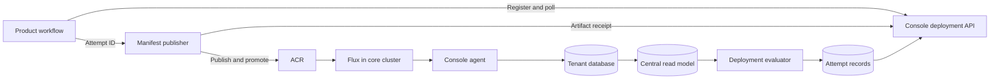

- Feature Name: dis_deployment_status
- Title: Deployment status through DIS Console
- Start Date: 2026-09-29
- RFC PR: [altinn/altinn-platform#4144](https://github.com/Altinn/altinn-platform/pull/4144)
- Github Issue: N/A; implementation issues follow RFC acceptance
- Product/Category: CI/CD / DIS Console
- State: **REVIEW**

# Summary

Extend `dis-console` with an authenticated API that lets product workflows register a deployment attempt and poll its outcome. A successful attempt means the requested application artifact reconciled in the intended environment and its required workloads completed their rollout. Reuse the existing cluster agents and central database, add durable attempt records, and provide a shared GitHub Action. Start with Dialogporten in `at23`. The [implementation plan](0016-dis-deployment-status-implementation-plan.md) describes the coordinated changes and validation.

# Motivation

Publishing manifests to ACR does not establish that Flux fetched them, applied them, or finished rolling out the application. Product repositories need to wait for that outcome before marking deployment successful or starting subsequent checks.

There are two common false positives:

- The previous release is healthy while the requested release has not reached the cluster.
- Kubernetes still serves traffic through old replicas while replacement replicas fail to become ready.

Dialogporten also has two repository identities: the application commit that initiated deployment and the manifest commit used to publish the Flux artifact. A result must be correlated through both repositories to the exact artifact and environment.

The console already collects Flux and workload state across clusters. Extending it gives product teams one contract for deployment results and failure detail, without requiring each workflow to implement cluster access and Flux-specific polling.

# Guide-level explanation

## Product workflow

A product registers a **deployment attempt** before asking its manifest publisher to promote a release. The registration identifies the application commit, workflow run, product, and environment. The console resolves the allowed cluster and resource mapping from platform configuration.

The publisher creates an **artifact receipt**: the manifest commit, OCI repository, immutable artifact digest, and expected application images. It attaches this receipt before promoting the environment's artifact tag. The workflow then polls the attempt using a shared action.

For Dialogporten `at23`, the sequence is:

1. Register an attempt for the application commit and `at23`.
2. Dispatch the attempt ID and requested images to `dialogporten-manifests`.
3. Publish the manifest artifact, attach its receipt, and promote the `at23` application artifact tag.
4. Flux observes the artifact and reconciles `product-dialogporten/dialogporten-apps`.
5. The console evaluates the application revision and required workload rollouts.
6. The shared action exits successfully when the attempt succeeds, or reports the terminal outcome and diagnostic details.

For example, if the old release remains available while the new Web API pods fail to start, the attempt stays in progress with rollout diagnostics. It eventually fails on an attributable terminal error or reaches its deadline. It cannot succeed using the old release's readiness.

## Scope of success

V1 covers manifest reconciliation and application rollout in one target cluster per attempt. The pilot supports explicitly configured Kubernetes Deployments. Other workload kinds and rollout strategies require defined evaluators before onboarding.

Migration execution, smoke tests, automatic rollback, and a new console UI are outside this RFC's initial implementation. A product can run its existing checks after the wait action. If multiple systems deploy an application during migration to DIS, their outcomes must be reported separately.

# Reference-level explanation

## Existing implementation

The source baseline for this proposal is `altinn-platform` commit `b5e1ed6d` and `dialogporten-manifests` commit `813149a5`. Source inspection does not verify deployed versions or connectivity.

- The [console agent](../services/dis-console/internal/flux/client.go) collects Flux resources and selected Deployments, StatefulSets, and DaemonSets. The central [API](../services/dis-console/internal/api/server.go) serves resource details, inventory, history, and cluster freshness.
- Current [normalization](../services/dis-console/internal/flux/normalize.go) projects one display revision and uses a Deployment's `Available` condition. Deployment evaluation needs separate applied/attempted revisions and complete rollout evidence.
- The [publishing action](../actions/flux/build-push-image/action.yaml) records the publishing repository's Git revision. It does not return a deployment receipt to the originating application workflow.
- Dialogporten's [application Kustomization](https://github.com/Altinn/dialogporten-manifests/blob/813149a5f4c9952032b7ddae2adc78e999af0492/flux/syncroot/base/dialogporten-flux-kustomization.yaml) has no explicit rollout health checks. Its [source](https://github.com/Altinn/dialogporten-manifests/blob/813149a5f4c9952032b7ddae2adc78e999af0492/flux/syncroot/base/dialogporten-oci-repository.yaml) polls a shared `:main` application artifact every ten minutes.

## Architecture



The server evaluates attempts independently of polling clients. Agents keep read-only Kubernetes access; the API writes tracking records and does not modify cluster resources. Expose a central endpoint rather than a separate public API in every core cluster.

## Identity and API

Store these identities independently:

- Product, environment, cluster, namespace, source, Kustomization, and required workloads.
- Application repository/full commit SHA and GitHub workflow run ID/attempt.
- Manifest repository/full commit SHA and immutable OCI manifest digest.
- Expected application image references, preferably pinned by digest.
- Deployment ID, idempotency key, registration time, and deadline.

Compare the upstream OCI digest represented in the source's `status.artifact.revision`. Flux's stored-artifact checksum is a different identity. An image tag alone is insufficient for strict version verification; the pilot must pin images by digest or establish an enforceable immutable image-tag policy. See [OCIRepository artifact status](https://fluxcd.io/flux/components/source/ocirepositories/#artifact).

Proposed routes:

| Method and route | Purpose |
| --- | --- |
| `POST /api/v1/products/{product}/environments/{environment}/deployments` | Register an attempt idempotently |
| `PUT /api/v1/deployments/{id}/artifact` | Attach an immutable publishing receipt |
| `POST /api/v1/deployments/{id}/events` | Report publication failure, cancellation, or authorized supersession |
| `GET /api/v1/deployments/{id}` | Read state, checks, freshness, and diagnostics |

The event route accepts a closed set of caller-authorized events; callers cannot assert deployment success. A duplicate registration/receipt returns the existing result, and a conflicting payload returns `409`. Unknown IDs return `404`; invalid or unsupported target configurations are rejected before promotion. A successful status read returns `200` regardless of deployment outcome. Authentication, authorization, rate limits, and service errors use their normal HTTP statuses.

Example status response; identifiers and digest are illustrative:

```json
{
  "deploymentId": "dp-at23-123456-1",
  "product": "dialogporten",
  "environment": "at23",
  "state": "progressing",
  "terminal": false,
  "target": {
    "cluster": "dis-core-at23-aks",
    "namespace": "product-dialogporten",
    "kustomization": "dialogporten-apps",
    "artifactDigest": "sha256:..."
  },
  "checks": {
    "sourceObserved": true,
    "revisionApplied": true,
    "workloadsHealthy": false
  },
  "reason": "RolloutInProgress",
  "message": "One required Deployment has not completed its rollout",
  "observedAt": "2026-09-29T12:00:00Z",
  "stale": false,
  "retryAfterSeconds": 15
}
```

## Evaluation and lifecycle

| State | Terminal | Meaning |
| --- | --- | --- |
| `pending` | No | Waiting for publication or observation of the requested release |
| `progressing` | No | Reconciliation, rollout, or retry is underway |
| `unknown` | No | Evidence is unavailable, incomplete, or stale |
| `succeeded` | Yes | All required checks passed for the requested release |
| `failed` | Yes | Publication failed or an attributable terminal deployment error occurred |
| `timed_out` | Yes | The attempt deadline expired |
| `superseded` | Yes | An authorized operation replaced this attempt |
| `cancelled` | Yes | An authorized caller ended tracking for this attempt |

Success requires matching artifact identity, successful application reconciliation, current observed generations, expected workload images, and completed required rollouts. Evaluate applied and attempted revisions separately: source updates can change revisions without changing the Kustomization's generation. A transient `Ready=False` retains diagnostics while retries continue. Suspension cannot produce a new success.

For Deployments, verify updated and available replica counts, generation, and completion of the replacement rollout. Old available replicas cannot satisfy a new release. An intentional zero-replica workload requires an explicit product policy; it must not claim that application readiness was exercised. Flux health checks and Kubernetes rollout semantics provide the underlying evidence. See [Flux health checks](https://fluxcd.io/flux/components/kustomize/kustomizations/#health-checks) and [Deployment completion](https://kubernetes.io/docs/concepts/workloads/controllers/deployment/#complete-deployment).

Persist evidence with resource identity, generation, revision, and collection timestamps. Reject partial sweeps or incompatible observations as evidence of success. Maintain successful collection and central-sync timestamps even when resource content does not change. Initial configurable defaults are 15-second client polling with jitter, two-minute maximum observation age, and a 30-minute attempt deadline. Stale data affects current evaluation; it does not erase a recorded terminal outcome.

Finalize outcomes transactionally and retain them independently of resource history. A later incident or rollback does not rewrite the result of an earlier attempt. A healthy rollback to the previous version does not satisfy the newer target. Cancellation stops tracking; Flux may continue reconciling an already-promoted artifact.

## Publication, concurrency, and recovery

Use environment-specific application artifact tags for the pilot. The existing shared `:main` bundle allows an unrelated environment update to replace the digest a caller is waiting for. Keep application artifact tags separate from bootstrap syncroot tags.

Registration permits one active attempt per product/environment. A competing attempt receives a retryable conflict. This avoids treating GitHub's workflow concurrency mechanism as a durable queue. An authorized explicit operation may supersede an attempt, but must first stop or fence the old publisher.

The publication sequence is upload immutable artifact, attach receipt, then promote the environment tag. Receipt retries must be safe, and a publisher must abort promotion when it no longer owns the active attempt. Every promotion path must follow the same ownership rule. Registry writes and console transactions are not atomic; the implementation must define fencing or serialized publisher ownership before enabling cancellation/supersession followed by another promotion. A console lock alone cannot prevent an old runner with registry credentials from writing a tag.

If no manifest change is needed, attach and verify the already-published artifact rather than returning success from the publisher. If the server restarts, resume evaluation and deadline processing from persistent records. If a revision was never observed, retain uncertainty and expire the attempt as `timed_out` at its deadline instead of inferring historical success. Periodic collection remains the recovery mechanism even if watches or notifications are added later.

## Authentication and authorization

Use short-lived GitHub Actions OIDC credentials at an existing gateway or in the service. Validate signatures, issuer, audience, expiry, immutable repository identity, and allowed workflow/ref/environment claims. Define the allowed product/environment mapping server-side. See [GitHub OIDC claims](https://docs.github.com/en/actions/reference/security/oidc).

Application workflows may register/read their attempts; approved manifest publishers may attach receipts and report publication outcomes for those attempts. Required workload policies come from reviewed configuration, so a caller cannot omit an unhealthy workload to obtain success. Receipts must reference approved repositories/artifact locations. Publishers are trusted to report provenance; the console independently verifies reconciliation and rollout.

Expose only the intended API routes and selected status fields. Protect diagnostics and prevent access to unrelated products or legacy raw-resource endpoints. Add audit records and request limits. The existing console API's authorization cannot be assumed sufficient for external CI clients.

## Delivery and validation

Implement additive schema and agent changes, then the evaluator/API/authentication, then publisher and wait actions, followed by the Dialogporten pilot. Preserve compatibility with existing console/UI consumers. The [implementation plan](0016-dis-deployment-status-implementation-plan.md) defines repository owners, dependency order, and checks.

Run the gate in observation mode before making it required. Acceptance scenarios include a successful rollout, a broken image while old replicas serve traffic, invalid manifests, source failure, stale collection, duplicate requests, cross-product access denial, interrupted publication, and competing attempts. Roll back enforcement independently of application delivery and retain attempt history.

# Drawbacks

- The console gains durable workflow state and becomes a dependency for deployment reporting and, once enforced, promotion registration.
- Polling and central synchronization add latency. The existing ten-minute source interval can dominate the feedback time.
- Correct revision correlation and publication ownership require coordinated changes across application, manifest, and platform repositories.
- The API cannot prove that a short-lived release succeeded if collection missed the evidence. It must report uncertainty conservatively.
- Registration, receipt handling, and authorization create more operational responsibility than a simple notification integration.

# Rationale and alternatives

## Extend the existing console

The console already collects the required resource families, stores history, and serves a fleet API. Adding an explicit deployment contract centralizes interpretation and keeps product workflows independent of cluster topology. Using PostgreSQL also allows attempt results to survive workflow and service restarts.

## Query Kubernetes directly

A reusable action could read Flux resources through the Kubernetes API. This is viable where runners already have connectivity and scoped RBAC, but distributes cluster access and resource interpretation across consumers and does not itself retain deployment attempts.

## Flux notifications and flux-dispatch

[RFC 0010 / PR #3220](https://github.com/Altinn/altinn-platform/pull/3220) proposes forwarding reconciliation events to GitHub; [PR #3925](https://github.com/Altinn/altinn-platform/pull/3925) implements that service. Both are separate work under review at the time of this proposal.

That proposal addresses event-triggered workflows. This RFC addresses a caller waiting for a durable outcome of a specific attempt. It has no dependency on merging or deploying flux-dispatch and does not decide that proposal's fate. If both proceed, agree on shared release identity and outcome vocabulary. Notifications could accelerate observation or publish finalized outcomes without becoming the sole source of truth.

Native [GitHub notification providers](https://fluxcd.io/flux/components/notification/providers/) are another option. They can publish commit statuses, but Dialogporten still needs correlation between its application commit and the manifest artifact's origin commit, plus rollout checks and missing-event/deadline handling.

## Prometheus or Azure Flux status

Flux resource metrics can answer readiness/revision queries, but need additional freshness, diagnostic, and attempt-lifecycle handling. Azure's Flux configuration API provides bootstrap compliance and object conditions, but the nested application revision remains the identity of interest. Both remain useful operational views rather than the proposed product-facing contract.

## Keep the current workflow

Product pipelines would continue reporting publication/dispatch success without knowing whether the intended application finished deploying. Teams would need separate checks or manual inspection.

# Prior art

- [RFC 0001: Pull-based CD](0001-pull-based-cd.md) describes retrieving desired/actual application state and optional completion notifications.
- [DIS Console](../services/dis-console/README.md) supplies the existing collection and fleet API architecture.
- [Flux Kustomization status](https://fluxcd.io/flux/components/kustomize/api/v1/) separates applied and attempted revisions and exposes conditions.
- [Flux resource metrics](https://fluxcd.io/flux/monitoring/metrics/) provide a monitoring representation of resource state.
- [Azure Flux configuration status](https://learn.microsoft.com/en-us/rest/api/kubernetesconfiguration/fluxconfigurations/flux-configurations/get?view=rest-kubernetesconfiguration-fluxconfigurations-2025-04-01) exposes a managed control-plane view.

# Unresolved questions

Before implementation and pilot enforcement:

- Which gateway, hostname, and infrastructure checkout own API exposure, and should OIDC validation happen at the gateway or service?
- Which Dialogporten Deployments are required, what is the policy for zero replicas, and will the pilot pin runtime images by digest?
- What serialized publisher/fencing mechanism prevents late writes after cancellation, timeout, or supersession? Confirm this before allowing a replacement publisher to proceed.
- Which console/Flux versions and agent coverage are actually deployed in the pilot, and what retention period should finalized attempts have?
- Does the shared action belong here or in `dis-way/actions`? Coordinate with the [pending action migration](https://github.com/Altinn/altinn-platform/pull/3926) before publishing a new supported action path.

# Future possibilities

- Add validated HelmRelease, StatefulSet, and DaemonSet rollout policies and aggregation across multiple clusters.
- Track a specific migration Job and product smoke-test results as additional checks.
- Publish GitHub deployment statuses or trigger workflows from finalized outcomes.
- Display attempts in the console UI and use their timestamps for deployment metrics.
- Use events or watches to reduce latency while retaining periodic reconciliation and durable outcomes.
