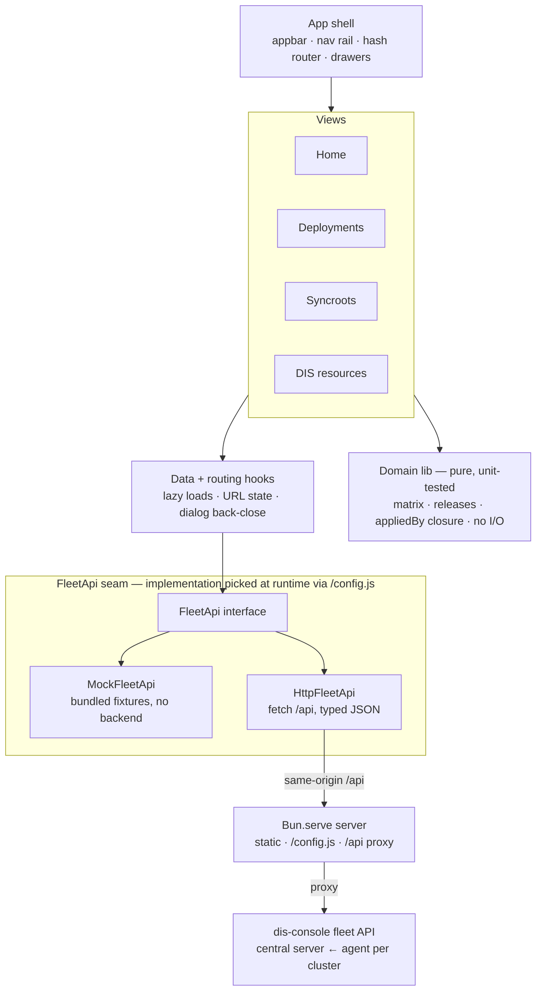

# dis-console-ui

A read-only web console for the **dis-console fleet API**. It shows what runs
where across the fleet: releases per app and environment, what each syncroot
deploys, container images, and the DIS platform resources with Azure Portal
links.

> Status: proof of concept. It runs on bundled **mock** data by default, so no
> backend is needed. Switching to a live server is a runtime setting (see
> below).

## Views

A collapsible left nav switches between views:

- **Home** — two flat tables: **Syncroots** (the namespaces each deploys
  into, environments covered, worst status) and **Clusters** (sync freshness,
  staleness). Syncroot rows open the syncroot page.
- **Deployments** — the release overview: a searchable app list on the left,
  the selected app's releases on the right. One row per release (newest
  first, built from the fleet API's status-event history), a stage chip per
  environment: ✓ runs it, outline-✓ ran it earlier, ↻ rolling out, ✕ failed,
  ⏸ suspended, ○ never had it. Release ids link to the git commit when one
  can be derived — directly for git revisions, via the source's origin
  annotations for OCI digests, and via the owning Kustomization's commit for
  Helm chart versions. Clicking a release opens a drawer with its revision,
  first-seen time, commit link, stage chips, and the container images the
  running environments declare. A second tab keeps the plain matrix (apps ×
  environments).
- **Syncroots** — a list of syncroots with their digest per environment (the
  digest is the version — tags are mutable ring tags; *rolling…* means a
  Kustomization has not applied the fetched digest yet). A syncroot opens its
  own page with tabs:
  - **Overview** — status, origin commit link, resource counts per category,
    and the namespaces it deploys into.
  - **Resources** — every custom resource the syncroot deployed (computed
    from the `appliedBy` closure over its root Kustomizations), filterable by
    namespace/kind/status and sortable. Kustomization rows open their own
    page with the full `status.inventory`, including kinds the agent does not
    sweep.
  - **Workloads** — the declared container image per workload and
    environment, drift across environments highlighted; empty until the
    fleet API's workload sweep (schema v5) is rolled out.
  - **Map** — a node graph of the syncroot's declared objects: pan, zoom,
    expand/collapse per node, click for details. Only declared objects
    appear (no runtime children like ReplicaSets); unswept kinds render
    dashed.
  - **Releases** — the same app list + releases view, scoped to this
    syncroot, with the artifact itself as the first entry (its releases are
    digests with origin commit links).
  - **Access** — the syncroot's ApplicationIdentities with Azure Portal
    links (cluster access itself is GitOps-only).
  - **Observability** — the apps with log/metric links into the shared
    Grafana (set `VITE_GRAFANA_BASE_URL`).
- **DIS resources** — one view per product family: **Databases**,
  **Identities**, **APIM**, and **Vaults**. Each groups resources by
  namespace for a tenant + environment, with **Open in Azure Portal** links
  built from the ARM ids the DIS operators surface in status.

Page-level navigation is in the URL (hash routes), so back/forward and deep
links work; the tenant + environment scope is shared across the product
views.

## The data model

The fleet API (`services/dis-console`) mirrors the Flux state of every
cluster. Flux has no tenant id, so tenant and environment are derived from
the cluster id, which is `<tenant>_<environment>` (`ttd_at23` → tenant
`ttd`, env `at23`). The environment is the column axis everywhere; the
tenant scopes each view. Chips show the Flux Ready state: `True` → healthy,
`Unknown` → reconciling, `False` → failed, missing → not deployed.

An **app** is: every HelmRelease, every Kustomization that is not an azapi
root (the root objects fluxConfigurations create carry no owner labels —
they are plumbing, and the apps views exclude them; an explicit Kind filter
still shows everything), and every workload applied directly by a root. A
HelmRelease or workload applied by an app folds into that app's row, so a
failed chart or Deployment reds its app. A root-applied workload's release
identity is its **primary container image tag**.

Clicking a cell opens a drawer with the resource's status, revision, owning
Kustomization, a link to the source repo at the deployed commit, and the raw
object.

## Architecture

Top to bottom: components render, hooks load data, the pure domain lib does
all derivation, and one interface talks to either the bundled mock or the
live API. All view logic lives in the two framework-free layers — the domain
lib carries the unit tests; components are covered by typecheck + build.



## Stack

- [Bun](https://bun.sh) — package manager, test runner, and the runtime for
  the production server (`server/`)
- [Vite](https://vite.dev) + React 19 + TypeScript
- [Designsystemet](https://designsystemet.no) (`@digdir/designsystemet-react`,
  `@digdir/designsystemet-css`) — the Norwegian government design system

## Develop

Requires [Bun](https://bun.sh).

```bash
make install   # bun install --frozen-lockfile
make dev       # Vite dev server on http://localhost:5173 (mock data)
```

No host toolchain? Run the dev server (with hot reload) in a container
instead — same URL, mock data:

```bash
make dev-podman
```

To read a live dis-console `server`, port-forward it and run the dev server
with `/api` proxied to it — the browser stays same-origin, so there is no
CORS to deal with:

```bash
# One command — port-forward a dis-console server from a kube context, then
# run the UI against it (e.g. the admin-test cluster):
make dev-cluster KUBE_CONTEXT=<your-admin-test-context>

# ...or as two steps (port-forward, then point the UI at it):
kubectl --context <ctx> -n product-dis \
  port-forward --address 0.0.0.0 svc/dis-console 8080:80
make dev-live BACKEND=http://host.containers.internal:8080

# ...or on the host (no container):
DIS_CONSOLE_API=http://localhost:8080 bun run dev
```

In production the mode is a **runtime** decision, not a build flag: the
server serves `/config.js` from its environment — live whenever
`DIS_CONSOLE_API` is set, mock otherwise (override with
`DIS_CONSOLE_USE_MOCK=true|false`). One image serves demos and production.
In dev, `VITE_USE_MOCK` is the fallback (mock unless set to `false`).

## Checks

```bash
make check     # typecheck + lint + test + build (the CI gate)
```

See [AGENTS.md](AGENTS.md) for the required verification flow and the
container fallback when no local toolchain is available.

## Run it in containers

The app is served by a small **`Bun.serve` server** (`server/`) on `:8080`:
static files, the runtime `/config.js`, and — when `DIS_CONSOLE_API` is set —
a same-origin `/api` proxy (no CORS; auth can live here later). Quickest way,
needs only podman/docker:

```bash
make serve   # http://localhost:8080
```

### In a Kind cluster

The same image runs in a throwaway Kind cluster, like `services/dis-console`.
Requires `kind` + a container runtime (podman locally, docker in CI):

```bash
make kind-up        # build the image, load it into Kind, deploy it
make kind-forward   # port-forward http://localhost:8080
make kind-down      # delete the cluster
```

Or as a one-shot check (create → deploy → smoke-test → tear down), which is
what CI runs:

```bash
make test-e2e-kind-ci
```

Everything happens inside containers, so this works without a host
toolchain.

## Layout

```
src/
  api/         fleet API client — types (mirror the Go JSON), interface,
               live HTTP client, and the bundled mock
  lib/         pure domain logic (unit-tested): status/environment helpers,
               the matrix and release transforms, the appliedBy closure
  hooks/       data loading and routing hooks
  components/  Designsystemet UI (views, tables, chips, drawers, the map)
server/        Bun.serve production server (static + /config.js + /api proxy)
```
