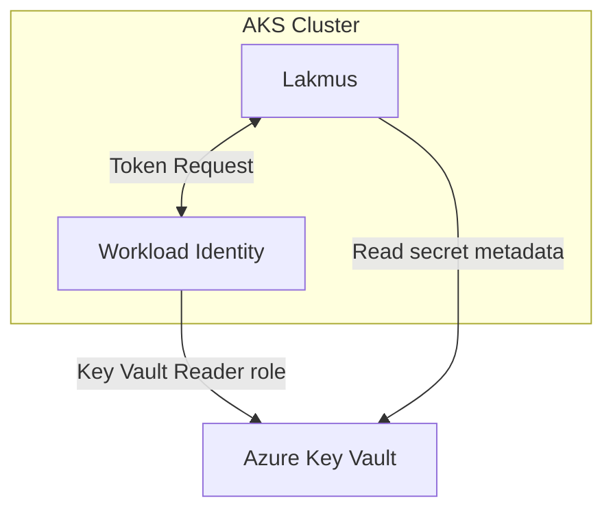

# Lakmus

**Lakmus** is a tiny Go service that adds visibility and observability for the DIS platform. It helps with
features for things that just don't come out of the box.

#### Features
- **AKV secret expiry exporter** — periodically scans Azure Key Vaults and exposes a Prometheus metric (`lakmus_keyvault_secret_expiration_timestamp_seconds`) so teams can alert in Grafana before secrets expire.

> The name **Lakmus** is Norwegian for “[litmus](https://en.wikipedia.org/wiki/Litmus)”.

## Summary

Several Altinn services rely on AKV-stored secrets, tokens or certificates. Expired secrets cause avoidable outages that are hard to triage, and the current solution deviates from our golden path. **Lakmus** runs in-cluster with Workload Identity and a read-only role against the target Key Vault, exporting an easy-to-alert signal.


### Overview



## How it works

Lakmus polls Key Vault on a fixed interval and exports a per-secret Prometheus metric:

```text
lakmus_keyvault_secret_expiration_timestamp_seconds{secret="my-sec", kv="mykv-prod"}
```

A simple dashboard/alert query:

```promql
# secrets expiring or already expired within 7 days
(lakmus_keyvault_secret_expiration_timestamp_seconds - time()) < 7 * 24 * 60 * 60
```

---

## Prerequisites

- **Go** (for local builds/tests)
- **Container runtime**: Podman (default) or Docker
- Access to Azure if running against a real Key Vault (Workload Identity recommended)
- curl for integration tests
- golangci-lint for make lint
- [cdk8s](https://cdk8s.io/) to generate manifests/yaml

---

## Makefile targets

The repo ships with a Makefile that supports Podman or Docker via `CONTAINER_RUNTIME`.

```makefile
CONTAINER_RUNTIME ?= podman   # override with CONTAINER_RUNTIME=docker
```

### Common tasks

#### 1) Unit tests

```bash
make test
```

#### 2) Build the container image

```bash
# Podman (default)
make docker-build

# Docker
make docker-build CONTAINER_RUNTIME=docker
```

#### 3) Run locally (foreground)

Runs the container with the fake mode args so you can hit the metrics endpoint at `http://127.0.0.1:8080/metrics`.

```bash
make docker-run
# or with Docker:
make docker-run CONTAINER_RUNTIME=docker
```

#### 4) Integration test (containerized)

Starts the container, waits a few seconds, curls `/metrics`, checks for the metric, prints logs on failure, and cleans up the container.
This runs with --use-fakes which makes the app run against azure fakes in order to run the test, so no real workload identity is required.

```bash
make test-integration
# or:
make test-integration CONTAINER_RUNTIME=docker
```

> The target looks for `lakmus_keyvault_secret_expiration_timestamp_seconds` on `http://127.0.0.1:${METRICS_PORT}/metrics`.

#### 5) Local binary build

```bash
make build
./bin/lakmus --help
```

#### 6) Clean artifacts

```bash
make clean
```

#### 7) Go tasks

```bash
make tidy
make lint
make fmt
```

#### 8) Make manifests

Generates Kubernetes and Flux manifests for **Lakmus** using [cdk8s](https://cdk8s.io/).  
The output is written to `flux/lakmus/` in the monorepo.

```bash
# Generate manifests with default image (latest tag)
make manifests

# Generate manifests with a specific tag
make manifests IMAGE_TAG=v1.0.0
```

---

## Configuration

Environment variables and flags you’ll commonly use:

```bash
# When running against a real Key Vault:
export AZURE_KEYVAULT_URL="https://<your-kv-name>.vault.azure.net"

# Optional: subscription id (used by fake/integration mode in examples)
export AZURE_SUBSCRIPTION_ID="<sub-id>"
```

Lakmus flags (examples):

```bash
./bin/lakmus \
  --subscription-id="$AZURE_SUBSCRIPTION_ID" \
  --tick-interval="60s" \
  --metrics-address=":8080"
```

In the provided Makefile targets, the integration/fake run uses:

```text
--subscription-id=$(SUBSCRIPTION_ID)
--tick-interval=$(TICK_INTERVAL)
--metrics-address=$(METRICS_ADDR)
--use-fakes
```

---

## Metrics

Scrape endpoint:

```text
GET http://<lakmus-host>:8080/metrics
```

Key metric emitted:

```text
lakmus_keyvault_secret_expiration_timestamp_seconds{secret="<name>", kv="<kv-name>"} <unix_timestamp_seconds>
```

Quick sanity check:

```bash
curl -sf "http://127.0.0.1:8080/metrics" \
  | grep -q 'lakmus_keyvault_secret_expiration_timestamp_seconds' && echo "Metric OK"
```


## RFC

[RFC 0005: Expiring secrets](https://github.com/Altinn/altinn-platform/blob/main/rfcs/0005-expiring-secrets.md)

---

### Troubleshooting

- **Metrics not found in `test-integration`**  
  Increase `INTEG_WAIT_S` or inspect logs:
  ```bash
  make test-integration INTEG_WAIT_S=10
  ```
- **Switch to Docker**  
  ```bash
  make docker-build CONTAINER_RUNTIME=docker
  make docker-run CONTAINER_RUNTIME=docker
  make test-integration CONTAINER_RUNTIME=docker
  ```
